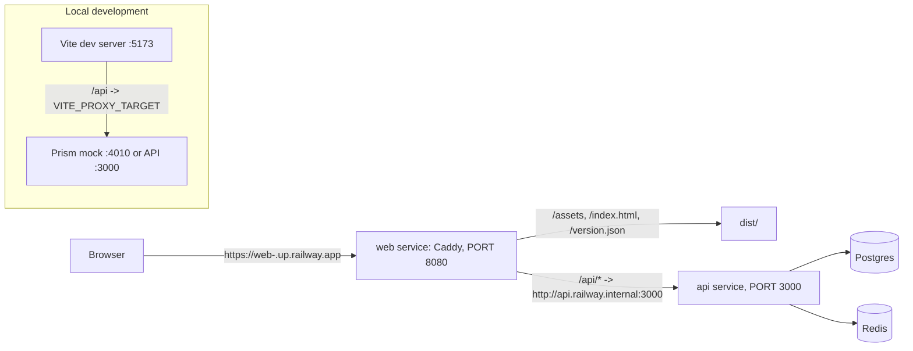

# Architecture

Kaizen Tasks Web is a Vite-built React single-page app served by Caddy. Every API call is a
same-origin request to `/api/v1`, which Caddy proxies to the API over Railway's private network.
The browser never learns the API's address, there is no CORS, and the refresh cookie is first-party.

## Proxy topology

- Production: `Caddyfile` at the repo root. Railpack detects the Vite app, builds `dist/`, and
  serves it with Caddy using our file instead of its template. `/api/*` is reverse-proxied to
  `http://api.railway.internal:3000`; the API pins `PORT=3000`, the web service pins `PORT=8080`.
  `/assets/*` is immutable for a year; `/version.json` is `no-store` so the promote workflow and the
  smoke package always see the live build.
- Development: `vite.config.ts` proxies `/api` to `VITE_PROXY_TARGET` (default `http://localhost:4010`,
  the Prism mock; `http://localhost:3000` for the real API).
- `src/api/client.ts` resolves `/api/v1` against `window.location.origin`. No other origin exists in
  the code base; the `reviewer` agent checks for absolute API origins.
- `.railway/railway.ts` declares the `web` service as a named partial (`export const partial = "web"`),
  so applying it can never destroy `api`, `Postgres`, or `Redis`, which the API repo's file declares.

## Authentication flow

1. On load `AuthProvider` calls `POST /auth/refresh` once (the httpOnly `kaizen_refresh` cookie
   travels because the request is same-origin), then `GET /auth/me`. The shell shows a neutral
   "Restoring your session" screen meanwhile, so a returning user never sees a login flash. A failed
   refresh means logged out, silently.
2. The access token lives in `src/api/auth-store.ts`, in module memory only (ADR 0003). The request
   middleware attaches it as `Authorization: Bearer`.
3. The response middleware handles a 401 from any route except `/auth/login`, `/auth/register`,
   `/auth/refresh`, and `/auth/logout`: it refreshes once (deduplicated across concurrent requests),
   stores the new token, and replays a clone of the original request. A second 401 clears the store;
   `RequireAuth` then redirects to `/login?returnTo=<path>`.
4. Logout calls the API, clears the store, clears the query cache, and navigates to `/login`.

## Contract copy and typed client

`src/api/openapi.json` is a committed copy of the API's contract (ADR 0002), pulled by
`scripts/pull-openapi.sh` from GitHub or from the nested backend checkout. `npm run api:types` turns it
into `src/api/types.ts` with openapi-typescript; `src/api/models.ts` derives every model type from
`paths`, so the backend's schema names do not matter. `src/api/client.ts` is an openapi-fetch client
typed by `paths`: the app cannot call a route the contract does not describe. `unwrap()` decodes the
error envelope into `ApiError`, and `toastApiError()` is the one error presentation.

Docs-check Rule B keeps `types.ts` in step with `openapi.json`; CI warns (never fails) when the copy
is behind `develop` on the API repo.

One route is not JSON: `POST /feature-requests/conversation/{id}/messages` answers with
`text/event-stream`. It goes through the same client with `parseAs: "stream"`, and
`src/api/conversation-stream.ts` decodes the frames into the contract's own `ConversationEvent`
union (ADR 0005).

## Server state and polling

TanStack Query owns server state; hooks live in `src/features/<domain>/hooks.ts` (tags in
`src/api/tags-query.ts`, shared by two features). Keys: `["tasks", filters]` for lists,
`["tasks", id]` for details, `["tags"]`. `src/lib/polling.ts` exports `activeAiInterval`, used by the
list query (3 s while any visible row is pending or running) and by the detail query (2 s while the
task is pending or running). When a detail settles, the list queries are invalidated so chips update.
Reorder is optimistic with rollback. List rows never fetch a detail: `TaskSummary` carries
`suggestionCount` and `aiError`. The request-a-feature link and route are gated on `GET /health`'s
`data.features.featureRequests`, read once per session (`staleTime: Infinity`) by
`features/feature-request/hooks.ts`.

## Mock

`npm run mock` merges `mock/examples.json` into a copy of the contract and serves it with Prism in
static mode (Prism's dynamic mode ignores examples). Every detail request returns the same example
task; that is the mock's limit.

## Selector contract

The assembly-line smoke test drives the deployed app by accessible role and name only. The exact
list is in `README.md`, "Selector contract". Changing any of those names is a cross-repo change.

## Verification items

| Item                                                               | Status                                                                                                        |
| ------------------------------------------------------------------ | ------------------------------------------------------------------------------------------------------------- |
| W1 Railpack honors the root Caddyfile with a private-network proxy | verified on the first staging deploy (L3-M1); fallback is a Node server with `serve-handler` and `http-proxy` |
| W2 Prism examples look sensible                                    | closed by running Prism in static mode with curated examples                                                  |
| W3 openapi-fetch replay after refresh                              | closed by `src/api/client.test.ts` ("refreshes once and replays")                                             |
