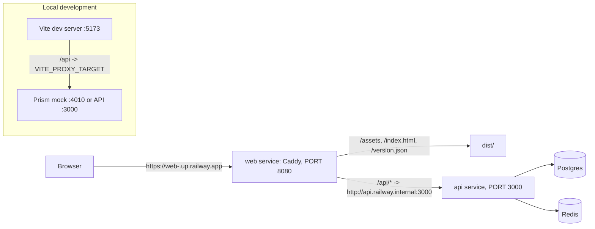

# Kaizen Tasks Web Implementation Plan

> **For agentic workers:** REQUIRED SUB-SKILL: Use superpowers:subagent-driven-development (recommended) or superpowers:executing-plans to implement this plan task-by-task. Steps use checkbox (`- [ ]`) syntax for tracking.

**Goal:** Build `kaizen-tasks-web`, the React app for Kaizen Tasks (login, registration, task list with AI chips, task detail with AI-suggested steps, tags, optional feature-request page), its Caddy production service that proxies `/api/*`, its tests, docs, Claude Code harness, CI, and Railway declaration.

**Architecture:** Vite + React 19 single-page app. Every API call goes through one openapi-fetch client typed from a committed copy of the API's `openapi.json`; a response middleware refreshes the access token once on 401 and replays. TanStack Query owns server state with per-feature hooks and polling while AI work is active. In development Vite proxies `/api` to a Prism mock built from the same contract; in production a `Caddyfile` serves `dist/` and proxies `/api/*` to the API over Railway private networking, so there is no CORS and the refresh cookie is first-party.

**Tech Stack:** Node 24, Vite 7, React 19, TypeScript 5.9 strict, react-router 7 (declarative), @tanstack/react-query 5, Tailwind 4 (CSS-first), shadcn/ui (`new-york-v4` style, Radix), lucide-react, sonner, openapi-typescript 7, openapi-fetch 0.17, @dnd-kit/core + @dnd-kit/sortable, Vitest 5 + jsdom + Testing Library + MSW 2, Prism CLI, Caddy (through Railpack), GitHub Actions, Railway TypeScript IaC.

**Spec:** `frontend/docs/superpowers/specs/2026-09-08-kaizen-tasks-web-design.md` (this plan argues from it; read it first). Upstream: `webapp/docs/PRD.md` sections 5, 6.3, 7; API contract in `webapp/backend/docs/superpowers/specs/2026-09-08-kaizen-tasks-api-design.md` section 4; coordination in `webapp/docs/superpowers/plans/2026-09-08-master-plan.md`.

## Global Constraints

From the master plan, verbatim:

- Node 24 LTS everywhere, pinned by `.nvmrc` containing `24`; `engines.node` is `>=24 <25`. Run `nvm use` before any npm command.
- Branching: work on `develop`. Feature branches come off `develop` and merge by pull request. `main` receives only `develop` by pull request after staging verification. Nothing is ever pushed to `main` directly. `develop` is the default branch on GitHub.
- Every commit message ends with the single trailer line `Co-Authored-By: Claude Fable 5.1 <noreply@anthropic.com>` (orchestrator ruling R6, 2026-09-08). No other trailer line.
- Secrets never enter a repository. `ANTHROPIC_API_KEY`, `JWT_SECRET`, `ADMIN_TOKEN`, `SEED_DEMO_PASSWORD`, and any GitHub token live only in Railway variables and in git-ignored local `.env` files. Mike pastes them.
- Railway: only the new project `kaizen-tasks`. Never link to, modify, or redeploy any other project in the account. Railway operations follow the official `use-railway` skill.
- GitHub: repos `kpnemo/kaizen-tasks-api`, `kpnemo/kaizen-tasks-web`, `kpnemo/kaizen-tasks-assembly-line`, `kpnemo/kaizen-tasks-product-skills`, all public.
- TypeScript strict in every repo. ESM. Prettier formatting. ESLint flat config.
- Test first: every task shows a failing test before implementation. Tests that hit external services are opt-in and excluded from CI.
- Docs are part of every change: `CHANGELOG.md` `[Unreleased]` bullet, regenerated OpenAPI or types where applicable, ADR when an architectural file changes. The docs-check script enforces it locally and in CI.
- Migrations are additive only (ADR 0004 in the API repo).
- The API service pins `PORT=3000`; the web service proxies `/api/*` to `http://api.railway.internal:3000`.
- The workshop root folder is not a repository. `webapp/` is `kaizen-tasks-assembly-line`; `webapp/backend/` and `webapp/frontend/` are nested, git-ignored repositories; `product-skills/` is at the root.

From the web spec:

- The app has no runtime configuration. Every request goes to the relative path `/api/v1` on the page's own origin. No absolute API origin appears anywhere in `src/`.
- `VITE_PROXY_TARGET` (default `http://localhost:4010`) is the only development variable; it is read by `vite.config.ts` only.
- The access token lives in module memory only (`src/api/auth-store.ts`). Never in `localStorage`, `sessionStorage`, cookies, or the query cache.
- Import rules: `features/*` import from `api`, `components` (shadcn under `components/ui`, hand-written shared pieces beside it), `lib`, and their own folder; never from another feature and never from `app`. `app/` composes features. `api/` imports nothing from `features`.
- Every feature ships a happy-path test and an error-state test. Every user-visible error is rendered from `ApiError` through the shared toast or a field error.
- Projector rules: base font 18px, headings in the display face, one accent color, visible focus ring on every control, minimum 44px hit area, nothing the demo depends on is hover-only.
- `src/api/openapi.json` and `src/api/types.ts` are committed and never hand-edited except by the pull script and the generator. A change to either is a normal reviewed change.
- `dist/version.json` is `{ "commit": "<sha>", "builtAt": "<iso>" }`, written after `vite build`, served with `Cache-Control: no-store`.
- Workflow and job ids are `ci` and `promote`.
- No Playwright in this repo.

Orchestrator rulings of 2026-09-08, already folded into the tasks below (listed so an implementer reading one task out of order knows them):

- R1. `TaskSummary` carries `suggestionCount` (integer) and `aiError` (string or null). The task list reads both from the summary; there is no per-row detail query (Tasks 8, 9, 11).
- R2. `GET /api/v1/health` returns `data.features.featureRequests` (boolean). The request-a-feature link and route appear only when it is true, read once per session; the served `/openapi.json` is never inspected (Tasks 8, 9, 17).
- R3. The task list's tag filter is single-select and sends one `tagId` (Task 11).
- R4. The tags page has no task-count column (Task 16).
- R5. `.railway/railway.ts` is a named partial (`export const partial = "web"`) that owns only the `web` service, so applying it cannot destroy `api`, `Postgres`, or `Redis` (Task 6).
- R6. The single commit trailer above; no `Claude-Session:` line anywhere.

## Pinned versions (verified with `npm view` on 2026-09-08)

The plan records them here per spec 2.1. Use exactly these in `package.json`.

| Package                           | Version                                                                | Note                                                                                                                                                                                                                       |
| --------------------------------- | ---------------------------------------------------------------------- | -------------------------------------------------------------------------------------------------------------------------------------------------------------------------------------------------------------------------- |
| vite                              | 7.3.6                                                                  | Vite 7 line; `@vitejs/plugin-react` 6.x requires Vite 8, so plugin-react is pinned to 5.x                                                                                                                                  |
| @vitejs/plugin-react              | 5.2.0                                                                  | peer `vite ^7`                                                                                                                                                                                                             |
| react, react-dom                  | 19.2.8                                                                 |                                                                                                                                                                                                                            |
| @types/react                      | 19.2.18                                                                |                                                                                                                                                                                                                            |
| @types/react-dom                  | 19.2.7                                                                 |                                                                                                                                                                                                                            |
| typescript                        | 5.9.3                                                                  | typescript-eslint caps at `<6.1`, so not TS 7                                                                                                                                                                              |
| react-router                      | 7.18.3                                                                 | declarative mode, import from `react-router`                                                                                                                                                                               |
| @tanstack/react-query             | 5.102.8                                                                |                                                                                                                                                                                                                            |
| tailwindcss, @tailwindcss/vite    | 4.3.3                                                                  | CSS-first config                                                                                                                                                                                                           |
| tw-animate-css                    | 1.4.0                                                                  | shadcn animation utilities                                                                                                                                                                                                 |
| shadcn (CLI, via npx)             | 4.21.0                                                                 | style `new-york-v4`                                                                                                                                                                                                        |
| lucide-react                      | 1.43.0                                                                 |                                                                                                                                                                                                                            |
| sonner                            | 2.0.8                                                                  | toasts                                                                                                                                                                                                                     |
| class-variance-authority          | 0.7.1                                                                  |                                                                                                                                                                                                                            |
| clsx                              | 2.1.1                                                                  |                                                                                                                                                                                                                            |
| tailwind-merge                    | 3.6.0                                                                  |                                                                                                                                                                                                                            |
| openapi-typescript                | 7.13.0                                                                 | has `--check`                                                                                                                                                                                                              |
| openapi-fetch                     | 0.17.0                                                                 | middleware gets `id` and `schemaPath`                                                                                                                                                                                      |
| @dnd-kit/core                     | 6.3.1                                                                  |                                                                                                                                                                                                                            |
| @dnd-kit/sortable                 | 10.0.0                                                                 | peer `@dnd-kit/core ^6.3.0`                                                                                                                                                                                                |
| @dnd-kit/utilities                | 3.2.2                                                                  |                                                                                                                                                                                                                            |
| @fontsource-variable/fraunces     | 5.3.0                                                                  | display face, self-hosted                                                                                                                                                                                                  |
| @fontsource/atkinson-hyperlegible | 5.3.0                                                                  | body face, self-hosted                                                                                                                                                                                                     |
| vitest                            | 5.0.0                                                                  | peer `vite ^7`                                                                                                                                                                                                             |
| jsdom                             | 30.0.1                                                                 | engines `^24.15.0`, satisfied by `nvm use` on `24`                                                                                                                                                                         |
| @testing-library/react            | 16.3.3                                                                 |                                                                                                                                                                                                                            |
| @testing-library/dom              | 10.4.1                                                                 | peer of the above                                                                                                                                                                                                          |
| @testing-library/jest-dom         | 7.0.1                                                                  | `@testing-library/jest-dom/vitest`                                                                                                                                                                                         |
| @testing-library/user-event       | 14.6.7                                                                 |                                                                                                                                                                                                                            |
| msw                               | 2.15.0                                                                 |                                                                                                                                                                                                                            |
| @stoplight/prism-cli              | 5.16.0                                                                 | engines `>=24.18`                                                                                                                                                                                                          |
| eslint                            | 9.39.5                                                                 |                                                                                                                                                                                                                            |
| @eslint/js                        | 9.39.5                                                                 |                                                                                                                                                                                                                            |
| typescript-eslint                 | 8.70.0                                                                 |                                                                                                                                                                                                                            |
| eslint-plugin-react-hooks         | 7.1.1                                                                  | `configs.flat.recommended`; it includes the React Compiler rules (`set-state-in-effect`, `refs`, `purity`, `immutability`, `set-state-in-render`), so no component in this plan calls a state setter inside an effect body |
| eslint-plugin-react-refresh       | 0.5.6                                                                  | import the named `reactRefresh` export: its `configs.vite()` is a function; the default export's `configs.vite` is a plain object (verified in the package's `index.d.ts`)                                                 |
| eslint-config-prettier            | 10.1.8                                                                 |                                                                                                                                                                                                                            |
| globals                           | 17.12.0                                                                |                                                                                                                                                                                                                            |
| prettier                          | 3.9.6                                                                  |                                                                                                                                                                                                                            |
| @types/node                       | 24.13.3                                                                |                                                                                                                                                                                                                            |
| railway                           | 3.11.0                                                                 | exports `railway/iac` for `.railway/railway.ts`                                                                                                                                                                            |
| GitHub Actions                    | actions/checkout@v7, actions/setup-node@v7, actions/upload-artifact@v7 |                                                                                                                                                                                                                            |

## Design tokens (spec A4, decided here)

- Accent: **Kaizen indigo**, `oklch(0.45 0.19 272)` (about `#3B3FBF`). The Japanese indigo dye _ai_ is the one deliberate identity choice; it carries actions, links, focus rings, and the AI badge.
- Muted second color for dismissed items: **stone**, `oklch(0.50 0.02 80)`.
- Ground: warm white `oklch(0.985 0.005 95)`, ink `oklch(0.20 0.02 270)`.
- Display typeface: **Fraunces** (variable, set heavy at `wght 700` with optical size on) for headings and the wordmark.
- Body typeface: **Atkinson Hyperlegible**, a humanist sans designed for legibility, which is exactly the projector brief.
- Base font size 18px, content column max width 64rem, corner radius 0.75rem, focus ring 3px indigo with 2px offset, controls at least 44px tall.
- Motion: one "thinking" pulse on the AI chip and banner, nothing else moves on its own; `motion-reduce` disables it.

## File map

```
webapp/frontend/
  .claude/settings.json                 Stop + PostToolUse hooks (Task 19)
  .claude/skills/{add-frontend-feature,write-adr,release-notes}/SKILL.md (Task 20)
  .claude/agents/{reviewer,test-writer}.md (Task 20)
  .github/workflows/ci.yml              (Task 7, extended in 8 and 19)
  .github/workflows/promote.yml         (Task 21)
  .railway/railway.ts                   (Task 6)
  Caddyfile                             (Task 6)
  docs/ARCHITECTURE.md, docs/adr/000{1,2,3}-*.md (Task 18); docs/architectural-files.txt (Task 19)
  mock/examples.json                    curated Prism examples overlay (Task 9)
  scripts/write-version.mjs             (Task 6)
  scripts/pull-openapi.sh               (Task 8)
  scripts/build-mock-spec.mjs           (Task 9)
  scripts/docs-check.sh, scripts/format-file.sh (Task 19)
  scripts/wait-for-version.sh           (Task 21)
  src/main.tsx                          providers (Task 5, 10)
  src/app/router.tsx, layout.tsx, routes/{RequireAuth,PublicOnly,NotFoundPage}.tsx (Task 5)
  src/api/openapi.json, types.ts        contract copy + generated types (Task 3 stub, Task 8 full)
  src/api/models.ts                     path-derived model aliases (Task 3, 8)
  src/api/errors.ts, auth-store.ts, client.ts (Task 3, 4)
  src/api/tags-query.ts                 shared tag query and mutations (Task 11, 15)
  src/features/auth/{LoginPage,RegisterPage,AuthProvider,RestoringScreen}.tsx, useSession.ts, hooks.ts (Task 5, 10)
  src/features/tasks/{TaskListPage,TaskDetailPage}.tsx, hooks.ts, components/* (Task 11-15)
  src/features/tags/TagsPage.tsx, hooks.ts, components/* (Task 16)
  src/features/feature-request/{RequestFeaturePage,FeatureRequestLink}.tsx, hooks.ts (Task 17)
  src/components/ui/*                   shadcn (Task 2)
  src/components/{kaizen-mark,field,api-error-toast,tag-chip,inline-text,native-select}.tsx (Task 5, 10, 11, 12)
  src/lib/{cn,format,polling,tag-palette}.ts (Task 2, 10, 11, 15)
  src/styles/globals.css                theme tokens (Task 2)
  tests/setup.ts, tests/render.tsx, tests/msw/{server,handlers,fixtures,db}.ts (Task 4, 5, 8)
  index.html vite.config.ts vitest.config.ts components.json eslint.config.js .prettierrc .prettierignore
  CHANGELOG.md CLAUDE.md README.md package.json tsconfig.json .env.example .nvmrc
```

## Milestones

- **L2-M1 (contract-independent skeleton) = Tasks 1 through 7.** Done when `npm test` and `npm run build` pass, `dist/version.json` exists after build, `Caddyfile` and `.railway/railway.ts` are committed, and `ci.yml` is green on `develop`. Nothing in Tasks 1-7 needs the backend's contract; Task 3 authors a minimal `openapi.json` with only the auth paths and the envelope schemas.
- **L2-M2 (all screens against the Prism mock, tests, docs, harness) = Tasks 8 through 21.** Task 8 must not start before L1-M1 is done (backend `openapi.json` committed) unless the fallback in Task 8 step 4 is taken.
- **L2-M3** (switch to the real API) is a verification run with `VITE_PROXY_TARGET=http://localhost:3000 npm run dev`; it has no tasks here beyond fixing what that run reveals.

Conventions for every task: run `nvm use` first; every `git commit` message ends with the single `Co-Authored-By: Claude Fable 5.1 <noreply@anthropic.com>` trailer line; every test step names the exact command and the expected outcome; `npm run lint && npm run typecheck` must pass before each commit.

---

### Task 1: Scaffold, toolchain, and first test

**Files:**

- Create: `.nvmrc`, `package.json`, `tsconfig.json`, `vite.config.ts`, `vitest.config.ts`, `index.html`, `eslint.config.js`, `.prettierrc`, `.prettierignore`, `.env.example`, `src/main.tsx`, `src/App.tsx`, `src/vite-env.d.ts`, `tests/setup.ts`
- Test: `src/App.test.tsx`

**Interfaces:**

- Consumes: nothing.
- Produces: the `@/` alias to `src/`; the npm scripts named in spec section 9 (`dev`, `build`, `preview`, `test`, `lint`, `typecheck`, `mock`, `api:pull`, `api:types`, `docs:check`); `tests/setup.ts` as the Vitest setup file (extended in Task 4).

- [ ] **Step 1: Pin Node and create package.json**

`.nvmrc`:

```
24
```

`package.json` (the `mock`, `api:pull`, and `docs:check` scripts point at files created in Tasks 9, 8, and 20; they are named now so the script list never changes):

```json
{
  "name": "kaizen-tasks-web",
  "version": "0.1.0",
  "private": true,
  "type": "module",
  "description": "Kaizen Tasks web app: tasks broken into small steps by an AI assistant, with the human in control",
  "engines": {
    "node": ">=24 <25"
  },
  "scripts": {
    "dev": "vite",
    "build": "vite build && node scripts/write-version.mjs",
    "preview": "vite preview",
    "test": "vitest run",
    "lint": "eslint . && prettier --check .",
    "typecheck": "tsc --noEmit",
    "mock": "node scripts/build-mock-spec.mjs && prism mock .mock/openapi.json -p 4010",
    "api:pull": "bash scripts/pull-openapi.sh",
    "api:types": "openapi-typescript src/api/openapi.json -o src/api/types.ts",
    "docs:check": "bash scripts/docs-check.sh --hook"
  },
  "dependencies": {
    "@dnd-kit/core": "6.3.1",
    "@dnd-kit/sortable": "10.0.0",
    "@dnd-kit/utilities": "3.2.2",
    "@fontsource-variable/fraunces": "5.3.0",
    "@fontsource/atkinson-hyperlegible": "5.3.0",
    "@tanstack/react-query": "5.102.8",
    "class-variance-authority": "0.7.1",
    "clsx": "2.1.1",
    "lucide-react": "1.43.0",
    "openapi-fetch": "0.17.0",
    "react": "19.2.8",
    "react-dom": "19.2.8",
    "react-router": "7.18.3",
    "sonner": "2.0.8",
    "tailwind-merge": "3.6.0"
  },
  "devDependencies": {
    "@eslint/js": "9.39.5",
    "@stoplight/prism-cli": "5.16.0",
    "@tailwindcss/vite": "4.3.3",
    "@testing-library/dom": "10.4.1",
    "@testing-library/jest-dom": "7.0.1",
    "@testing-library/react": "16.3.3",
    "@testing-library/user-event": "14.6.7",
    "@types/node": "24.13.3",
    "@types/react": "19.2.18",
    "@types/react-dom": "19.2.7",
    "@vitejs/plugin-react": "5.2.0",
    "eslint": "9.39.5",
    "eslint-config-prettier": "10.1.8",
    "eslint-plugin-react-hooks": "7.1.1",
    "eslint-plugin-react-refresh": "0.5.6",
    "globals": "17.12.0",
    "jsdom": "30.0.1",
    "msw": "2.15.0",
    "openapi-typescript": "7.13.0",
    "prettier": "3.9.6",
    "railway": "3.11.0",
    "tailwindcss": "4.3.3",
    "tw-animate-css": "1.4.0",
    "typescript": "5.9.3",
    "typescript-eslint": "8.70.0",
    "vite": "7.3.6",
    "vitest": "5.0.0"
  }
}
```

- [ ] **Step 2: TypeScript, Vite, Vitest, ESLint, Prettier configuration**

`tsconfig.json`:

```json
{
  "compilerOptions": {
    "target": "ES2022",
    "lib": ["ES2023", "DOM", "DOM.Iterable"],
    "module": "ESNext",
    "moduleResolution": "bundler",
    "jsx": "react-jsx",
    "strict": true,
    "noUnusedLocals": true,
    "noUnusedParameters": true,
    "noFallthroughCasesInSwitch": true,
    "noUncheckedSideEffectImports": true,
    "verbatimModuleSyntax": true,
    "isolatedModules": true,
    "moduleDetection": "force",
    "skipLibCheck": true,
    "noEmit": true,
    "resolveJsonModule": true,
    "baseUrl": ".",
    "paths": { "@/*": ["./src/*"] },
    "types": ["vite/client", "node"]
  },
  "include": ["src", "tests", ".railway", "vite.config.ts", "vitest.config.ts"]
}
```

`vite.config.ts` (the only place `VITE_PROXY_TARGET` is read; `loadEnv` merges `.env` files and the process environment):

```ts
import { fileURLToPath, URL } from "node:url";
import tailwindcss from "@tailwindcss/vite";
import react from "@vitejs/plugin-react";
import { defineConfig, loadEnv } from "vite";

export default defineConfig(({ mode }) => {
  const env = loadEnv(mode, process.cwd(), "VITE_");
  const proxyTarget = env.VITE_PROXY_TARGET || "http://localhost:4010";
  return {
    plugins: [react(), tailwindcss()],
    resolve: {
      alias: { "@": fileURLToPath(new URL("./src", import.meta.url)) },
    },
    server: {
      proxy: {
        "/api": { target: proxyTarget, changeOrigin: false },
      },
    },
  };
});
```

`vitest.config.ts`:

```ts
import { defineConfig, mergeConfig } from "vitest/config";
import viteConfig from "./vite.config";

export default mergeConfig(
  viteConfig({ mode: "test", command: "serve" }),
  defineConfig({
    test: {
      environment: "jsdom",
      environmentOptions: { jsdom: { url: "http://localhost:3000" } },
      setupFiles: ["./tests/setup.ts"],
      include: ["src/**/*.test.{ts,tsx}", "tests/**/*.test.{ts,tsx}"],
      css: false,
      restoreMocks: true,
    },
  }),
);
```

`eslint.config.js`:

```js
import js from "@eslint/js";
import prettier from "eslint-config-prettier";
import reactHooks from "eslint-plugin-react-hooks";
import { reactRefresh } from "eslint-plugin-react-refresh";
import { globalIgnores } from "eslint/config";
import globals from "globals";
import tseslint from "typescript-eslint";

export default tseslint.config([
  globalIgnores(["dist", ".mock", "src/api/types.ts", "src/components/ui"]),
  {
    files: ["**/*.{ts,tsx}"],
    extends: [
      js.configs.recommended,
      tseslint.configs.recommended,
      reactHooks.configs.flat.recommended,
      reactRefresh.configs.vite(),
      prettier,
    ],
    languageOptions: { ecmaVersion: 2022, globals: { ...globals.browser, ...globals.node } },
    rules: {
      "@typescript-eslint/consistent-type-imports": ["error", { prefer: "type-imports" }],
      "no-restricted-imports": [
        "error",
        {
          patterns: [
            {
              group: ["**/features/*/**", "@/features/*/**"],
              message:
                "Features may not import from other features. Share through api/, lib/, or components/ui.",
            },
          ],
        },
      ],
    },
  },
  {
    files: ["src/app/**", "src/main.tsx", "tests/**", "src/features/**/*.test.tsx"],
    rules: { "no-restricted-imports": "off" },
  },
  {
    files: ["src/features/**"],
    ignores: ["src/features/**/*.test.tsx"],
    rules: {
      "no-restricted-imports": [
        "error",
        {
          patterns: [
            {
              group: ["@/features/*", "@/features/*/**", "../*/**"],
              message:
                "Features may not import from other features. Share through api/, lib/, or components/ui.",
            },
          ],
        },
      ],
    },
  },
]);
```

`.prettierrc`:

```json
{ "printWidth": 100, "singleQuote": false, "trailingComma": "all", "semi": true }
```

`.prettierignore` (generated and pulled files are never reformatted, so a drift check compares raw generator output):

```
dist
.mock
node_modules
src/api/types.ts
src/api/openapi.json
src/components/ui
CHANGELOG.md
```

`.env.example`:

```
# Where the Vite dev server forwards /api. 4010 is the Prism mock (npm run mock).
# Use http://localhost:3000 for the real API.
VITE_PROXY_TARGET=http://localhost:4010
```

- [ ] **Step 3: Entry files and the first failing test**

`index.html`:

```html
<!doctype html>
<html lang="en">
  <head>
    <meta charset="UTF-8" />
    <meta name="viewport" content="width=device-width, initial-scale=1.0" />
    <title>Kaizen Tasks</title>
  </head>
  <body>
    <div id="root"></div>
    <script type="module" src="/src/main.tsx"></script>
  </body>
</html>
```

`src/vite-env.d.ts`:

```ts
/// <reference types="vite/client" />
```

`src/App.tsx`:

```tsx
export function App() {
  return <h1>Kaizen Tasks</h1>;
}
```

`src/main.tsx`:

```tsx
import { StrictMode } from "react";
import { createRoot } from "react-dom/client";
import { App } from "./App";

createRoot(document.getElementById("root")!).render(
  <StrictMode>
    <App />
  </StrictMode>,
);
```

`tests/setup.ts` (extended in Task 4 with the MSW server):

```ts
import "@testing-library/jest-dom/vitest";
import { cleanup } from "@testing-library/react";
import { afterEach } from "vitest";

afterEach(() => {
  cleanup();
});
```

`src/App.test.tsx`:

```tsx
import { render, screen } from "@testing-library/react";
import { describe, expect, it } from "vitest";
import { App } from "./App";

describe("App", () => {
  it("renders the product name", () => {
    render(<App />);
    expect(screen.getByRole("heading", { name: "Kaizen Tasks" })).toBeInTheDocument();
  });
});
```

- [ ] **Step 4: Install and run the test**

Run:

```bash
cd /Users/Mike.Bogdanovsky/Projects/nice-product-workshop-Sep.2026/webapp/frontend
nvm use
npm install
npm test
```

Expected: `npm install` completes with no peer warnings about vite (plugin-react 5.2.0 accepts Vite 7); `npm test` prints `✓ src/App.test.tsx (1 test)` and `Test Files  1 passed (1)`.

- [ ] **Step 5: Lint, typecheck, build**

Run: `npm run lint && npm run typecheck && npx vite build`
Expected: eslint and prettier report no problems; `tsc` exits 0; `vite build` prints `✓ built in` and creates `dist/index.html`. (`npm run build` itself waits for `scripts/write-version.mjs` in Task 6.)

- [ ] **Step 6: Commit**

```bash
git add .nvmrc package.json package-lock.json tsconfig.json vite.config.ts vitest.config.ts index.html eslint.config.js .prettierrc .prettierignore .env.example src tests
git commit -m "chore: scaffold Vite 7 + React 19 + TypeScript with Vitest and ESLint

Co-Authored-By: Claude Fable 5.1 <noreply@anthropic.com>"
```

---

### Task 2: Tailwind 4, shadcn/ui, and the Kaizen theme tokens

**Files:**

- Create: `components.json`, `src/lib/cn.ts`, `src/styles/globals.css`, `src/components/ui/*` (through the shadcn CLI)
- Modify: `src/main.tsx` (import the stylesheet)
- Test: `src/lib/cn.test.ts`

**Interfaces:**

- Consumes: the `@/` alias from Task 1.
- Produces: `cn(...inputs: ClassValue[]): string` in `src/lib/cn.ts`; shadcn components `Button`, `Input`, `Textarea`, `Label`, `Badge`, `Card`, `Popover`, `AlertDialog`, `Checkbox`, `DropdownMenu`, `Toaster` (sonner), `Separator` under `src/components/ui/`; Tailwind tokens `bg-background`, `text-foreground`, `bg-primary`, `text-muted-foreground`, `font-display`, `font-sans`, `ring-ring`, plus the custom `animate-thinking` utility.

- [ ] **Step 1: Write the failing test for `cn`**

`src/lib/cn.test.ts`:

```ts
import { describe, expect, it } from "vitest";
import { cn } from "./cn";

describe("cn", () => {
  it("merges conditional classes and resolves Tailwind conflicts", () => {
    expect(cn("px-2", false && "hidden", "px-4")).toBe("px-4");
  });
});
```

Run: `npx vitest run src/lib/cn.test.ts`
Expected: FAIL with `Failed to resolve import "./cn"`.

- [ ] **Step 2: `cn` and the shadcn configuration**

`src/lib/cn.ts`:

```ts
import { clsx, type ClassValue } from "clsx";
import { twMerge } from "tailwind-merge";

export function cn(...inputs: ClassValue[]): string {
  return twMerge(clsx(inputs));
}
```

`components.json` (the `utils` alias points at `@/lib/cn` so generated components import `cn` from there; `tailwind.config` is blank for Tailwind 4):

```json
{
  "$schema": "https://ui.shadcn.com/schema.json",
  "style": "new-york-v4",
  "rsc": false,
  "tsx": true,
  "tailwind": {
    "config": "",
    "css": "src/styles/globals.css",
    "baseColor": "neutral",
    "cssVariables": true,
    "prefix": ""
  },
  "aliases": {
    "components": "@/components",
    "utils": "@/lib/cn",
    "ui": "@/components/ui",
    "lib": "@/lib",
    "hooks": "@/hooks"
  },
  "iconLibrary": "lucide"
}
```

Run: `npx vitest run src/lib/cn.test.ts`
Expected: PASS.

- [ ] **Step 3: Theme tokens**

`src/styles/globals.css` (self-hosted fonts, Kaizen indigo accent, projector sizing; `@theme inline` maps the shadcn variables to Tailwind color utilities):

```css
@import "tailwindcss";
@import "tw-animate-css";
@import "@fontsource-variable/fraunces";
@import "@fontsource/atkinson-hyperlegible/400.css";
@import "@fontsource/atkinson-hyperlegible/700.css";

/* Kaizen identity: one accent (indigo, the Japanese dye "ai"), one display face (Fraunces),
   one body face (Atkinson Hyperlegible), tuned for a projected laptop screen. */
:root {
  --background: oklch(0.985 0.005 95);
  --foreground: oklch(0.2 0.02 270);
  --card: oklch(1 0 0);
  --card-foreground: oklch(0.2 0.02 270);
  --popover: oklch(1 0 0);
  --popover-foreground: oklch(0.2 0.02 270);
  --primary: oklch(0.45 0.19 272);
  --primary-foreground: oklch(0.99 0 0);
  --secondary: oklch(0.94 0.01 95);
  --secondary-foreground: oklch(0.2 0.02 270);
  --muted: oklch(0.94 0.01 95);
  --muted-foreground: oklch(0.5 0.02 80);
  --accent: oklch(0.93 0.04 272);
  --accent-foreground: oklch(0.3 0.15 272);
  --destructive: oklch(0.55 0.2 27);
  --border: oklch(0.86 0.01 95);
  --input: oklch(0.86 0.01 95);
  --ring: oklch(0.45 0.19 272);
  --radius: 0.75rem;
}

@theme inline {
  --font-sans: "Atkinson Hyperlegible", "Segoe UI", system-ui, sans-serif;
  --font-display: "Fraunces Variable", Georgia, serif;

  --color-background: var(--background);
  --color-foreground: var(--foreground);
  --color-card: var(--card);
  --color-card-foreground: var(--card-foreground);
  --color-popover: var(--popover);
  --color-popover-foreground: var(--popover-foreground);
  --color-primary: var(--primary);
  --color-primary-foreground: var(--primary-foreground);
  --color-secondary: var(--secondary);
  --color-secondary-foreground: var(--secondary-foreground);
  --color-muted: var(--muted);
  --color-muted-foreground: var(--muted-foreground);
  --color-accent: var(--accent);
  --color-accent-foreground: var(--accent-foreground);
  --color-destructive: var(--destructive);
  --color-border: var(--border);
  --color-input: var(--input);
  --color-ring: var(--ring);

  --radius-sm: calc(var(--radius) - 4px);
  --radius-md: calc(var(--radius) - 2px);
  --radius-lg: var(--radius);
  --radius-xl: calc(var(--radius) + 4px);

  --animate-thinking: thinking 1.6s ease-in-out infinite;

  @keyframes thinking {
    0%,
    100% {
      opacity: 1;
    }
    50% {
      opacity: 0.45;
    }
  }
}

@layer base {
  * {
    @apply border-border outline-ring/50;
  }

  html {
    font-size: 18px;
  }

  body {
    @apply bg-background text-foreground font-sans antialiased;
    line-height: 1.5;
  }

  h1,
  h2,
  h3 {
    @apply font-display font-bold tracking-tight;
    font-variation-settings: "opsz" 144;
  }

  h1 {
    @apply text-4xl;
  }

  h2 {
    @apply text-2xl;
  }

  /* Every interactive control gets a visible ring and a 44px hit area. */
  :focus-visible {
    outline: 3px solid var(--ring);
    outline-offset: 2px;
  }

  button:not([role="checkbox"]):not([role="switch"]),
  input:not([type="checkbox"]):not([type="radio"]),
  select,
  textarea,
  a[data-nav] {
    min-height: 2.75rem;
  }

  @media (prefers-reduced-motion: reduce) {
    .animate-thinking {
      animation: none;
    }
  }
}
```

Modify `src/main.tsx`: add `import "./styles/globals.css";` as the first import.

- [ ] **Step 4: Add the shadcn components**

Run:

```bash
npx shadcn@4.21.0 add -y button input textarea label badge card popover alert-dialog checkbox dropdown-menu sonner separator
```

Expected: `✔ Created 12 files` under `src/components/ui/` (`button.tsx`, `input.tsx`, `textarea.tsx`, `label.tsx`, `badge.tsx`, `card.tsx`, `popover.tsx`, `alert-dialog.tsx`, `checkbox.tsx`, `dropdown-menu.tsx`, `sonner.tsx`, `separator.tsx`) and Radix packages added to `package.json` by the CLI. Confirm every generated file imports `cn` from `@/lib/cn`:

Run: `grep -L '@/lib/cn' src/components/ui/*.tsx | grep -v sonner || echo OK`
Expected: `OK` (only `sonner.tsx` has no `cn` import).

The CLI reads `components.json` (hand-written above; `add` does not need `init`) and may append theme variables or a base layer it considers missing to `src/styles/globals.css`. Run `git diff src/styles/globals.css`; keep the Step 3 file as written and delete any duplicated `--color-*`, `--radius-*`, or `@layer base` lines the CLI added.

Because `sonner.tsx` from the registry imports `next-themes`, replace its content with a theme-free version:

```tsx
import { Toaster as Sonner, type ToasterProps } from "sonner";

export function Toaster(props: ToasterProps) {
  return (
    <Sonner
      theme="light"
      position="bottom-right"
      closeButton
      toastOptions={{ classNames: { toast: "text-base" } }}
      {...props}
    />
  );
}
```

Run: `npm ls next-themes 2>/dev/null | grep -q next-themes && npm uninstall next-themes || echo "no next-themes"`
Expected: `next-themes` is not a dependency afterwards.

- [ ] **Step 5: Verify build, lint, typecheck, tests**

Run: `npm run lint && npm run typecheck && npx vite build && npm test`
Expected: all green; `vite build` output lists a CSS asset larger than 40 kB (fonts and utilities included).

- [ ] **Step 6: Commit**

```bash
git add components.json src/lib src/styles src/components/ui src/main.tsx package.json package-lock.json
git commit -m "feat: add Tailwind 4, shadcn/ui, and the Kaizen theme tokens

Co-Authored-By: Claude Fable 5.1 <noreply@anthropic.com>"
```

---

### Task 3: Minimal contract stub, generated types, models, errors, auth store

**Files:**

- Create: `src/api/openapi.json` (hand-written stub: auth paths + envelopes only), `src/api/types.ts` (generated), `src/api/models.ts`, `src/api/errors.ts`, `src/api/auth-store.ts`
- Test: `src/api/errors.test.ts`, `src/api/auth-store.test.ts`

**Interfaces:**

- Consumes: `npm run api:types` from Task 1.
- Produces:
  - `paths` from `src/api/types.ts`.
  - `models.ts`: `User`, `AuthSession`, `ErrorEnvelope`, `ErrorBody`, `ErrorCode`, `LoginBody`, `RegisterBody` (all derived from `paths`, so they survive the Task 8 replacement).
  - `errors.ts`: `class ApiError extends Error { code: ErrorCode; status: number; details: unknown; requestId: string; fieldErrors(): Record<string,string>; rateLimit(): RateLimitDetails | null; static fromResponse(response: Response, body: unknown): ApiError }`, `isApiError(e): e is ApiError`, `toApiError(e): ApiError`, `ERROR_CODES`.
  - `auth-store.ts`: `authStore` with `getState(): AuthState`, `getToken(): string | null`, `subscribe(fn): () => void`, `setSession({ token, user })`, `setToken(token)`, `clear()`, `reset()`; types `AuthState = { status: SessionStatus; token: string | null; user: User | null }`, `SessionStatus = "restoring" | "authenticated" | "anonymous"`. Initial status is `"anonymous"` until Task 10 introduces session restore.

- [ ] **Step 1: Author the minimal contract stub**

`src/api/openapi.json` (OpenAPI 3.1; only auth paths and the envelopes from API spec section 4.1 and 4.4; `x-stub: true` marks it for replacement):

```json
{
  "openapi": "3.1.0",
  "info": {
    "title": "Kaizen Tasks API",
    "version": "0.0.0-stub",
    "description": "Hand-written stub with the auth paths and envelopes only. Replaced by the backend's generated document through scripts/pull-openapi.sh at L1-M1."
  },
  "x-stub": true,
  "servers": [{ "url": "/api/v1" }],
  "components": {
    "securitySchemes": {
      "bearerAuth": { "type": "http", "scheme": "bearer", "bearerFormat": "JWT" }
    },
    "schemas": {
      "Meta": {
        "type": "object",
        "properties": {
          "requestId": { "type": "string" },
          "nextCursor": { "type": ["string", "null"] }
        },
        "required": ["requestId"]
      },
      "ErrorCode": {
        "type": "string",
        "enum": [
          "VALIDATION_ERROR",
          "UNAUTHORIZED",
          "FORBIDDEN",
          "NOT_FOUND",
          "CONFLICT",
          "RATE_LIMITED",
          "UPSTREAM_ERROR",
          "UNAVAILABLE",
          "INTERNAL"
        ]
      },
      "ValidationDetail": {
        "type": "object",
        "properties": { "path": { "type": "string" }, "message": { "type": "string" } },
        "required": ["path", "message"]
      },
      "RateLimitDetails": {
        "type": "object",
        "properties": {
          "scope": { "type": "string", "enum": ["user", "global"] },
          "limit": { "type": "integer" },
          "resetAt": { "type": "string", "format": "date-time" }
        },
        "required": ["scope", "limit", "resetAt"]
      },
      "ErrorEnvelope": {
        "type": "object",
        "properties": {
          "error": {
            "type": "object",
            "properties": {
              "code": { "$ref": "#/components/schemas/ErrorCode" },
              "message": { "type": "string" },
              "details": {
                "oneOf": [
                  { "type": "array", "items": { "$ref": "#/components/schemas/ValidationDetail" } },
                  { "$ref": "#/components/schemas/RateLimitDetails" }
                ]
              },
              "requestId": { "type": "string" }
            },
            "required": ["code", "message", "requestId"]
          }
        },
        "required": ["error"]
      },
      "User": {
        "type": "object",
        "properties": {
          "id": { "type": "string", "format": "uuid" },
          "email": { "type": "string", "format": "email" },
          "displayName": { "type": "string" },
          "createdAt": { "type": "string", "format": "date-time" }
        },
        "required": ["id", "email", "displayName", "createdAt"]
      },
      "LoginRequest": {
        "type": "object",
        "properties": {
          "email": { "type": "string", "format": "email" },
          "password": { "type": "string", "minLength": 8 }
        },
        "required": ["email", "password"]
      },
      "RegisterRequest": {
        "type": "object",
        "properties": {
          "email": { "type": "string", "format": "email" },
          "password": { "type": "string", "minLength": 8 },
          "displayName": { "type": "string", "minLength": 1, "maxLength": 80 }
        },
        "required": ["email", "password", "displayName"]
      },
      "AuthSession": {
        "type": "object",
        "properties": {
          "user": { "$ref": "#/components/schemas/User" },
          "accessToken": { "type": "string" }
        },
        "required": ["user", "accessToken"]
      },
      "AuthSessionEnvelope": {
        "type": "object",
        "properties": {
          "data": { "$ref": "#/components/schemas/AuthSession" },
          "meta": { "$ref": "#/components/schemas/Meta" }
        },
        "required": ["data", "meta"]
      },
      "AccessTokenEnvelope": {
        "type": "object",
        "properties": {
          "data": {
            "type": "object",
            "properties": { "accessToken": { "type": "string" } },
            "required": ["accessToken"]
          },
          "meta": { "$ref": "#/components/schemas/Meta" }
        },
        "required": ["data", "meta"]
      },
      "UserEnvelope": {
        "type": "object",
        "properties": {
          "data": {
            "type": "object",
            "properties": { "user": { "$ref": "#/components/schemas/User" } },
            "required": ["user"]
          },
          "meta": { "$ref": "#/components/schemas/Meta" }
        },
        "required": ["data", "meta"]
      }
    },
    "responses": {
      "Error": {
        "description": "Error envelope",
        "content": {
          "application/json": { "schema": { "$ref": "#/components/schemas/ErrorEnvelope" } }
        }
      }
    }
  },
  "paths": {
    "/auth/register": {
      "post": {
        "summary": "Register a new user",
        "requestBody": {
          "required": true,
          "content": {
            "application/json": { "schema": { "$ref": "#/components/schemas/RegisterRequest" } }
          }
        },
        "responses": {
          "201": {
            "description": "Registered; sets the refresh cookie",
            "content": {
              "application/json": {
                "schema": { "$ref": "#/components/schemas/AuthSessionEnvelope" }
              }
            }
          },
          "400": { "$ref": "#/components/responses/Error" },
          "409": { "$ref": "#/components/responses/Error" }
        }
      }
    },
    "/auth/login": {
      "post": {
        "summary": "Log in",
        "requestBody": {
          "required": true,
          "content": {
            "application/json": { "schema": { "$ref": "#/components/schemas/LoginRequest" } }
          }
        },
        "responses": {
          "200": {
            "description": "Logged in; sets the refresh cookie",
            "content": {
              "application/json": {
                "schema": { "$ref": "#/components/schemas/AuthSessionEnvelope" }
              }
            }
          },
          "400": { "$ref": "#/components/responses/Error" },
          "401": { "$ref": "#/components/responses/Error" }
        }
      }
    },
    "/auth/refresh": {
      "post": {
        "summary": "Rotate the refresh cookie and issue a new access token",
        "responses": {
          "200": {
            "description": "New access token",
            "content": {
              "application/json": {
                "schema": { "$ref": "#/components/schemas/AccessTokenEnvelope" }
              }
            }
          },
          "401": { "$ref": "#/components/responses/Error" }
        }
      }
    },
    "/auth/logout": {
      "post": {
        "summary": "Revoke the refresh token and clear the cookie",
        "responses": { "204": { "description": "Logged out" } }
      }
    },
    "/auth/me": {
      "get": {
        "summary": "Current user",
        "security": [{ "bearerAuth": [] }],
        "responses": {
          "200": {
            "description": "The authenticated user",
            "content": {
              "application/json": { "schema": { "$ref": "#/components/schemas/UserEnvelope" } }
            }
          },
          "401": { "$ref": "#/components/responses/Error" }
        }
      }
    }
  }
}
```

- [ ] **Step 2: Generate the types and derive the models**

Run: `npm run api:types`
Expected: `✨ openapi-typescript 7.13.0` then `🚀 src/api/openapi.json → src/api/types.ts`. The file exports `interface paths` with keys `/auth/register`, `/auth/login`, `/auth/refresh`, `/auth/logout`, `/auth/me`, and `interface components`.

`src/api/models.ts` (every alias is derived from `paths`, never from `components`, so the backend's schema names do not matter):

```ts
import type { paths } from "./types";

/** The JSON body of a response object generated by openapi-typescript. */
export type JsonBody<R> = R extends { content: { "application/json": infer B } } ? B : never;
/** The JSON body of a request object generated by openapi-typescript. */
export type JsonRequest<R> =
  NonNullable<R> extends { content: { "application/json": infer B } } ? B : never;

export type ErrorEnvelope = JsonBody<paths["/auth/login"]["post"]["responses"][401]>;
export type ErrorBody = ErrorEnvelope["error"];
export type ErrorCode = ErrorBody["code"];

export type User = JsonBody<paths["/auth/me"]["get"]["responses"][200]>["data"]["user"];
export type AuthSession = JsonBody<paths["/auth/login"]["post"]["responses"][200]>["data"];
export type LoginBody = JsonRequest<paths["/auth/login"]["post"]["requestBody"]>;
export type RegisterBody = JsonRequest<paths["/auth/register"]["post"]["requestBody"]>;
```

Run: `npm run typecheck`
Expected: exit 0.

- [ ] **Step 3: Failing tests for `ApiError` and the auth store**

`src/api/errors.test.ts`:

```ts
import { describe, expect, it } from "vitest";
import { ApiError, isApiError, toApiError } from "./errors";

function res(status: number, headers: Record<string, string> = {}) {
  return new Response(null, { status, headers });
}

describe("ApiError.fromResponse", () => {
  it("decodes the error envelope", () => {
    const err = ApiError.fromResponse(res(409), {
      error: { code: "CONFLICT", message: "Already working on it", requestId: "req-1" },
    });
    expect(err.code).toBe("CONFLICT");
    expect(err.message).toBe("Already working on it");
    expect(err.status).toBe(409);
    expect(err.requestId).toBe("req-1");
  });

  it("falls back to INTERNAL for a body that is not an envelope", () => {
    const err = ApiError.fromResponse(res(502, { "x-request-id": "req-2" }), "<html>");
    expect(err.code).toBe("INTERNAL");
    expect(err.status).toBe(502);
    expect(err.requestId).toBe("req-2");
    expect(err.message).toContain("502");
  });

  it("falls back to INTERNAL for an unknown code", () => {
    const err = ApiError.fromResponse(res(418), {
      error: { code: "TEAPOT", message: "short and stout", requestId: "req-3" },
    });
    expect(err.code).toBe("INTERNAL");
    expect(err.message).toBe("short and stout");
  });
});

describe("ApiError helpers", () => {
  it("maps VALIDATION_ERROR details onto field names without the body prefix", () => {
    const err = ApiError.fromResponse(res(400), {
      error: {
        code: "VALIDATION_ERROR",
        message: "Invalid request",
        details: [
          { path: "body.title", message: "Title is required" },
          { path: "body.title", message: "Duplicate message is ignored" },
          { path: "query.limit", message: "Too large" },
        ],
        requestId: "req-4",
      },
    });
    expect(err.fieldErrors()).toEqual({ title: "Title is required", limit: "Too large" });
  });

  it("returns no field errors for other codes", () => {
    const err = new ApiError({ code: "NOT_FOUND", message: "Missing", status: 404 });
    expect(err.fieldErrors()).toEqual({});
    expect(err.rateLimit()).toBeNull();
  });

  it("exposes RATE_LIMITED details", () => {
    const err = ApiError.fromResponse(res(429), {
      error: {
        code: "RATE_LIMITED",
        message: "Hourly limit reached",
        details: { scope: "global", limit: 300, resetAt: "2026-09-22T10:00:00.000Z" },
        requestId: "req-5",
      },
    });
    expect(err.rateLimit()).toEqual({
      scope: "global",
      limit: 300,
      resetAt: "2026-09-22T10:00:00.000Z",
    });
  });

  it("wraps unknown throwables", () => {
    expect(isApiError(new Error("x"))).toBe(false);
    const wrapped = toApiError(new TypeError("Failed to fetch"));
    expect(wrapped.code).toBe("INTERNAL");
    expect(wrapped.message).toBe("Failed to fetch");
    expect(toApiError(wrapped)).toBe(wrapped);
  });
});
```

`src/api/auth-store.test.ts`:

```ts
import { beforeEach, describe, expect, it, vi } from "vitest";
import { authStore } from "./auth-store";

const user = {
  id: "u-1",
  email: "demo@kaizen.local",
  displayName: "Demo",
  createdAt: "2026-09-01T00:00:00.000Z",
};

describe("authStore", () => {
  beforeEach(() => authStore.reset());

  it("starts anonymous with no token", () => {
    expect(authStore.getState()).toEqual({ status: "anonymous", token: null, user: null });
    expect(authStore.getToken()).toBeNull();
  });

  it("setSession stores the token in memory and notifies subscribers", () => {
    const listener = vi.fn();
    const unsubscribe = authStore.subscribe(listener);
    authStore.setSession({ token: "tok-1", user });
    expect(authStore.getState()).toEqual({ status: "authenticated", token: "tok-1", user });
    expect(listener).toHaveBeenCalledTimes(1);
    unsubscribe();
    authStore.clear();
    expect(listener).toHaveBeenCalledTimes(1);
  });

  it("setToken replaces the token and keeps the user", () => {
    authStore.setSession({ token: "tok-1", user });
    authStore.setToken("tok-2");
    expect(authStore.getState()).toEqual({ status: "authenticated", token: "tok-2", user });
  });

  it("clear drops everything and reports anonymous", () => {
    authStore.setSession({ token: "tok-1", user });
    authStore.clear();
    expect(authStore.getState()).toEqual({ status: "anonymous", token: null, user: null });
  });

  it("never touches web storage", () => {
    authStore.setSession({ token: "tok-1", user });
    expect(localStorage.length).toBe(0);
    expect(sessionStorage.length).toBe(0);
  });
});
```

Run: `npx vitest run src/api`
Expected: FAIL, both files cannot resolve `./errors` and `./auth-store`.

- [ ] **Step 4: Implement `errors.ts` and `auth-store.ts`**

`src/api/errors.ts`:

```ts
import type { ErrorCode, ErrorEnvelope } from "./models";

export const ERROR_CODES = [
  "VALIDATION_ERROR",
  "UNAUTHORIZED",
  "FORBIDDEN",
  "NOT_FOUND",
  "CONFLICT",
  "RATE_LIMITED",
  "UPSTREAM_ERROR",
  "UNAVAILABLE",
  "INTERNAL",
] as const satisfies readonly ErrorCode[];

export type ValidationDetail = { path: string; message: string };
export type RateLimitDetails = { scope: "user" | "global"; limit: number; resetAt: string };

function isErrorCode(value: unknown): value is ErrorCode {
  return typeof value === "string" && (ERROR_CODES as readonly string[]).includes(value);
}

/** Every failed API call is thrown as an ApiError decoded from the error envelope. */
export class ApiError extends Error {
  readonly code: ErrorCode;
  readonly status: number;
  readonly details: unknown;
  readonly requestId: string;

  constructor(input: {
    code: ErrorCode;
    message: string;
    status: number;
    details?: unknown;
    requestId?: string;
  }) {
    super(input.message);
    this.name = "ApiError";
    this.code = input.code;
    this.status = input.status;
    this.details = input.details;
    this.requestId = input.requestId ?? "";
  }

  /** VALIDATION_ERROR details keyed by field name, with the "body." / "query." / "params." prefix removed. */
  fieldErrors(): Record<string, string> {
    if (this.code !== "VALIDATION_ERROR" || !Array.isArray(this.details)) return {};
    const out: Record<string, string> = {};
    for (const detail of this.details as Partial<ValidationDetail>[]) {
      if (typeof detail?.path !== "string" || typeof detail.message !== "string") continue;
      const key = detail.path.replace(/^(body|query|params)\./, "");
      if (!(key in out)) out[key] = detail.message;
    }
    return out;
  }

  /** RATE_LIMITED details, or null for any other code or a malformed payload. */
  rateLimit(): RateLimitDetails | null {
    if (this.code !== "RATE_LIMITED") return null;
    const d = this.details as Partial<RateLimitDetails> | null | undefined;
    if (!d || typeof d.resetAt !== "string") return null;
    return {
      scope: d.scope === "global" ? "global" : "user",
      limit: Number(d.limit ?? 0),
      resetAt: d.resetAt,
    };
  }

  static fromResponse(response: Response, body: unknown): ApiError {
    const headerId = response.headers.get("x-request-id") ?? "";
    const envelope = body as Partial<ErrorEnvelope> | null | undefined;
    const error = envelope && typeof envelope === "object" ? envelope.error : undefined;
    if (error && typeof error === "object" && typeof error.message === "string") {
      return new ApiError({
        code: isErrorCode(error.code) ? error.code : "INTERNAL",
        message: error.message,
        status: response.status,
        details: error.details,
        requestId: typeof error.requestId === "string" ? error.requestId : headerId,
      });
    }
    return new ApiError({
      code: "INTERNAL",
      message: `Request failed with status ${response.status}`,
      status: response.status,
      requestId: headerId,
    });
  }
}

export function isApiError(error: unknown): error is ApiError {
  return error instanceof ApiError;
}

/** Normalizes anything thrown around a request (network failures included) into an ApiError. */
export function toApiError(error: unknown): ApiError {
  if (isApiError(error)) return error;
  return new ApiError({
    code: "INTERNAL",
    message: error instanceof Error ? error.message : "Something went wrong",
    status: 0,
  });
}
```

`src/api/auth-store.ts`:

```ts
import type { User } from "./models";

export type SessionStatus = "restoring" | "authenticated" | "anonymous";
export type AuthState = { status: SessionStatus; token: string | null; user: User | null };

// Task 10 changes the initial status to "restoring" when AuthProvider starts restoring sessions on load.
const INITIAL: AuthState = { status: "anonymous", token: null, user: null };

let state: AuthState = INITIAL;
const listeners = new Set<() => void>();

function emit() {
  for (const listener of listeners) listener();
}

/** The access token lives here, in module memory, and nowhere else. */
export const authStore = {
  getState(): AuthState {
    return state;
  },
  getToken(): string | null {
    return state.token;
  },
  subscribe(listener: () => void): () => void {
    listeners.add(listener);
    return () => {
      listeners.delete(listener);
    };
  },
  setSession(session: { token: string; user: User }): void {
    state = { status: "authenticated", token: session.token, user: session.user };
    emit();
  },
  setToken(token: string): void {
    state = { ...state, status: "authenticated", token };
    emit();
  },
  clear(): void {
    state = { status: "anonymous", token: null, user: null };
    emit();
  },
  /** Test helper: back to the initial state. */
  reset(): void {
    state = INITIAL;
    emit();
  },
};
```

- [ ] **Step 5: Run the tests**

Run: `npx vitest run src/api`
Expected: `Test Files  2 passed (2)`, `Tests  12 passed (12)`.

- [ ] **Step 6: Lint, typecheck, commit**

Run: `npm run lint && npm run typecheck`
Expected: exit 0.

```bash
git add src/api
git commit -m "feat: add contract stub, generated types, ApiError, and in-memory auth store

Co-Authored-By: Claude Fable 5.1 <noreply@anthropic.com>"
```

---

### Task 4: Typed client with the 401-refresh-and-replay middleware, MSW infrastructure

**Files:**

- Create: `src/api/client.ts`, `tests/msw/server.ts`, `tests/msw/fixtures.ts`, `tests/msw/handlers.ts`
- Modify: `tests/setup.ts`
- Test: `src/api/client.test.ts`

**Interfaces:**

- Consumes: `authStore`, `ApiError`, `paths` from Task 3.
- Produces:
  - `client.ts`: `API_BASE` (same-origin `/api/v1` resolved against `window.location.origin`), `client` (openapi-fetch `createClient<paths>` with the auth middleware), `refreshAccessToken(): Promise<string | null>` (deduplicated), `unwrap<T>(result: { data?: T; error?: unknown; response: Response }): T` (throws `ApiError`).
  - `tests/msw/handlers.ts`: `API` (`"http://localhost:3000/api/v1"`), `ok(data, meta?, status?)`, `err(code, message, details?)` (the status is derived from the code), `authHandlers`, `handlers` (the default list; Task 8 appends task and tag handlers), `DEMO_PASSWORD`.
  - `tests/msw/fixtures.ts`: `demoUser: User`, `ISO` (a fixed timestamp).
  - `tests/msw/server.ts`: `server` (`setupServer(...handlers)`).
  - `tests/setup.ts` starts the server with `onUnhandledRequest: "error"`, resets handlers and the auth store between tests, and installs jsdom polyfills (`ResizeObserver`, `matchMedia`, `scrollIntoView`, pointer capture).
- Verification item W3 (spec 10): the replay test below closes it. If `fetch(clone)` ever fails with "body already used", take the spec's fallback (wrap the client in a `request()` function that refreshes before calling openapi-fetch) and record it in `docs/ARCHITECTURE.md`.

- [ ] **Step 1: MSW infrastructure**

`tests/msw/fixtures.ts`:

```ts
import type { User } from "@/api/models";

export const ISO = "2026-09-01T09:00:00.000Z";

export const demoUser: User = {
  id: "11111111-1111-4111-8111-111111111111",
  email: "demo@kaizen.local",
  displayName: "Demo",
  createdAt: ISO,
};
```

`tests/msw/handlers.ts`:

```ts
import { http, HttpResponse } from "msw";
import type { ErrorCode } from "@/api/models";
import { demoUser } from "./fixtures";

export const API = "http://localhost:3000/api/v1";
export const DEMO_PASSWORD = "kaizen-demo-2026";
export const REQUEST_ID = "req-test";

const STATUS: Record<ErrorCode, number> = {
  VALIDATION_ERROR: 400,
  UNAUTHORIZED: 401,
  FORBIDDEN: 403,
  NOT_FOUND: 404,
  CONFLICT: 409,
  RATE_LIMITED: 429,
  UPSTREAM_ERROR: 502,
  UNAVAILABLE: 503,
  INTERNAL: 500,
};

/** Success envelope: { data, meta: { requestId, ...meta } }. */
export function ok<T>(data: T, meta: Record<string, unknown> = {}, status = 200) {
  return HttpResponse.json({ data, meta: { requestId: REQUEST_ID, ...meta } }, { status });
}

/** Error envelope with the status derived from the code, exactly like the API. */
export function err(code: ErrorCode, message: string, details?: unknown) {
  return HttpResponse.json(
    { error: { code, message, details, requestId: REQUEST_ID } },
    { status: STATUS[code], headers: { "x-request-id": REQUEST_ID } },
  );
}

export const authHandlers = [
  http.post(`${API}/auth/login`, async ({ request }) => {
    const body = (await request.json()) as { email: string; password: string };
    if (body.email === demoUser.email && body.password === DEMO_PASSWORD) {
      return ok({ user: demoUser, accessToken: "access-1" });
    }
    return err("UNAUTHORIZED", "Invalid email or password");
  }),
  http.post(`${API}/auth/register`, async ({ request }) => {
    const body = (await request.json()) as { email: string; password: string; displayName: string };
    if (body.email === demoUser.email)
      return err("CONFLICT", "An account with this email already exists");
    return ok(
      {
        user: {
          ...demoUser,
          id: "22222222-2222-4222-8222-222222222222",
          email: body.email,
          displayName: body.displayName,
        },
        accessToken: "access-new",
      },
      {},
      201,
    );
  }),
  http.post(`${API}/auth/refresh`, () => ok({ accessToken: "access-refreshed" })),
  http.post(`${API}/auth/logout`, () => new HttpResponse(null, { status: 204 })),
  http.get(`${API}/auth/me`, ({ request }) => {
    if (!request.headers.get("authorization")?.startsWith("Bearer ")) {
      return err("UNAUTHORIZED", "Missing token");
    }
    return ok({ user: demoUser });
  }),
];

export const handlers = [...authHandlers];
```

`tests/msw/server.ts`:

```ts
import { setupServer } from "msw/node";
import { handlers } from "./handlers";

export const server = setupServer(...handlers);
```

Replace `tests/setup.ts` with:

```ts
import "@testing-library/jest-dom/vitest";
import { cleanup } from "@testing-library/react";
import { afterAll, afterEach, beforeAll, beforeEach } from "vitest";
import { authStore } from "@/api/auth-store";
import { server } from "./msw/server";

beforeAll(() => server.listen({ onUnhandledRequest: "error" }));
beforeEach(() => authStore.reset());
afterEach(() => {
  server.resetHandlers();
  cleanup();
});
afterAll(() => server.close());

// jsdom gaps that Radix (Popover, AlertDialog, Checkbox) and sonner touch.
if (typeof globalThis.ResizeObserver === "undefined") {
  class ResizeObserverStub {
    observe() {}
    unobserve() {}
    disconnect() {}
  }
  globalThis.ResizeObserver = ResizeObserverStub as unknown as typeof ResizeObserver;
}
if (typeof window.matchMedia !== "function") {
  window.matchMedia = (query: string) =>
    ({
      matches: false,
      media: query,
      onchange: null,
      addListener: () => {},
      removeListener: () => {},
      addEventListener: () => {},
      removeEventListener: () => {},
      dispatchEvent: () => false,
    }) as MediaQueryList;
}
if (typeof Element.prototype.scrollIntoView !== "function") {
  Element.prototype.scrollIntoView = () => {};
}
if (typeof Element.prototype.hasPointerCapture !== "function") {
  Element.prototype.hasPointerCapture = () => false;
  Element.prototype.setPointerCapture = () => {};
  Element.prototype.releasePointerCapture = () => {};
}
```

- [ ] **Step 2: Failing tests for the client**

`src/api/client.test.ts`:

```ts
import { http } from "msw";
import { describe, expect, it } from "vitest";
import { demoUser } from "../../tests/msw/fixtures";
import { API, err, ok } from "../../tests/msw/handlers";
import { server } from "../../tests/msw/server";
import { authStore } from "./auth-store";
import { client, unwrap } from "./client";
import { ApiError } from "./errors";

describe("client auth middleware", () => {
  it("attaches the bearer token when one is stored", async () => {
    authStore.setSession({ token: "access-1", user: demoUser });
    let seen = "";
    server.use(
      http.get(`${API}/auth/me`, ({ request }) => {
        seen = request.headers.get("authorization") ?? "";
        return ok({ user: demoUser });
      }),
    );
    await client.GET("/auth/me");
    expect(seen).toBe("Bearer access-1");
  });

  it("on 401 refreshes once and replays the request with the new token", async () => {
    authStore.setSession({ token: "stale", user: demoUser });
    const seen: string[] = [];
    let refreshes = 0;
    server.use(
      http.get(`${API}/auth/me`, ({ request }) => {
        const auth = request.headers.get("authorization") ?? "";
        seen.push(auth);
        if (auth !== "Bearer fresh") return err("UNAUTHORIZED", "Token expired");
        return ok({ user: demoUser });
      }),
      http.post(`${API}/auth/refresh`, () => {
        refreshes += 1;
        return ok({ accessToken: "fresh" });
      }),
    );
    const result = await client.GET("/auth/me");
    expect(result.response.status).toBe(200);
    expect(result.data?.data.user.email).toBe("demo@kaizen.local");
    expect(refreshes).toBe(1);
    expect(seen).toEqual(["Bearer stale", "Bearer fresh"]);
    expect(authStore.getToken()).toBe("fresh");
  });

  it("clears the session when the refresh itself fails", async () => {
    authStore.setSession({ token: "stale", user: demoUser });
    let refreshes = 0;
    server.use(
      http.get(`${API}/auth/me`, () => err("UNAUTHORIZED", "Token expired")),
      http.post(`${API}/auth/refresh`, () => {
        refreshes += 1;
        return err("UNAUTHORIZED", "No refresh cookie");
      }),
    );
    const result = await client.GET("/auth/me");
    expect(result.response.status).toBe(401);
    expect(refreshes).toBe(1);
    expect(authStore.getState().status).toBe("anonymous");
    expect(authStore.getToken()).toBeNull();
  });

  it("clears the session when the replay is rejected again", async () => {
    authStore.setSession({ token: "stale", user: demoUser });
    let calls = 0;
    server.use(
      http.get(`${API}/auth/me`, () => {
        calls += 1;
        return err("UNAUTHORIZED", "Still no");
      }),
      http.post(`${API}/auth/refresh`, () => ok({ accessToken: "fresh" })),
    );
    const result = await client.GET("/auth/me");
    expect(result.response.status).toBe(401);
    expect(calls).toBe(2);
    expect(authStore.getState().status).toBe("anonymous");
  });

  it("does not refresh for a 401 from an auth route", async () => {
    let refreshes = 0;
    server.use(
      http.post(`${API}/auth/refresh`, () => {
        refreshes += 1;
        return ok({ accessToken: "fresh" });
      }),
    );
    const result = await client.POST("/auth/login", {
      body: { email: "nobody@kaizen.local", password: "wrong-password" },
    });
    expect(result.response.status).toBe(401);
    expect(refreshes).toBe(0);
  });

  it("shares one refresh between concurrent 401s", async () => {
    authStore.setSession({ token: "stale", user: demoUser });
    let refreshes = 0;
    server.use(
      http.get(`${API}/auth/me`, ({ request }) => {
        if (request.headers.get("authorization") !== "Bearer fresh") {
          return err("UNAUTHORIZED", "Token expired");
        }
        return ok({ user: demoUser });
      }),
      http.post(`${API}/auth/refresh`, async () => {
        refreshes += 1;
        await new Promise((r) => setTimeout(r, 20));
        return ok({ accessToken: "fresh" });
      }),
    );
    const [a, b] = await Promise.all([client.GET("/auth/me"), client.GET("/auth/me")]);
    expect(a.response.status).toBe(200);
    expect(b.response.status).toBe(200);
    expect(refreshes).toBe(1);
  });
});

describe("unwrap", () => {
  it("returns the body on success", async () => {
    authStore.setSession({ token: "access-1", user: demoUser });
    const body = unwrap(await client.GET("/auth/me"));
    expect(body.data.user.displayName).toBe("Demo");
  });

  it("throws a decoded ApiError on failure", async () => {
    let thrown: unknown;
    try {
      unwrap(
        await client.POST("/auth/login", {
          body: { email: "nobody@kaizen.local", password: "wrong-password" },
        }),
      );
    } catch (e) {
      thrown = e;
    }
    expect(thrown).toBeInstanceOf(ApiError);
    expect((thrown as ApiError).code).toBe("UNAUTHORIZED");
    expect((thrown as ApiError).message).toBe("Invalid email or password");
    expect((thrown as ApiError).requestId).toBe("req-test");
  });
});
```

Run: `npx vitest run src/api/client.test.ts`
Expected: FAIL with `Failed to resolve import "./client"`.

- [ ] **Step 3: Implement the client**

`src/api/client.ts`:

```ts
import createClient, { type Middleware } from "openapi-fetch";
import { authStore } from "./auth-store";
import { ApiError } from "./errors";
import type { paths } from "./types";

/**
 * Same-origin API root. The path is always the relative "/api/v1"; resolving it against the
 * page origin only makes jsdom and the browser agree on the absolute form. No other origin exists.
 */
export const API_BASE = new URL("/api/v1", window.location.origin).href;

/** A 401 from these routes is an answer, not an expired token. */
const AUTH_ROUTES = new Set(["/auth/login", "/auth/register", "/auth/refresh", "/auth/logout"]);

let refreshInFlight: Promise<string | null> | null = null;

/** POST /auth/refresh once, shared by every concurrent caller. Resolves to the new token or null. */
export function refreshAccessToken(): Promise<string | null> {
  if (!refreshInFlight) {
    refreshInFlight = fetch(`${API_BASE}/auth/refresh`, { method: "POST", credentials: "include" })
      .then(async (response) => {
        if (!response.ok) return null;
        const body = (await response.json()) as { data?: { accessToken?: unknown } };
        return typeof body.data?.accessToken === "string" ? body.data.accessToken : null;
      })
      .catch(() => null)
      .finally(() => {
        refreshInFlight = null;
      });
  }
  return refreshInFlight;
}

/** Clones of in-flight requests, keyed by openapi-fetch's per-request id, kept until the response arrives. */
const replayable = new Map<string, Request>();

const authMiddleware: Middleware = {
  async onRequest({ request, id, schemaPath }) {
    const token = authStore.getToken();
    if (token) request.headers.set("Authorization", `Bearer ${token}`);
    if (!AUTH_ROUTES.has(schemaPath)) replayable.set(id, request.clone());
    return request;
  },
  async onResponse({ response, id }) {
    const clone = replayable.get(id);
    replayable.delete(id);
    if (response.status !== 401 || !clone) return response;

    const token = await refreshAccessToken();
    if (!token) {
      authStore.clear();
      return response;
    }
    authStore.setToken(token);
    clone.headers.set("Authorization", `Bearer ${token}`);
    const replay = await fetch(clone);
    if (replay.status === 401) authStore.clear();
    return replay;
  },
};

export const client = createClient<paths>({ baseUrl: API_BASE, credentials: "include" });
client.use(authMiddleware);

/** Throws ApiError for any non-2xx result; returns the parsed body otherwise. */
export function unwrap<T>(result: { data?: T; error?: unknown; response: Response }): T {
  if (result.error !== undefined || !result.response.ok) {
    throw ApiError.fromResponse(result.response, result.error);
  }
  return result.data as T;
}
```

- [ ] **Step 4: Run the tests**

Run: `npx vitest run src/api/client.test.ts`
Expected: `Tests  8 passed (8)`. If "on 401 refreshes once and replays" fails with a body-used error, apply the W3 fallback described in Interfaces before continuing.

- [ ] **Step 5: Lint, typecheck, full suite, commit**

Run: `npm run lint && npm run typecheck && npm test`
Expected: all green (`Test Files  5 passed`: `App`, `cn`, `errors`, `auth-store`, `client`).

```bash
git add src/api/client.ts src/api/client.test.ts tests
git commit -m "feat: typed openapi-fetch client with 401 refresh-and-replay, MSW test server

Co-Authored-By: Claude Fable 5.1 <noreply@anthropic.com>"
```

---

### Task 5: App layout, router shell, route guards, session hook

**Files:**

- Create: `src/components/kaizen-mark.tsx`, `src/app/router.tsx`, `src/app/layout.tsx`, `src/app/routes/RequireAuth.tsx`, `src/app/routes/PublicOnly.tsx`, `src/app/routes/RestoringScreen.tsx`, `src/app/routes/NotFoundPage.tsx`, `src/features/auth/useSession.ts`, `src/features/auth/LoginPage.tsx`, `src/features/auth/RegisterPage.tsx`, `src/features/tasks/TaskListPage.tsx`, `src/features/tasks/TaskDetailPage.tsx`, `src/features/tags/TagsPage.tsx`, `src/features/feature-request/RequestFeaturePage.tsx`, `tests/render.tsx`
- Modify: `src/main.tsx`
- Delete: `src/App.tsx`, `src/App.test.tsx`
- Test: `src/app/router.test.tsx`

**Interfaces:**

- Consumes: `authStore`, `useSession` reads it through `useSyncExternalStore`; shadcn `Button`; `Toaster`.
- Produces:
  - `AppRoutes()` in `src/app/router.tsx`: the `<Routes>` for `/login`, `/register`, `/tasks`, `/tasks/:id`, `/tags`, `/request-feature`, `/` (redirect to `/tasks`), `*`.
  - `AppShell()` in `src/app/layout.tsx` (top bar + `<Outlet />`) and a `FeatureRequestLink()` stub that Task 17 replaces; `KaizenMark({ className? })` in `src/components/kaizen-mark.tsx`.
  - `RequireAuth()`, `PublicOnly()`, `RestoringScreen()`, `NotFoundPage()`.
  - `useSession(): AuthState` in `src/features/auth/useSession.ts`.
  - Stub page components with their final names and file paths; Tasks 10-17 replace their bodies.
  - `renderApp({ route?, session? })` in `tests/render.tsx` returning `{ user, queryClient, ...renderResult }` and rendering a `<output data-testid="location">` with the current `pathname + search`.

- [ ] **Step 1: Failing router tests**

`src/app/router.test.tsx`:

```tsx
import { screen } from "@testing-library/react";
import { describe, expect, it } from "vitest";
import { renderApp } from "../../tests/render";

describe("routing shell", () => {
  it("redirects / to /tasks for a logged-in user", async () => {
    renderApp({ route: "/" });
    expect(await screen.findByRole("heading", { name: "Tasks" })).toBeInTheDocument();
    expect(screen.getByTestId("location")).toHaveTextContent("/tasks");
  });

  it("sends an anonymous visitor to /login with returnTo", async () => {
    renderApp({ route: "/tasks/abc?x=1", session: "anonymous" });
    expect(await screen.findByRole("heading", { name: "Log in" })).toBeInTheDocument();
    expect(screen.getByTestId("location")).toHaveTextContent(
      "/login?returnTo=%2Ftasks%2Fabc%3Fx%3D1",
    );
  });

  it("sends a logged-in user away from /login to /tasks", async () => {
    renderApp({ route: "/login" });
    expect(await screen.findByRole("heading", { name: "Tasks" })).toBeInTheDocument();
  });

  it("shows the shell with the display name, nav links, and log out", async () => {
    const { user } = renderApp({ route: "/tags" });
    expect(await screen.findByRole("heading", { name: "Tags" })).toBeInTheDocument();
    expect(screen.getByText("Demo")).toBeInTheDocument();
    expect(screen.getByRole("link", { name: "Tasks" })).toHaveAttribute("href", "/tasks");
    expect(screen.getByRole("link", { name: "Tags" })).toHaveAttribute("href", "/tags");
    expect(screen.queryByRole("link", { name: "Request a feature" })).not.toBeInTheDocument();
    await user.click(screen.getByRole("button", { name: "Log out" }));
    expect(await screen.findByRole("heading", { name: "Log in" })).toBeInTheDocument();
  });

  it("renders a not-found page for unknown paths", async () => {
    renderApp({ route: "/nowhere" });
    expect(await screen.findByRole("heading", { name: "Page not found" })).toBeInTheDocument();
  });
});
```

Run: `npx vitest run src/app/router.test.tsx`
Expected: FAIL, cannot resolve `../../tests/render`.

- [ ] **Step 2: Session hook, guards, layout, router, stub pages**

`src/features/auth/useSession.ts`:

```ts
import { useSyncExternalStore } from "react";
import { authStore, type AuthState } from "@/api/auth-store";

/** Re-renders when the in-memory session changes. */
export function useSession(): AuthState {
  return useSyncExternalStore(authStore.subscribe, authStore.getState, authStore.getState);
}
```

`src/app/routes/RestoringScreen.tsx`:

```tsx
export function RestoringScreen() {
  return (
    <div
      role="status"
      aria-label="Session"
      aria-live="polite"
      className="grid min-h-screen place-items-center text-muted-foreground"
    >
      Restoring your session
    </div>
  );
}
```

`src/app/routes/RequireAuth.tsx`:

```tsx
import { Navigate, Outlet, useLocation } from "react-router";
import { useSession } from "@/features/auth/useSession";
import { RestoringScreen } from "./RestoringScreen";

export function RequireAuth() {
  const { status } = useSession();
  const location = useLocation();
  if (status === "restoring") return <RestoringScreen />;
  if (status === "anonymous") {
    const returnTo = encodeURIComponent(`${location.pathname}${location.search}`);
    return <Navigate to={`/login?returnTo=${returnTo}`} replace />;
  }
  return <Outlet />;
}
```

`src/app/routes/PublicOnly.tsx`:

```tsx
import { Navigate, Outlet } from "react-router";
import { useSession } from "@/features/auth/useSession";
import { RestoringScreen } from "./RestoringScreen";

export function PublicOnly() {
  const { status } = useSession();
  if (status === "restoring") return <RestoringScreen />;
  if (status === "authenticated") return <Navigate to="/tasks" replace />;
  return <Outlet />;
}
```

`src/app/routes/NotFoundPage.tsx`:

```tsx
import { Link } from "react-router";

export function NotFoundPage() {
  return (
    <main className="mx-auto max-w-5xl px-6 py-16">
      <h1>Page not found</h1>
      <p className="mt-4 text-muted-foreground">
        Nothing lives at this address.{" "}
        <Link to="/tasks" className="text-primary underline">
          Go to your tasks
        </Link>
        .
      </p>
    </main>
  );
}
```

`src/components/kaizen-mark.tsx` (shared so feature pages can use it without importing from `app/`):

```tsx
import { cn } from "@/lib/cn";

/** Three rising steps: small improvements, stacked. */
export function KaizenMark({ className }: { className?: string }) {
  return (
    <svg viewBox="0 0 32 32" aria-hidden="true" className={cn("size-8", className)}>
      <path d="M4 28h8v-8H4zM12 20h8v-8h-8zM20 12h8V4h-8z" fill="currentColor" />
    </svg>
  );
}
```

`src/app/layout.tsx`:

```tsx
import { LogOut } from "lucide-react";
import { NavLink, Outlet } from "react-router";
import { authStore } from "@/api/auth-store";
import { KaizenMark } from "@/components/kaizen-mark";
import { Button } from "@/components/ui/button";
import { useSession } from "@/features/auth/useSession";
import { cn } from "@/lib/cn";

function navLinkClass({ isActive }: { isActive: boolean }) {
  return cn(
    "inline-flex items-center rounded-md px-3 text-base font-semibold text-foreground/80 hover:text-foreground",
    isActive && "bg-accent text-accent-foreground",
  );
}

/** Stub until Task 17 replaces it with the link gated on the health feature flag. */
export function FeatureRequestLink() {
  return null;
}

export function AppShell() {
  const { user } = useSession();
  return (
    <div className="min-h-screen">
      <header className="border-b bg-card">
        <div className="mx-auto flex h-16 w-full max-w-5xl items-center gap-6 px-6">
          <NavLink to="/tasks" className="flex items-center gap-2 text-primary" data-nav>
            <KaizenMark />
            <span className="font-display text-2xl font-bold">Kaizen Tasks</span>
          </NavLink>
          <nav aria-label="Primary" className="flex items-center gap-1">
            <NavLink to="/tasks" className={navLinkClass} data-nav>
              Tasks
            </NavLink>
            <NavLink to="/tags" className={navLinkClass} data-nav>
              Tags
            </NavLink>
            <FeatureRequestLink />
          </nav>
          <div className="ml-auto flex items-center gap-3">
            <span className="text-base text-muted-foreground">{user?.displayName}</span>
            <Button variant="outline" onClick={() => authStore.clear()}>
              <LogOut aria-hidden="true" />
              Log out
            </Button>
          </div>
        </div>
      </header>
      <main className="mx-auto w-full max-w-5xl px-6 py-8">
        <Outlet />
      </main>
    </div>
  );
}
```

`src/app/router.tsx`:

```tsx
import { Navigate, Route, Routes } from "react-router";
import { LoginPage } from "@/features/auth/LoginPage";
import { RegisterPage } from "@/features/auth/RegisterPage";
import { RequestFeaturePage } from "@/features/feature-request/RequestFeaturePage";
import { TagsPage } from "@/features/tags/TagsPage";
import { TaskDetailPage } from "@/features/tasks/TaskDetailPage";
import { TaskListPage } from "@/features/tasks/TaskListPage";
import { AppShell } from "./layout";
import { NotFoundPage } from "./routes/NotFoundPage";
import { PublicOnly } from "./routes/PublicOnly";
import { RequireAuth } from "./routes/RequireAuth";

export function AppRoutes() {
  return (
    <Routes>
      <Route element={<PublicOnly />}>
        <Route path="/login" element={<LoginPage />} />
        <Route path="/register" element={<RegisterPage />} />
      </Route>
      <Route element={<RequireAuth />}>
        <Route element={<AppShell />}>
          <Route path="/tasks" element={<TaskListPage />} />
          <Route path="/tasks/:id" element={<TaskDetailPage />} />
          <Route path="/tags" element={<TagsPage />} />
          <Route path="/request-feature" element={<RequestFeaturePage />} />
        </Route>
      </Route>
      <Route path="/" element={<Navigate to="/tasks" replace />} />
      <Route path="*" element={<NotFoundPage />} />
    </Routes>
  );
}
```

Stub pages, each replaced in its feature task. Every one has the exact heading its tests will look for:

`src/features/auth/LoginPage.tsx`:

```tsx
export function LoginPage() {
  return (
    <main className="mx-auto max-w-md px-6 py-16">
      <h1>Log in</h1>
    </main>
  );
}
```

`src/features/auth/RegisterPage.tsx`:

```tsx
export function RegisterPage() {
  return (
    <main className="mx-auto max-w-md px-6 py-16">
      <h1>Create your account</h1>
    </main>
  );
}
```

`src/features/tasks/TaskListPage.tsx`:

```tsx
export function TaskListPage() {
  return <h1>Tasks</h1>;
}
```

`src/features/tasks/TaskDetailPage.tsx`:

```tsx
export function TaskDetailPage() {
  return <h1>Task</h1>;
}
```

`src/features/tags/TagsPage.tsx`:

```tsx
export function TagsPage() {
  return <h1>Tags</h1>;
}
```

`src/features/feature-request/RequestFeaturePage.tsx`:

```tsx
export function RequestFeaturePage() {
  return <h1>Request a feature</h1>;
}
```

`src/main.tsx` (replace the whole file):

```tsx
import "./styles/globals.css";
import { QueryClient, QueryClientProvider } from "@tanstack/react-query";
import { StrictMode } from "react";
import { createRoot } from "react-dom/client";
import { BrowserRouter } from "react-router";
import { AppRoutes } from "./app/router";
import { Toaster } from "./components/ui/sonner";

const queryClient = new QueryClient({
  defaultOptions: { queries: { retry: 1, staleTime: 5_000 } },
});

createRoot(document.getElementById("root")!).render(
  <StrictMode>
    <QueryClientProvider client={queryClient}>
      <BrowserRouter>
        <AppRoutes />
      </BrowserRouter>
      <Toaster />
    </QueryClientProvider>
  </StrictMode>,
);
```

Delete `src/App.tsx` and `src/App.test.tsx`: `git rm src/App.tsx src/App.test.tsx`.

`tests/render.tsx`:

```tsx
import { QueryClient, QueryClientProvider } from "@tanstack/react-query";
import { render } from "@testing-library/react";
import userEvent from "@testing-library/user-event";
import { MemoryRouter, useLocation } from "react-router";
import { authStore } from "@/api/auth-store";
import { AppRoutes } from "@/app/router";
import { Toaster } from "@/components/ui/sonner";
import { demoUser } from "./msw/fixtures";

export type SessionSetup = "authenticated" | "anonymous";

function LocationProbe() {
  const location = useLocation();
  return <output data-testid="location">{`${location.pathname}${location.search}`}</output>;
}

export function makeQueryClient() {
  return new QueryClient({
    defaultOptions: {
      queries: { retry: false, gcTime: 0, staleTime: 0 },
      mutations: { retry: false },
    },
  });
}

/** Renders the real route tree at `route` with a seeded in-memory session. */
export function renderApp({
  route = "/tasks",
  session = "authenticated",
}: { route?: string; session?: SessionSetup } = {}) {
  if (session === "authenticated") authStore.setSession({ token: "test-token", user: demoUser });
  else authStore.clear();
  const queryClient = makeQueryClient();
  const user = userEvent.setup();
  const view = render(
    <QueryClientProvider client={queryClient}>
      <MemoryRouter initialEntries={[route]}>
        <AppRoutes />
        <LocationProbe />
      </MemoryRouter>
      <Toaster />
    </QueryClientProvider>,
  );
  return { ...view, user, queryClient };
}
```

- [ ] **Step 3: Run the router tests**

Run: `npx vitest run src/app/router.test.tsx`
Expected: `Tests  5 passed (5)`.

- [ ] **Step 4: Dev server smoke check**

Run: `npm run dev -- --port 5173 &` then `curl -s http://localhost:5173/ | grep -c 'src="/src/main.tsx"'` then `kill %1`
Expected: `1`. Open `http://localhost:5173/` in a browser: the login stub page renders at 18px base with the indigo wordmark absent (login is outside the shell); `/tasks` after `authStore` is anonymous redirects to `/login?returnTo=%2Ftasks`.

- [ ] **Step 5: Lint, typecheck, full suite, commit**

Run: `npm run lint && npm run typecheck && npm test`
Expected: green.

```bash
git add -A src tests
git commit -m "feat: app shell, router, auth guards, and session hook

Co-Authored-By: Claude Fable 5.1 <noreply@anthropic.com>"
```

---

### Task 6: version.json writer, Caddyfile, Railway declaration

**Files:**

- Create: `scripts/write-version.mjs`, `Caddyfile`, `.railway/railway.ts`
- Test: `tests/write-version.test.ts`

**Interfaces:**

- Consumes: the `build` script from Task 1 (`vite build && node scripts/write-version.mjs`).
- Produces: `dist/version.json` = `{ "commit": "<sha>", "builtAt": "<iso>" }` (master plan interface "Web version"); the `Caddyfile` proxy (`/api/*` to `http://api.railway.internal:3000`) (interface "Proxy"); the `web` service declaration with `PORT=8080` (interface "Web port") that L3 applies with `railway config apply`, written as a named partial (`export const partial = "web"`) so the file owns only `web` and applying it can never destroy `api`, `Postgres`, or `Redis` (ruling R5).
- `VERSION_OUT_DIR` (default `dist`) lets the test write elsewhere.

- [ ] **Step 1: Failing test for the version writer**

`tests/write-version.test.ts`:

```ts
import { execFileSync } from "node:child_process";
import { mkdtempSync, readFileSync } from "node:fs";
import { tmpdir } from "node:os";
import { join } from "node:path";
import { describe, expect, it } from "vitest";

function run(env: Record<string, string>) {
  const outDir = mkdtempSync(join(tmpdir(), "kaizen-version-"));
  execFileSync("node", ["scripts/write-version.mjs"], {
    env: { ...process.env, VERSION_OUT_DIR: outDir, ...env },
  });
  return JSON.parse(readFileSync(join(outDir, "version.json"), "utf8")) as {
    commit: string;
    builtAt: string;
  };
}

describe("scripts/write-version.mjs", () => {
  it("prefers RAILWAY_GIT_COMMIT_SHA", () => {
    const v = run({ RAILWAY_GIT_COMMIT_SHA: "abc123" });
    expect(v.commit).toBe("abc123");
    expect(new Date(v.builtAt).toISOString()).toBe(v.builtAt);
  });

  it("falls back to git rev-parse HEAD", () => {
    const head = execFileSync("git", ["rev-parse", "HEAD"]).toString().trim();
    const v = run({ RAILWAY_GIT_COMMIT_SHA: "" });
    expect(v.commit).toBe(head);
  });
});
```

Run: `npx vitest run tests/write-version.test.ts`
Expected: FAIL, `Cannot find module 'scripts/write-version.mjs'`.

- [ ] **Step 2: The writer**

`scripts/write-version.mjs`:

```js
#!/usr/bin/env node
// Writes <outDir>/version.json after `vite build` so the promote workflow and the smoke
// package can tell which commit a web deployment is serving. Never cached (see Caddyfile).
import { execSync } from "node:child_process";
import { mkdirSync, writeFileSync } from "node:fs";
import { join } from "node:path";

function resolveCommit() {
  const fromRailway = process.env.RAILWAY_GIT_COMMIT_SHA;
  if (fromRailway && fromRailway.trim()) return fromRailway.trim();
  try {
    return execSync("git rev-parse HEAD", { stdio: ["ignore", "pipe", "ignore"] })
      .toString()
      .trim();
  } catch {
    return "unknown";
  }
}

const outDir = process.env.VERSION_OUT_DIR || "dist";
const version = { commit: resolveCommit(), builtAt: new Date().toISOString() };
mkdirSync(outDir, { recursive: true });
const file = join(outDir, "version.json");
writeFileSync(file, `${JSON.stringify(version)}\n`);
console.log(`${file} -> ${version.commit}`);
```

Run: `npx vitest run tests/write-version.test.ts`
Expected: `Tests  2 passed (2)`.

Run: `npm run build && cat dist/version.json`
Expected: the Vite build summary, then `dist/version.json -> <sha>`, then `{"commit":"<sha>","builtAt":"2026-..."}` where `<sha>` equals `git rev-parse HEAD`.

- [ ] **Step 3: Caddyfile (verbatim from spec 2.4)**

`Caddyfile`:

```
{
  auto_https off
}
:{$PORT}
handle /api/* {
  reverse_proxy http://api.railway.internal:3000
}
handle {
  root * dist
  try_files {path} /index.html
  file_server
  header /assets/* Cache-Control "public, max-age=31536000, immutable"
  header /version.json Cache-Control "no-store"
}
```

Railpack facts this relies on (verified 2026-09-08 in Railpack's node provider): a Vite project is detected as an SPA and served with Caddy; a `Caddyfile` at the repository root replaces Railpack's template; a custom `start` script in `package.json` would disable the Caddy serving, so this repo must never define a `start` script. Verification item W1 stays open until the first staging deploy (L3-M1); the fallback is a tiny Node server (`serve-handler` plus `http-proxy`) declared as `start`.

Optional local check when Caddy is installed (`brew install caddy`):

Run: `PORT=8080 caddy run --config Caddyfile --adapter caddyfile &` then `curl -sI http://localhost:8080/version.json | grep -i cache-control` then `kill %1`
Expected: `Cache-Control: no-store`.

- [ ] **Step 4: Railway declaration**

`.railway/railway.ts`:

```ts
import { defineRailway, github, project, service } from "railway/iac";

/**
 * Named partial: this file owns ONLY the `web` service. Railway IaC treats "omitted" as "delete"
 * inside the set of resources a file owns; exporting `partial` scopes that set to `web`, so
 * applying this file can never destroy `api`, `Postgres`, or `Redis`, which the API repo's own
 * `.railway/railway.ts` declares. This is the mechanism Railway documents for split repositories
 * ("One file per project", docs.railway.com/infrastructure-as-code). Never rename it once applied.
 */
export const partial = "web";

/**
 * The web service of project kaizen-tasks. Applied per environment by the CI/CD lane with
 * `railway config apply`; the branch follows the environment (develop -> staging, main -> production).
 * No `start`: Railpack serves dist/ through the root Caddyfile (see docs/ARCHITECTURE.md).
 * PORT is pinned to 8080 so the public domain's target port is deterministic (master plan interface
 * "Web port"); the Caddyfile binds :{$PORT}. The API service pins PORT=3000 in its own file.
 * Wait-for-CI is the source field `checkSuites` (master plan section 5); it is already on for `web`
 * in both environments, and declaring it keeps a future apply from switching it off.
 */
export default defineRailway((ctx) => {
  const branch = ctx.isEnvironment("production") ? "main" : "develop";

  const web = service("web", {
    source: github("kpnemo/kaizen-tasks-web", { branch, checkSuites: true }),
    build: "npm ci && npm run build",
    healthcheck: "/version.json",
    healthcheckTimeout: 120,
    env: { PORT: "8080" },
  });

  return project("kaizen-tasks", { resources: [web] });
});
```

Run: `npm run typecheck && npx eslint .railway && grep -c 'export const partial = "web"' .railway/railway.ts`
Expected: exit 0 and `1` (the `railway` devDependency provides the `railway/iac` types: `defineRailway((ctx) => ...)`, `ctx.isEnvironment`, `github(repo, { branch, checkSuites })`, `build`, `healthcheck`, `healthcheckTimeout`, `env` are all in its `dist/iac/index.d.ts`).

Hand-off note for L3 (do not apply from this lane): before `railway config apply`, run `railway config plan` in the linked environment and confirm the plan lists only the `web` service and shows `0 to destroy`. The `partial` export means the plan cannot propose destroying `api`, `Postgres`, or `Redis` (the API lane declares those in its own file); if it does, the export is missing or was renamed, so stop and fix this file before applying. Never pass `--confirm-destructive` for this file.

- [ ] **Step 5: Lint, full suite, commit**

Run: `npm run lint && npm run typecheck && npm test`
Expected: green.

```bash
git add scripts/write-version.mjs tests/write-version.test.ts Caddyfile .railway/railway.ts
git commit -m "feat: version.json writer, Caddy production config, Railway web service declaration

Co-Authored-By: Claude Fable 5.1 <noreply@anthropic.com>"
```

---

### Task 7: CI workflow, README, CLAUDE.md, and CHANGELOG skeletons (end of L2-M1)

**Files:**

- Create: `.github/workflows/ci.yml`, `README.md`, `CLAUDE.md`, `CHANGELOG.md`

**Interfaces:**

- Consumes: all scripts from Task 1.
- Produces: workflow `ci` with job id `ci` (master plan interface "Check names"). Tasks 8 and 20 append the contract-drift warning and the docs-check step. `CHANGELOG.md` with an `[Unreleased]` section that later tasks add bullets to.

- [ ] **Step 1: Workflow**

`.github/workflows/ci.yml`:

```yaml
name: ci

on:
  pull_request:
  push:
    branches: [develop, main]

concurrency:
  group: ci-${{ github.ref }}
  cancel-in-progress: true

jobs:
  ci:
    runs-on: ubuntu-latest
    timeout-minutes: 15
    steps:
      - uses: actions/checkout@v7
        with:
          fetch-depth: 0
      - uses: actions/setup-node@v7
        with:
          node-version-file: .nvmrc
          cache: npm
      - run: npm ci
      - run: npm run typecheck
      - run: npm run lint
      - run: npm test
      - run: npm run build
      - name: Assert dist/version.json
        run: |
          node -e '
            const v = require("./dist/version.json");
            if (typeof v.commit !== "string" || !v.commit || typeof v.builtAt !== "string") {
              console.error("dist/version.json is malformed:", v); process.exit(1);
            }
            console.log("version.json ok:", v);
          '
```

- [ ] **Step 2: README skeleton**

`README.md`:

````markdown
# Kaizen Tasks Web

The web app for Kaizen Tasks: a personal task manager where every big task is broken into small
doable steps by an AI assistant, and the human decides what to accept.

Part of the Kaizen Tasks workshop. The API lives in
[kaizen-tasks-api](https://github.com/kpnemo/kaizen-tasks-api); the cross-repo harness and the
smoke package live in [kaizen-tasks-assembly-line](https://github.com/kpnemo/kaizen-tasks-assembly-line).

## Run it

Prerequisites: nvm with Node 24 (`nvm install 24`).

```bash
nvm use
npm ci
```

With the contract mock (no backend needed):

```bash
npm run mock      # Prism on http://localhost:4010, built from src/api/openapi.json
npm run dev       # Vite on http://localhost:5173, proxies /api to the mock
```

Against the real API running locally on port 3000:

```bash
VITE_PROXY_TARGET=http://localhost:3000 npm run dev
```

## Scripts

| Script       | Does                                                                                         |
| ------------ | -------------------------------------------------------------------------------------------- |
| `dev`        | Vite dev server with the `/api` proxy (`VITE_PROXY_TARGET`, default `http://localhost:4010`) |
| `build`      | `vite build`, then writes `dist/version.json`                                                |
| `preview`    | Serves `dist/` locally                                                                       |
| `test`       | Vitest, jsdom, Testing Library, MSW                                                          |
| `lint`       | ESLint and Prettier check                                                                    |
| `typecheck`  | `tsc --noEmit`                                                                               |
| `mock`       | Prism mock of the contract on port 4010                                                      |
| `api:pull`   | Copies the API contract into `src/api/openapi.json` and regenerates types                    |
| `api:types`  | Regenerates `src/api/types.ts` from the contract                                             |
| `docs:check` | Docs freshness gate (also the Claude Code Stop hook)                                         |

## URLs

| Environment | URL                                                          |
| ----------- | ------------------------------------------------------------ |
| Local       | http://localhost:5173                                        |
| Staging     | https://web-staging-52c0.up.railway.app (deploys `develop`)  |
| Production  | https://web-production-7ef71.up.railway.app (deploys `main`) |

`/version.json` on every deployed environment reports the commit that is live.

## Ports and proxy

On Railway the `web` service listens on `PORT=8080` (Caddy, `Caddyfile` at the repo root) and proxies
`/api/*` to the API at `http://api.railway.internal:3000`; the API service pins `PORT=3000`. The
browser only ever talks to the web origin, so there is no CORS and the refresh cookie is first-party.

## Features

- Login and registration
- (Task list, task detail with AI steps, tags, and request-a-feature are added by later tasks.)

## Docs

`docs/ARCHITECTURE.md`, `docs/adr/`, `CHANGELOG.md`, `CLAUDE.md`.
````

- [ ] **Step 3: CLAUDE.md skeleton**

`CLAUDE.md`:

```markdown
# CLAUDE.md

Kaizen Tasks Web: React 19 + Vite 7 + TypeScript strict. Read `README.md` first.

## Conventions

- Feature folders under `src/features/<domain>/` hold pages, components, hooks, and tests for that domain. Shared primitives live in `src/components/ui/` (shadcn). `src/lib/` holds pure helpers.
- Import rules: `features/*` import from `api`, `components/ui`, `lib`, and their own folder, never from another feature. `app/` composes features. `api/` imports nothing from `features`. ESLint enforces the feature rule.
- Server state is TanStack Query through hooks in `features/<domain>/hooks.ts`. No global state library. The access token lives in `src/api/auth-store.ts` in memory only.
- Every request goes through `src/api/client.ts`, typed from `src/api/openapi.json`. The app cannot call an endpoint the contract does not describe. Pull a new contract with `npm run api:pull`, never edit `openapi.json` or `types.ts` by hand.
- Every user-visible error comes from `ApiError` through the shared toast or a field error.
- Tests first: a failing component test, then the implementation. Every feature has a happy-path test and an error-state test.

## Docs are part of every change

`CHANGELOG.md` `[Unreleased]` bullet for any change under `src/`; regenerated `src/api/types.ts` when `openapi.json` changes; an ADR under `docs/adr/` when an architectural file changes. `scripts/docs-check.sh` enforces this as the Stop hook and in CI (added in a later task).

## Architectural files

Listed in `docs/architectural-files.txt` (added with the docs-check task).

## Scripts

See the table in `README.md`.
```

- [ ] **Step 4: CHANGELOG**

`CHANGELOG.md`:

```markdown
# Changelog

All notable changes to this project will be documented in this file.

The format is based on [Keep a Changelog](https://keepachangelog.com/en/1.1.0/), and this project adheres to [Semantic Versioning](https://semver.org/spec/v2.0.0.html).

## [Unreleased]

### Added

- Vite 7 + React 19 + TypeScript scaffold with Vitest, Testing Library, and MSW.
- Kaizen theme on Tailwind 4 and shadcn/ui: indigo accent, Fraunces display face, Atkinson Hyperlegible body, 18px base.
- Typed API client with in-memory access token and 401 refresh-and-replay middleware.
- App shell, router, and auth guards.
- `dist/version.json` writer, Caddy production config, Railway web service declaration.
- CI workflow `ci`.
```

- [ ] **Step 5: Verify and commit**

Run: `npm run lint && npm run typecheck && npm test && npm run build && cat dist/version.json`
Expected: green; `dist/version.json` shows the current HEAD.

```bash
git add .github/workflows/ci.yml README.md CLAUDE.md CHANGELOG.md
git commit -m "chore: ci workflow, README, CLAUDE.md, and CHANGELOG skeletons

Co-Authored-By: Claude Fable 5.1 <noreply@anthropic.com>"
```

- [ ] **Step 6: Push and watch CI (closes L2-M1)**

Run: `git remote -v`
If `origin` exists (L3 task 1 done): `git push origin develop && gh run watch --exit-status`
Expected: the `ci` workflow completes with `✓ ci` green.
If `origin` does not exist yet, L3 pushes this branch when it creates the repo; L2-M1 closes when that first run is green.

**L2-M1 ends here.** Tasks 8 onward need the backend's contract (L1-M1) or take the Task 8 fallback.

---

### Task 8: Pull the real contract, regenerate types, models, and the full MSW handler set

**Files:**

- Create: `scripts/pull-openapi.sh`, `tests/msw/db.ts`
- Modify: `src/api/openapi.json` (replaced by the pulled document), `src/api/types.ts` (regenerated), `src/api/models.ts`, `tests/msw/fixtures.ts`, `tests/msw/handlers.ts`, `.github/workflows/ci.yml`, `README.md`, `CHANGELOG.md`
- Test: `tests/pull-openapi.test.ts`, `src/api/client.test.ts` (one added case), `src/api/models.test.ts`

**Interfaces:**

- Consumes: master plan interface "API contract": `openapi.json` at the API repo root, raw URL `https://raw.githubusercontent.com/kpnemo/kaizen-tasks-api/<ref>/openapi.json`, or `--local <path>` for the nested checkout at `../backend/openapi.json`.
- Produces:
  - `scripts/pull-openapi.sh [ref] | --local <path> | [ref] --check`.
  - `models.ts` additions: `TaskListEnvelope`, `TaskSummary`, `TaskDetail`, `Tag`, `TaskStatus`, `AiStatus`, `AiSkipReason`, `SuggestionState`, `TaskListQuery`, `CreateTaskBody`, `UpdateTaskBody`, `ReplaceTagsBody`, `CreateTagBody`, `UpdateTagBody`, `FeatureRequestBody`, `FeatureRequestResult`.
  - Contract rulings of 2026-09-08 (master plan section 4, "Task summary fields" and "Health"): `TaskSummary` carries `suggestionCount` (integer: direct children with origin `ai` in state `suggested`) and `aiError` (string or null), so the list needs no per-row detail query; `TaskDetail` adds `children` and `aiTagSuggestions`. The health payload carries `features.featureRequests` (boolean). Step 5 checks all three are in the pulled contract; if any is missing, stop and report to the coordinator instead of working around it in this repo.
  - `tests/msw/db.ts`: `db` (in-memory `tasks: TaskDetail[]`, `tags: Tag[]`, `reset()`), factories `makeTask`, `makeStep`, `makeTag`, and the seeded ids `T_SUGGESTED = "t-1"`, `T_SKIPPED = "t-2"`, `T_FAILED = "t-3"`, `TAG_WORK = "tag-1"`, `TAG_HOME = "tag-2"`.
  - `tests/msw/handlers.ts`: `taskHandlers`, `tagHandlers`, `featureRequestHandlers`, `healthHandlers`, `healthBody(featureRequests = true)` (the health payload, so a test can override the flag with `ok(healthBody(false))`), and `handlers` (everything). `db.reset()` runs in `tests/setup.ts` before each test.
- Path parameter assumption: the pulled contract names the task and tag id parameter `{id}` (`/tasks/{id}`, `/tags/{id}`). Step 5 checks it; if the backend chose another name, rename it in this task's code (`models.ts`, `hooks.ts` in later tasks) rather than editing the contract.

- [ ] **Step 1: Failing test for the pull script**

`tests/pull-openapi.test.ts`:

```ts
import { execFileSync, spawnSync } from "node:child_process";
import { mkdtempSync, readFileSync, writeFileSync } from "node:fs";
import { tmpdir } from "node:os";
import { join } from "node:path";
import { describe, expect, it } from "vitest";

const DEST = "src/api/openapi.json";

function tmpFile(content: string) {
  const dir = mkdtempSync(join(tmpdir(), "kaizen-openapi-"));
  const file = join(dir, "openapi.json");
  writeFileSync(file, content);
  return file;
}

describe("scripts/pull-openapi.sh --check", () => {
  it("reports a match without writing", () => {
    const same = tmpFile(readFileSync(DEST, "utf8"));
    const out = execFileSync("bash", [
      "scripts/pull-openapi.sh",
      "--local",
      same,
      "--check",
    ]).toString();
    expect(out).toContain("matches");
  });

  it("prints a warning annotation when the copy is behind, and still exits 0", () => {
    const changed = tmpFile(JSON.stringify({ openapi: "3.1.0", paths: {} }));
    const result = spawnSync("bash", ["scripts/pull-openapi.sh", "--local", changed, "--check"]);
    expect(result.status).toBe(0);
    expect(result.stdout.toString()).toContain("::warning::");
    expect(readFileSync(DEST, "utf8")).not.toContain('"paths":{}');
  });

  it("fails loudly outside check mode when the local file is missing", () => {
    const result = spawnSync("bash", [
      "scripts/pull-openapi.sh",
      "--local",
      "/nonexistent/openapi.json",
    ]);
    expect(result.status).toBe(1);
    expect(result.stderr.toString()).toContain("no file at");
  });
});
```

Run: `npx vitest run tests/pull-openapi.test.ts`
Expected: FAIL (`bash: scripts/pull-openapi.sh: No such file or directory`).

- [ ] **Step 2: The pull script**

`scripts/pull-openapi.sh`:

```bash
#!/usr/bin/env bash
# Copies the API contract into src/api/openapi.json and regenerates src/api/types.ts.
#   scripts/pull-openapi.sh [ref]              download from GitHub (default ref: develop)
#   scripts/pull-openapi.sh --local <path>     copy from a local checkout, e.g. ../backend/openapi.json
#   scripts/pull-openapi.sh [ref] --check      compare only: warn when the copy is behind, never fail
#   scripts/pull-openapi.sh --local <p> --check
set -uo pipefail
cd "$(dirname "$0")/.."

REF="develop"
LOCAL=""
CHECK=0
while [ $# -gt 0 ]; do
  case "$1" in
    --local) LOCAL="${2:-}"; shift 2 ;;
    --check) CHECK=1; shift ;;
    -h|--help) sed -n '2,6p' "$0"; exit 0 ;;
    *) REF="$1"; shift ;;
  esac
done

DEST="src/api/openapi.json"
TMP="$(mktemp)"
trap 'rm -f "$TMP"' EXIT

if [ -n "$LOCAL" ]; then
  if [ ! -f "$LOCAL" ]; then
    echo "pull-openapi: no file at $LOCAL" >&2
    exit 1
  fi
  cp "$LOCAL" "$TMP"
  SOURCE="$LOCAL"
else
  SOURCE="https://raw.githubusercontent.com/kpnemo/kaizen-tasks-api/$REF/openapi.json"
  if ! curl -fsSL "$SOURCE" -o "$TMP"; then
    if [ "$CHECK" = 1 ]; then
      echo "::warning::pull-openapi: could not download $SOURCE; drift check skipped"
      exit 0
    fi
    echo "pull-openapi: could not download $SOURCE" >&2
    exit 1
  fi
fi

if ! node -e 'JSON.parse(require("fs").readFileSync(process.argv[1], "utf8"))' "$TMP" 2>/dev/null; then
  echo "pull-openapi: $SOURCE is not valid JSON" >&2
  [ "$CHECK" = 1 ] && exit 0
  exit 1
fi

if [ "$CHECK" = 1 ]; then
  if cmp -s "$TMP" "$DEST"; then
    echo "pull-openapi: $DEST matches $SOURCE"
  else
    echo "::warning::pull-openapi: $DEST is behind $SOURCE. Run: npm run api:pull (or npm run api:pull -- --local ../backend/openapi.json) and commit both files."
  fi
  exit 0
fi

cp "$TMP" "$DEST"
echo "pull-openapi: wrote $DEST from $SOURCE"
npm run api:types
```

Run: `chmod +x scripts/pull-openapi.sh && npx vitest run tests/pull-openapi.test.ts`
Expected: `Tests  3 passed (3)`.

- [ ] **Step 3: Pull the real contract**

Run, when L1-M1 is done and the nested backend checkout has it:

```bash
bash scripts/pull-openapi.sh --local ../backend/openapi.json
```

Expected: `pull-openapi: wrote src/api/openapi.json from ../backend/openapi.json`, then the openapi-typescript banner and `🚀 src/api/openapi.json → src/api/types.ts`.

When the backend repo is already on GitHub with the file on `develop`, `bash scripts/pull-openapi.sh develop` does the same from the raw URL.

- [ ] **Step 4: Fallback when no backend contract exists yet (spec 5.1)**

Only if step 3 has no source: write `src/api/openapi.json` by hand from API spec section 4 as below, then `npm run api:types`. The backend's generated document must match this one before its first merge; both repos converge on it. This is the complete contract (every endpoint in API spec 4.4):

```json
{
  "openapi": "3.1.0",
  "info": {
    "title": "Kaizen Tasks API",
    "version": "0.1.0",
    "description": "Kaizen Tasks: tasks broken into small steps by an AI assistant, with the human in control."
  },
  "servers": [{ "url": "/api/v1" }],
  "security": [{ "bearerAuth": [] }],
  "components": {
    "securitySchemes": {
      "bearerAuth": { "type": "http", "scheme": "bearer", "bearerFormat": "JWT" }
    },
    "parameters": {
      "TaskId": {
        "name": "id",
        "in": "path",
        "required": true,
        "schema": { "type": "string", "format": "uuid" }
      },
      "TagId": {
        "name": "id",
        "in": "path",
        "required": true,
        "schema": { "type": "string", "format": "uuid" }
      }
    },
    "schemas": {
      "Meta": {
        "type": "object",
        "properties": {
          "requestId": { "type": "string" },
          "nextCursor": { "type": ["string", "null"] }
        },
        "required": ["requestId"]
      },
      "ErrorCode": {
        "type": "string",
        "enum": [
          "VALIDATION_ERROR",
          "UNAUTHORIZED",
          "FORBIDDEN",
          "NOT_FOUND",
          "CONFLICT",
          "RATE_LIMITED",
          "UPSTREAM_ERROR",
          "UNAVAILABLE",
          "INTERNAL"
        ]
      },
      "ValidationDetail": {
        "type": "object",
        "properties": { "path": { "type": "string" }, "message": { "type": "string" } },
        "required": ["path", "message"]
      },
      "RateLimitDetails": {
        "type": "object",
        "properties": {
          "scope": { "type": "string", "enum": ["user", "global"] },
          "limit": { "type": "integer" },
          "resetAt": { "type": "string", "format": "date-time" }
        },
        "required": ["scope", "limit", "resetAt"]
      },
      "ErrorEnvelope": {
        "type": "object",
        "properties": {
          "error": {
            "type": "object",
            "properties": {
              "code": { "$ref": "#/components/schemas/ErrorCode" },
              "message": { "type": "string" },
              "details": {
                "oneOf": [
                  { "type": "array", "items": { "$ref": "#/components/schemas/ValidationDetail" } },
                  { "$ref": "#/components/schemas/RateLimitDetails" }
                ]
              },
              "requestId": { "type": "string" }
            },
            "required": ["code", "message", "requestId"]
          }
        },
        "required": ["error"]
      },
      "TaskStatus": { "type": "string", "enum": ["todo", "in_progress", "done"] },
      "AiStatus": { "type": "string", "enum": ["pending", "running", "done", "failed", "skipped"] },
      "AiSkipReason": { "type": "string", "enum": ["too_short", "rate_limited", "ai_disabled"] },
      "TaskOrigin": { "type": "string", "enum": ["user", "ai"] },
      "SuggestionState": { "type": "string", "enum": ["suggested", "accepted", "dismissed"] },
      "User": {
        "type": "object",
        "properties": {
          "id": { "type": "string", "format": "uuid" },
          "email": { "type": "string", "format": "email" },
          "displayName": { "type": "string" },
          "createdAt": { "type": "string", "format": "date-time" }
        },
        "required": ["id", "email", "displayName", "createdAt"]
      },
      "Tag": {
        "type": "object",
        "properties": {
          "id": { "type": "string", "format": "uuid" },
          "name": { "type": "string", "minLength": 1, "maxLength": 40 },
          "color": { "type": "string", "pattern": "^#[0-9a-fA-F]{6}$" },
          "createdAt": { "type": "string", "format": "date-time" }
        },
        "required": ["id", "name", "color", "createdAt"]
      },
      "Progress": {
        "type": "object",
        "properties": { "done": { "type": "integer" }, "total": { "type": "integer" } },
        "required": ["done", "total"]
      },
      "TaskSummary": {
        "type": "object",
        "properties": {
          "id": { "type": "string", "format": "uuid" },
          "parentId": { "type": ["string", "null"], "format": "uuid" },
          "title": { "type": "string" },
          "description": { "type": ["string", "null"] },
          "status": { "$ref": "#/components/schemas/TaskStatus" },
          "aiStatus": { "$ref": "#/components/schemas/AiStatus" },
          "aiSkipReason": {
            "oneOf": [{ "$ref": "#/components/schemas/AiSkipReason" }, { "type": "null" }]
          },
          "position": { "type": "integer" },
          "origin": { "$ref": "#/components/schemas/TaskOrigin" },
          "suggestionState": {
            "oneOf": [{ "$ref": "#/components/schemas/SuggestionState" }, { "type": "null" }]
          },
          "rationale": { "type": ["string", "null"] },
          "tags": { "type": "array", "items": { "$ref": "#/components/schemas/Tag" } },
          "progress": { "$ref": "#/components/schemas/Progress" },
          "suggestionCount": {
            "type": "integer",
            "minimum": 0,
            "description": "Direct children with origin ai in state suggested"
          },
          "aiError": { "type": ["string", "null"] },
          "createdAt": { "type": "string", "format": "date-time" },
          "updatedAt": { "type": "string", "format": "date-time" }
        },
        "required": [
          "id",
          "parentId",
          "title",
          "description",
          "status",
          "aiStatus",
          "aiSkipReason",
          "position",
          "origin",
          "suggestionState",
          "rationale",
          "tags",
          "progress",
          "suggestionCount",
          "aiError",
          "createdAt",
          "updatedAt"
        ]
      },
      "TaskDetail": {
        "allOf": [
          { "$ref": "#/components/schemas/TaskSummary" },
          {
            "type": "object",
            "properties": {
              "children": {
                "type": "array",
                "items": { "$ref": "#/components/schemas/TaskSummary" }
              },
              "aiTagSuggestions": { "type": "array", "items": { "type": "string" } }
            },
            "required": ["children", "aiTagSuggestions"]
          }
        ]
      },
      "LoginRequest": {
        "type": "object",
        "properties": {
          "email": { "type": "string", "format": "email" },
          "password": { "type": "string", "minLength": 8 }
        },
        "required": ["email", "password"]
      },
      "RegisterRequest": {
        "type": "object",
        "properties": {
          "email": { "type": "string", "format": "email" },
          "password": { "type": "string", "minLength": 8 },
          "displayName": { "type": "string", "minLength": 1, "maxLength": 80 }
        },
        "required": ["email", "password", "displayName"]
      },
      "AuthSession": {
        "type": "object",
        "properties": {
          "user": { "$ref": "#/components/schemas/User" },
          "accessToken": { "type": "string" }
        },
        "required": ["user", "accessToken"]
      },
      "CreateTaskRequest": {
        "type": "object",
        "properties": {
          "title": { "type": "string", "minLength": 1, "maxLength": 200 },
          "description": { "type": "string", "maxLength": 4000 },
          "parentId": { "type": "string", "format": "uuid" },
          "tagIds": { "type": "array", "items": { "type": "string", "format": "uuid" } }
        },
        "required": ["title"]
      },
      "UpdateTaskRequest": {
        "type": "object",
        "properties": {
          "title": { "type": "string", "minLength": 1, "maxLength": 200 },
          "description": { "type": ["string", "null"], "maxLength": 4000 },
          "status": { "$ref": "#/components/schemas/TaskStatus" },
          "position": { "type": "integer", "minimum": 0 },
          "suggestionState": { "$ref": "#/components/schemas/SuggestionState" }
        }
      },
      "ReplaceTagsRequest": {
        "type": "object",
        "properties": {
          "tagIds": { "type": "array", "items": { "type": "string", "format": "uuid" } }
        },
        "required": ["tagIds"]
      },
      "CreateTagRequest": {
        "type": "object",
        "properties": {
          "name": { "type": "string", "minLength": 1, "maxLength": 40 },
          "color": { "type": "string", "pattern": "^#[0-9a-fA-F]{6}$" }
        },
        "required": ["name", "color"]
      },
      "UpdateTagRequest": {
        "type": "object",
        "properties": {
          "name": { "type": "string", "minLength": 1, "maxLength": 40 },
          "color": { "type": "string", "pattern": "^#[0-9a-fA-F]{6}$" }
        }
      },
      "FeatureRequestRequest": {
        "type": "object",
        "properties": {
          "title": { "type": "string", "minLength": 1, "maxLength": 200 },
          "problem": { "type": "string", "minLength": 1 },
          "proposedBehavior": { "type": "string", "minLength": 1 },
          "acceptanceCriteria": { "type": "string", "minLength": 1 },
          "outOfScope": { "type": "string" }
        },
        "required": ["title", "problem", "proposedBehavior", "acceptanceCriteria"]
      },
      "FeatureRequestResult": {
        "type": "object",
        "properties": {
          "issueNumber": { "type": "integer" },
          "issueUrl": { "type": "string", "format": "uri" }
        },
        "required": ["issueNumber", "issueUrl"]
      },
      "Health": {
        "type": "object",
        "properties": {
          "status": { "type": "string", "enum": ["ok", "degraded"] },
          "commit": { "type": "string" },
          "env": { "type": "string" },
          "checks": {
            "type": "object",
            "properties": { "db": { "type": "string" }, "redis": { "type": "string" } },
            "required": ["db", "redis"]
          },
          "features": {
            "type": "object",
            "properties": {
              "featureRequests": {
                "type": "boolean",
                "description": "True exactly when POST /feature-requests is mounted"
              }
            },
            "required": ["featureRequests"]
          }
        },
        "required": ["status", "commit", "env", "checks", "features"]
      },
      "AuthSessionEnvelope": {
        "type": "object",
        "properties": {
          "data": { "$ref": "#/components/schemas/AuthSession" },
          "meta": { "$ref": "#/components/schemas/Meta" }
        },
        "required": ["data", "meta"]
      },
      "AccessTokenEnvelope": {
        "type": "object",
        "properties": {
          "data": {
            "type": "object",
            "properties": { "accessToken": { "type": "string" } },
            "required": ["accessToken"]
          },
          "meta": { "$ref": "#/components/schemas/Meta" }
        },
        "required": ["data", "meta"]
      },
      "UserEnvelope": {
        "type": "object",
        "properties": {
          "data": {
            "type": "object",
            "properties": { "user": { "$ref": "#/components/schemas/User" } },
            "required": ["user"]
          },
          "meta": { "$ref": "#/components/schemas/Meta" }
        },
        "required": ["data", "meta"]
      },
      "TaskListEnvelope": {
        "type": "object",
        "properties": {
          "data": { "type": "array", "items": { "$ref": "#/components/schemas/TaskSummary" } },
          "meta": { "$ref": "#/components/schemas/Meta" }
        },
        "required": ["data", "meta"]
      },
      "TaskDetailEnvelope": {
        "type": "object",
        "properties": {
          "data": { "$ref": "#/components/schemas/TaskDetail" },
          "meta": { "$ref": "#/components/schemas/Meta" }
        },
        "required": ["data", "meta"]
      },
      "TagListEnvelope": {
        "type": "object",
        "properties": {
          "data": { "type": "array", "items": { "$ref": "#/components/schemas/Tag" } },
          "meta": { "$ref": "#/components/schemas/Meta" }
        },
        "required": ["data", "meta"]
      },
      "TagEnvelope": {
        "type": "object",
        "properties": {
          "data": { "$ref": "#/components/schemas/Tag" },
          "meta": { "$ref": "#/components/schemas/Meta" }
        },
        "required": ["data", "meta"]
      },
      "FeatureRequestEnvelope": {
        "type": "object",
        "properties": {
          "data": { "$ref": "#/components/schemas/FeatureRequestResult" },
          "meta": { "$ref": "#/components/schemas/Meta" }
        },
        "required": ["data", "meta"]
      },
      "SeedResetEnvelope": {
        "type": "object",
        "properties": {
          "data": {
            "type": "object",
            "properties": { "demoUserId": { "type": "string", "format": "uuid" } },
            "required": ["demoUserId"]
          },
          "meta": { "$ref": "#/components/schemas/Meta" }
        },
        "required": ["data", "meta"]
      },
      "HealthEnvelope": {
        "type": "object",
        "properties": {
          "data": { "$ref": "#/components/schemas/Health" },
          "meta": { "$ref": "#/components/schemas/Meta" }
        },
        "required": ["data", "meta"]
      }
    },
    "responses": {
      "Error": {
        "description": "Error envelope",
        "content": {
          "application/json": { "schema": { "$ref": "#/components/schemas/ErrorEnvelope" } }
        }
      },
      "TaskDetail": {
        "description": "The task with its children, tags, progress, AI tag suggestions, and AI error",
        "content": {
          "application/json": { "schema": { "$ref": "#/components/schemas/TaskDetailEnvelope" } }
        }
      },
      "Tag": {
        "description": "The tag",
        "content": {
          "application/json": { "schema": { "$ref": "#/components/schemas/TagEnvelope" } }
        }
      }
    }
  },
  "paths": {
    "/auth/register": {
      "post": {
        "summary": "Register a new user",
        "security": [],
        "requestBody": {
          "required": true,
          "content": {
            "application/json": { "schema": { "$ref": "#/components/schemas/RegisterRequest" } }
          }
        },
        "responses": {
          "201": {
            "description": "Registered; sets the refresh cookie",
            "content": {
              "application/json": {
                "schema": { "$ref": "#/components/schemas/AuthSessionEnvelope" }
              }
            }
          },
          "400": { "$ref": "#/components/responses/Error" },
          "409": { "$ref": "#/components/responses/Error" }
        }
      }
    },
    "/auth/login": {
      "post": {
        "summary": "Log in",
        "security": [],
        "requestBody": {
          "required": true,
          "content": {
            "application/json": { "schema": { "$ref": "#/components/schemas/LoginRequest" } }
          }
        },
        "responses": {
          "200": {
            "description": "Logged in; sets the refresh cookie",
            "content": {
              "application/json": {
                "schema": { "$ref": "#/components/schemas/AuthSessionEnvelope" }
              }
            }
          },
          "400": { "$ref": "#/components/responses/Error" },
          "401": { "$ref": "#/components/responses/Error" }
        }
      }
    },
    "/auth/refresh": {
      "post": {
        "summary": "Rotate the refresh cookie and issue a new access token",
        "security": [],
        "responses": {
          "200": {
            "description": "New access token",
            "content": {
              "application/json": {
                "schema": { "$ref": "#/components/schemas/AccessTokenEnvelope" }
              }
            }
          },
          "401": { "$ref": "#/components/responses/Error" }
        }
      }
    },
    "/auth/logout": {
      "post": {
        "summary": "Revoke the refresh token and clear the cookie",
        "security": [],
        "responses": { "204": { "description": "Logged out" } }
      }
    },
    "/auth/me": {
      "get": {
        "summary": "Current user",
        "responses": {
          "200": {
            "description": "The authenticated user",
            "content": {
              "application/json": { "schema": { "$ref": "#/components/schemas/UserEnvelope" } }
            }
          },
          "401": { "$ref": "#/components/responses/Error" }
        }
      }
    },
    "/tasks": {
      "get": {
        "summary": "List tasks (top-level unless parentId is given), keyset paginated",
        "parameters": [
          {
            "name": "status",
            "in": "query",
            "schema": { "$ref": "#/components/schemas/TaskStatus" }
          },
          { "name": "tagId", "in": "query", "schema": { "type": "string", "format": "uuid" } },
          { "name": "parentId", "in": "query", "schema": { "type": "string", "format": "uuid" } },
          {
            "name": "limit",
            "in": "query",
            "schema": { "type": "integer", "minimum": 1, "maximum": 100, "default": 50 }
          },
          { "name": "cursor", "in": "query", "schema": { "type": "string" } }
        ],
        "responses": {
          "200": {
            "description": "A page of tasks",
            "content": {
              "application/json": { "schema": { "$ref": "#/components/schemas/TaskListEnvelope" } }
            }
          },
          "400": { "$ref": "#/components/responses/Error" },
          "401": { "$ref": "#/components/responses/Error" }
        }
      },
      "post": {
        "summary": "Create a task; root creates enqueue a breakdown",
        "requestBody": {
          "required": true,
          "content": {
            "application/json": { "schema": { "$ref": "#/components/schemas/CreateTaskRequest" } }
          }
        },
        "responses": {
          "201": { "$ref": "#/components/responses/TaskDetail" },
          "400": { "$ref": "#/components/responses/Error" },
          "401": { "$ref": "#/components/responses/Error" }
        }
      }
    },
    "/tasks/{id}": {
      "parameters": [{ "$ref": "#/components/parameters/TaskId" }],
      "get": {
        "summary": "Get a task with its children",
        "responses": {
          "200": { "$ref": "#/components/responses/TaskDetail" },
          "401": { "$ref": "#/components/responses/Error" },
          "404": { "$ref": "#/components/responses/Error" }
        }
      },
      "patch": {
        "summary": "Update a task; position is a target index among siblings",
        "requestBody": {
          "required": true,
          "content": {
            "application/json": { "schema": { "$ref": "#/components/schemas/UpdateTaskRequest" } }
          }
        },
        "responses": {
          "200": { "$ref": "#/components/responses/TaskDetail" },
          "400": { "$ref": "#/components/responses/Error" },
          "401": { "$ref": "#/components/responses/Error" },
          "404": { "$ref": "#/components/responses/Error" }
        }
      },
      "delete": {
        "summary": "Delete a task and its children",
        "responses": {
          "204": { "description": "Deleted" },
          "401": { "$ref": "#/components/responses/Error" },
          "404": { "$ref": "#/components/responses/Error" }
        }
      }
    },
    "/tasks/{id}/breakdown": {
      "parameters": [{ "$ref": "#/components/parameters/TaskId" }],
      "post": {
        "summary": "Run or re-run the AI breakdown on a root task",
        "responses": {
          "202": { "$ref": "#/components/responses/TaskDetail" },
          "401": { "$ref": "#/components/responses/Error" },
          "404": { "$ref": "#/components/responses/Error" },
          "409": { "$ref": "#/components/responses/Error" },
          "429": { "$ref": "#/components/responses/Error" },
          "503": { "$ref": "#/components/responses/Error" }
        }
      }
    },
    "/tasks/{id}/suggestions/accept-all": {
      "parameters": [{ "$ref": "#/components/parameters/TaskId" }],
      "post": {
        "summary": "Accept every suggested child",
        "responses": {
          "200": { "$ref": "#/components/responses/TaskDetail" },
          "401": { "$ref": "#/components/responses/Error" },
          "404": { "$ref": "#/components/responses/Error" }
        }
      }
    },
    "/tasks/{id}/suggestions/dismiss-all": {
      "parameters": [{ "$ref": "#/components/parameters/TaskId" }],
      "post": {
        "summary": "Dismiss every suggested child",
        "responses": {
          "200": { "$ref": "#/components/responses/TaskDetail" },
          "401": { "$ref": "#/components/responses/Error" },
          "404": { "$ref": "#/components/responses/Error" }
        }
      }
    },
    "/tasks/{id}/tags": {
      "parameters": [{ "$ref": "#/components/parameters/TaskId" }],
      "put": {
        "summary": "Replace the task's tag set",
        "requestBody": {
          "required": true,
          "content": {
            "application/json": { "schema": { "$ref": "#/components/schemas/ReplaceTagsRequest" } }
          }
        },
        "responses": {
          "200": { "$ref": "#/components/responses/TaskDetail" },
          "400": { "$ref": "#/components/responses/Error" },
          "401": { "$ref": "#/components/responses/Error" },
          "404": { "$ref": "#/components/responses/Error" }
        }
      }
    },
    "/tags": {
      "get": {
        "summary": "List the user's tags",
        "responses": {
          "200": {
            "description": "All tags",
            "content": {
              "application/json": { "schema": { "$ref": "#/components/schemas/TagListEnvelope" } }
            }
          },
          "401": { "$ref": "#/components/responses/Error" }
        }
      },
      "post": {
        "summary": "Create a tag",
        "requestBody": {
          "required": true,
          "content": {
            "application/json": { "schema": { "$ref": "#/components/schemas/CreateTagRequest" } }
          }
        },
        "responses": {
          "201": { "$ref": "#/components/responses/Tag" },
          "400": { "$ref": "#/components/responses/Error" },
          "401": { "$ref": "#/components/responses/Error" },
          "409": { "$ref": "#/components/responses/Error" }
        }
      }
    },
    "/tags/{id}": {
      "parameters": [{ "$ref": "#/components/parameters/TagId" }],
      "patch": {
        "summary": "Rename or recolor a tag",
        "requestBody": {
          "required": true,
          "content": {
            "application/json": { "schema": { "$ref": "#/components/schemas/UpdateTagRequest" } }
          }
        },
        "responses": {
          "200": { "$ref": "#/components/responses/Tag" },
          "400": { "$ref": "#/components/responses/Error" },
          "401": { "$ref": "#/components/responses/Error" },
          "404": { "$ref": "#/components/responses/Error" },
          "409": { "$ref": "#/components/responses/Error" }
        }
      },
      "delete": {
        "summary": "Delete a tag and its links",
        "responses": {
          "204": { "description": "Deleted" },
          "401": { "$ref": "#/components/responses/Error" },
          "404": { "$ref": "#/components/responses/Error" }
        }
      }
    },
    "/feature-requests": {
      "post": {
        "summary": "File a feature request as a GitHub issue (mounted only when configured)",
        "requestBody": {
          "required": true,
          "content": {
            "application/json": {
              "schema": { "$ref": "#/components/schemas/FeatureRequestRequest" }
            }
          }
        },
        "responses": {
          "201": {
            "description": "Issue created",
            "content": {
              "application/json": {
                "schema": { "$ref": "#/components/schemas/FeatureRequestEnvelope" }
              }
            }
          },
          "400": { "$ref": "#/components/responses/Error" },
          "401": { "$ref": "#/components/responses/Error" },
          "502": { "$ref": "#/components/responses/Error" }
        }
      }
    },
    "/admin/seed-reset": {
      "post": {
        "summary": "Recreate the demo user's fixtures (mounted only when ADMIN_TOKEN is set)",
        "security": [],
        "parameters": [
          {
            "name": "x-admin-token",
            "in": "header",
            "required": true,
            "schema": { "type": "string" }
          }
        ],
        "responses": {
          "200": {
            "description": "Reset done",
            "content": {
              "application/json": { "schema": { "$ref": "#/components/schemas/SeedResetEnvelope" } }
            }
          },
          "404": { "$ref": "#/components/responses/Error" }
        }
      }
    },
    "/health": {
      "get": {
        "summary": "Liveness with commit SHA and dependency checks",
        "security": [],
        "responses": {
          "200": {
            "description": "Healthy",
            "content": {
              "application/json": { "schema": { "$ref": "#/components/schemas/HealthEnvelope" } }
            }
          },
          "503": { "$ref": "#/components/responses/Error" }
        }
      }
    },
    "/openapi.json": {
      "get": {
        "summary": "This document",
        "security": [],
        "responses": {
          "200": {
            "description": "The OpenAPI document",
            "content": { "application/json": { "schema": { "type": "object" } } }
          }
        }
      }
    }
  }
}
```

Run: `npm run api:types`
Expected: `🚀 src/api/openapi.json → src/api/types.ts`.

- [ ] **Step 5: Confirm the path parameter name and the envelope shape**

Run: `node -e 'const d=require("./src/api/openapi.json"); console.log(Object.keys(d.paths).filter((p)=>p.includes("{")).join(" ")); console.log(Object.keys(d.paths["/tasks"].get.responses["200"].content["application/json"].schema.$ref ? d.components.schemas.TaskListEnvelope.properties : d.paths["/tasks"].get.responses["200"].content["application/json"].schema.properties).join(","))'`
Expected: first line `/tasks/{id} /tasks/{id}/breakdown /tasks/{id}/suggestions/accept-all /tasks/{id}/suggestions/dismiss-all /tasks/{id}/tags /tags/{id}`; second line `data,meta`.

Then the ruling fields (R1, R2):

Run: `node -e 'const d=require("./src/api/openapi.json");const s=d.components.schemas;const ts=(s.TaskSummary.properties)||{};console.log("suggestionCount" in ts, "aiError" in ts, JSON.stringify(s.Health.properties.features||null))'`
Expected: `true true {"type":"object",...featureRequests...}`. If the backend nested `TaskSummary` differently, read the list item schema from `TaskListEnvelope.properties.data.items.$ref` and check the same two properties there. Any `false` or `null` means the backend has not applied the 2026-09-08 rulings: stop and report to the coordinator. If the first line shows another parameter name (for example `{taskId}`), use that name wherever this plan writes `{id}` in `client.GET("/tasks/{id}", ...)` calls and in `models.ts`. If the second command throws because the backend named the list envelope differently, read the schema name from the `$ref` and confirm it has `data` and `meta` properties; the plan's path-derived models do not depend on the name.

- [ ] **Step 6: Extend the models**

Append to `src/api/models.ts`:

```ts
export type TaskListEnvelope = JsonBody<paths["/tasks"]["get"]["responses"][200]>;
export type TaskSummary = TaskListEnvelope["data"][number];
export type TaskDetail = JsonBody<paths["/tasks/{id}"]["get"]["responses"][200]>["data"];
export type Tag = JsonBody<paths["/tags"]["get"]["responses"][200]>["data"][number];

export type TaskStatus = TaskSummary["status"];
export type AiStatus = TaskSummary["aiStatus"];
export type AiSkipReason = NonNullable<TaskSummary["aiSkipReason"]>;
export type SuggestionState = NonNullable<TaskSummary["suggestionState"]>;

export type TaskListQuery = NonNullable<paths["/tasks"]["get"]["parameters"]["query"]>;
export type CreateTaskBody = JsonRequest<paths["/tasks"]["post"]["requestBody"]>;
export type UpdateTaskBody = JsonRequest<paths["/tasks/{id}"]["patch"]["requestBody"]>;
export type ReplaceTagsBody = JsonRequest<paths["/tasks/{id}/tags"]["put"]["requestBody"]>;
export type CreateTagBody = JsonRequest<paths["/tags"]["post"]["requestBody"]>;
export type UpdateTagBody = JsonRequest<paths["/tags/{id}"]["patch"]["requestBody"]>;
export type FeatureRequestBody = JsonRequest<paths["/feature-requests"]["post"]["requestBody"]>;
export type FeatureRequestResult = JsonBody<
  paths["/feature-requests"]["post"]["responses"][201]
>["data"];
```

`src/api/models.test.ts` (compile-time assertions, checked by `npm run typecheck`):

```ts
import { describe, expectTypeOf, it } from "vitest";
import type {
  AiSkipReason,
  AiStatus,
  SuggestionState,
  Tag,
  TaskDetail,
  TaskStatus,
  TaskSummary,
} from "./models";

describe("models derived from the contract", () => {
  it("match the API spec shapes", () => {
    expectTypeOf<TaskStatus>().toEqualTypeOf<"todo" | "in_progress" | "done">();
    expectTypeOf<AiStatus>().toEqualTypeOf<"pending" | "running" | "done" | "failed" | "skipped">();
    expectTypeOf<AiSkipReason>().toEqualTypeOf<"too_short" | "rate_limited" | "ai_disabled">();
    expectTypeOf<SuggestionState>().toEqualTypeOf<"suggested" | "accepted" | "dismissed">();
    expectTypeOf<TaskDetail>().toExtend<TaskSummary>();
    expectTypeOf<TaskDetail["children"]>().toEqualTypeOf<TaskSummary[]>();
    expectTypeOf<TaskDetail["aiTagSuggestions"]>().toEqualTypeOf<string[]>();
    expectTypeOf<TaskSummary["progress"]>().toEqualTypeOf<{ done: number; total: number }>();
    // Rulings R1: the summary carries the suggestion count and the AI error.
    expectTypeOf<TaskSummary["suggestionCount"]>().toEqualTypeOf<number>();
    expectTypeOf<TaskSummary["aiError"]>().toEqualTypeOf<string | null>();
    expectTypeOf<Tag>().toEqualTypeOf<{
      id: string;
      name: string;
      color: string;
      createdAt: string;
    }>();
  });
});
```

Run: `npm run typecheck && npx vitest run src/api/models.test.ts`
Expected: exit 0 and `1 passed`.

- [ ] **Step 7: In-memory MSW database and the full handler set**

`tests/msw/db.ts`:

```ts
import type { Tag, TaskDetail, TaskSummary } from "@/api/models";
import { ISO } from "./fixtures";

/** A stored task row: everything on TaskDetail except the derived children, progress, and suggestionCount. */
export type Row = Omit<TaskDetail, "children" | "progress" | "suggestionCount">;

export const TAG_WORK = "tag-1";
export const TAG_HOME = "tag-2";
export const T_SUGGESTED = "t-1";
export const T_SKIPPED = "t-2";
export const T_FAILED = "t-3";

let counter = 100;
export function nextId(prefix: string): string {
  counter += 1;
  return `${prefix}-${counter}`;
}

export function makeTag(overrides: Partial<Tag> & Pick<Tag, "id" | "name">): Tag {
  return { color: "#3B3FBF", createdAt: ISO, ...overrides };
}

/** A root task row with sensible defaults (AI done, no error, no suggestions). */
export function makeTask(overrides: Partial<Row> & Pick<Row, "id" | "title">): Row {
  return {
    parentId: null,
    description: null,
    status: "todo",
    aiStatus: "done",
    aiSkipReason: null,
    position: 0,
    origin: "user",
    suggestionState: null,
    rationale: null,
    tags: [],
    createdAt: ISO,
    updatedAt: ISO,
    aiTagSuggestions: [],
    aiError: null,
    ...overrides,
  };
}

/** A child row; AI-origin and suggested unless overridden. */
export function makeStep(overrides: Partial<Row> & Pick<Row, "id" | "parentId" | "title">): Row {
  return makeTask({
    aiStatus: "skipped",
    origin: "ai",
    suggestionState: "suggested",
    rationale: "It is the first physical action and everything else depends on it.",
    ...overrides,
  });
}

export function progressOf(children: Row[]): { done: number; total: number } {
  const counted = children.filter((c) => c.origin === "user" || c.suggestionState === "accepted");
  return { done: counted.filter((c) => c.status === "done").length, total: counted.length };
}

function byPosition(a: Row, b: Row) {
  return (
    a.position - b.position || a.createdAt.localeCompare(b.createdAt) || a.id.localeCompare(b.id)
  );
}

function seed(): { rows: Row[]; tags: Tag[] } {
  const work = makeTag({ id: TAG_WORK, name: "work", color: "#3B3FBF" });
  const home = makeTag({ id: TAG_HOME, name: "home", color: "#2F7D4F" });
  const rows: Row[] = [
    makeTask({
      id: T_SUGGESTED,
      title: "Prepare the quarterly business review deck",
      description: "For the leadership team on the 30th.",
      tags: [work],
      aiTagSuggestions: ["planning"],
    }),
    makeStep({
      id: "s-1",
      parentId: T_SUGGESTED,
      title: "List the three decisions the deck must drive",
      position: 0,
      rationale: "Everything else follows from what the room must decide.",
    }),
    makeStep({
      id: "s-2",
      parentId: T_SUGGESTED,
      title: "Pull last quarter's numbers from the dashboard",
      position: 1,
      rationale: "The numbers gate every other slide.",
    }),
    makeStep({
      id: "s-3",
      parentId: T_SUGGESTED,
      title: "Draft the outline",
      position: 2,
      rationale: "An outline makes the review cheap.",
    }),
    makeStep({
      id: "s-4",
      parentId: T_SUGGESTED,
      title: "Book the rehearsal slot",
      position: 3,
      origin: "user",
      suggestionState: null,
      rationale: null,
    }),
    makeTask({
      id: T_SKIPPED,
      title: "Buy milk",
      aiStatus: "skipped",
      aiSkipReason: "too_short",
      tags: [home],
    }),
    makeTask({
      id: T_FAILED,
      title: "Plan the team offsite agenda",
      aiStatus: "failed",
      aiError: "The assistant is unavailable, try again",
    }),
  ];
  return { rows, tags: [work, home] };
}

export const db = {
  rows: [] as Row[],
  tags: [] as Tag[],

  reset() {
    const s = seed();
    this.rows = s.rows;
    this.tags = s.tags;
    counter = 100;
  },
  find(id: string): Row | undefined {
    return this.rows.find((r) => r.id === id);
  },
  children(parentId: string): Row[] {
    return this.rows.filter((r) => r.parentId === parentId).sort(byPosition);
  },
  /** TaskSummary = the row minus the detail-only aiTagSuggestions, plus the derived suggestionCount and progress (R1). */
  summary(row: Row): TaskSummary {
    const { aiTagSuggestions, ...rest } = row;
    void aiTagSuggestions; // detail-only field, dropped from the summary
    const children = this.children(row.id);
    return {
      ...rest,
      suggestionCount: children.filter((c) => c.suggestionState === "suggested").length,
      progress: progressOf(children),
    };
  },
  detail(id: string): TaskDetail | undefined {
    const row = this.find(id);
    if (!row) return undefined;
    return {
      ...this.summary(row),
      children: this.children(id).map((c) => this.summary(c)),
      aiTagSuggestions: row.aiTagSuggestions,
    };
  },
  /** Moves a row to the target index among its siblings and renumbers positions densely. */
  move(row: Row, targetIndex: number) {
    const siblings = this.children(row.parentId ?? "").filter((r) => r.id !== row.id);
    const index = Math.max(0, Math.min(targetIndex, siblings.length));
    siblings.splice(index, 0, row);
    siblings.forEach((r, i) => {
      r.position = i;
    });
  },
  remove(id: string) {
    const doomed = new Set([id, ...this.children(id).map((c) => c.id)]);
    this.rows = this.rows.filter((r) => !doomed.has(r.id));
  },
};
```

Replace `tests/msw/handlers.ts` with the full set (the auth handlers stay as in Task 4):

```ts
import { http, HttpResponse } from "msw";
import type {
  CreateTagBody,
  CreateTaskBody,
  ErrorCode,
  FeatureRequestBody,
  ReplaceTagsBody,
  UpdateTagBody,
  UpdateTaskBody,
} from "@/api/models";
import { db, makeTag, makeTask, nextId } from "./db";
import { demoUser } from "./fixtures";

export const API = "http://localhost:3000/api/v1";
export const DEMO_PASSWORD = "kaizen-demo-2026";
export const REQUEST_ID = "req-test";

const STATUS: Record<ErrorCode, number> = {
  VALIDATION_ERROR: 400,
  UNAUTHORIZED: 401,
  FORBIDDEN: 403,
  NOT_FOUND: 404,
  CONFLICT: 409,
  RATE_LIMITED: 429,
  UPSTREAM_ERROR: 502,
  UNAVAILABLE: 503,
  INTERNAL: 500,
};

/** Success envelope: { data, meta: { requestId, ...meta } }. */
export function ok<T>(data: T, meta: Record<string, unknown> = {}, status = 200) {
  return HttpResponse.json({ data, meta: { requestId: REQUEST_ID, ...meta } }, { status });
}

/** Error envelope with the status derived from the code, exactly like the API. */
export function err(code: ErrorCode, message: string, details?: unknown) {
  return HttpResponse.json(
    { error: { code, message, details, requestId: REQUEST_ID } },
    { status: STATUS[code], headers: { "x-request-id": REQUEST_ID } },
  );
}

const noContent = () => new HttpResponse(null, { status: 204 });
type IdParams = { id: string };

export const authHandlers = [
  http.post(`${API}/auth/login`, async ({ request }) => {
    const body = (await request.json()) as { email: string; password: string };
    if (body.email === demoUser.email && body.password === DEMO_PASSWORD) {
      return ok({ user: demoUser, accessToken: "access-1" });
    }
    return err("UNAUTHORIZED", "Invalid email or password");
  }),
  http.post(`${API}/auth/register`, async ({ request }) => {
    const body = (await request.json()) as { email: string; password: string; displayName: string };
    if (body.email === demoUser.email)
      return err("CONFLICT", "An account with this email already exists");
    return ok(
      {
        user: {
          ...demoUser,
          id: "22222222-2222-4222-8222-222222222222",
          email: body.email,
          displayName: body.displayName,
        },
        accessToken: "access-new",
      },
      {},
      201,
    );
  }),
  http.post(`${API}/auth/refresh`, () => ok({ accessToken: "access-refreshed" })),
  http.post(`${API}/auth/logout`, noContent),
  http.get(`${API}/auth/me`, ({ request }) => {
    if (!request.headers.get("authorization")?.startsWith("Bearer ")) {
      return err("UNAUTHORIZED", "Missing token");
    }
    return ok({ user: demoUser });
  }),
];

function newestFirst(a: { createdAt: string; id: string }, b: { createdAt: string; id: string }) {
  return b.createdAt.localeCompare(a.createdAt) || b.id.localeCompare(a.id);
}

export const taskHandlers = [
  http.get(`${API}/tasks`, ({ request }) => {
    const q = new URL(request.url).searchParams;
    const parentId = q.get("parentId");
    const status = q.get("status");
    const tagId = q.get("tagId");
    const limit = Number(q.get("limit") ?? 50);
    const cursor = q.get("cursor");
    let rows = db.rows.filter((r) => (parentId ? r.parentId === parentId : r.parentId === null));
    if (status) rows = rows.filter((r) => r.status === status);
    if (tagId) rows = rows.filter((r) => r.tags.some((t) => t.id === tagId));
    rows = [...rows].sort(newestFirst);
    const start = cursor ? rows.findIndex((r) => r.id === cursor) : 0;
    if (start < 0) {
      return err("VALIDATION_ERROR", "Invalid request", [
        { path: "query.cursor", message: "Bad cursor" },
      ]);
    }
    const page = rows.slice(start, start + limit);
    return ok(
      page.map((r) => db.summary(r)),
      { nextCursor: rows[start + limit]?.id ?? null },
    );
  }),
  http.post(`${API}/tasks`, async ({ request }) => {
    const body = (await request.json()) as CreateTaskBody;
    if (!body.title || !body.title.trim()) {
      return err("VALIDATION_ERROR", "Invalid request", [
        { path: "body.title", message: "Title is required" },
      ]);
    }
    const parent = body.parentId ? db.find(body.parentId) : undefined;
    if (body.parentId && !parent) return err("NOT_FOUND", "Task not found");
    const tagIds = body.tagIds ?? [];
    const tags = db.tags.filter((t) => tagIds.includes(t.id));
    if (tags.length !== tagIds.length) {
      return err("VALIDATION_ERROR", "Invalid request", [
        { path: "body.tagIds", message: "Unknown tag" },
      ]);
    }
    const now = new Date().toISOString();
    const row = makeTask({
      id: nextId("t"),
      title: body.title,
      description: body.description ?? null,
      parentId: body.parentId ?? null,
      aiStatus: parent ? "skipped" : "pending",
      position: parent ? db.children(parent.id).length : 0,
      tags,
      createdAt: now,
      updatedAt: now,
    });
    db.rows.push(row);
    return ok(db.detail(row.id), {}, 201);
  }),
  http.get<IdParams>(`${API}/tasks/:id`, ({ params }) => {
    const detail = db.detail(params.id);
    return detail ? ok(detail) : err("NOT_FOUND", "Task not found");
  }),
  http.patch<IdParams>(`${API}/tasks/:id`, async ({ params, request }) => {
    const row = db.find(params.id);
    if (!row) return err("NOT_FOUND", "Task not found");
    const body = (await request.json()) as UpdateTaskBody;
    if (body.suggestionState !== undefined && row.origin !== "ai") {
      return err("VALIDATION_ERROR", "Invalid request", [
        { path: "body.suggestionState", message: "Only AI suggestions carry a suggestion state" },
      ]);
    }
    if (body.title !== undefined) row.title = body.title;
    if (body.description !== undefined) row.description = body.description;
    if (body.status !== undefined) row.status = body.status;
    if (body.suggestionState !== undefined) row.suggestionState = body.suggestionState;
    if (body.position !== undefined) db.move(row, body.position);
    row.updatedAt = new Date().toISOString();
    return ok(db.detail(row.id));
  }),
  http.delete<IdParams>(`${API}/tasks/:id`, ({ params }) => {
    if (!db.find(params.id)) return err("NOT_FOUND", "Task not found");
    db.remove(params.id);
    return noContent();
  }),
  http.post<IdParams>(`${API}/tasks/:id/breakdown`, ({ params }) => {
    const row = db.find(params.id);
    if (!row) return err("NOT_FOUND", "Task not found");
    if (row.aiStatus === "pending" || row.aiStatus === "running") {
      return err("CONFLICT", "Already working on it");
    }
    row.aiStatus = "pending";
    row.aiError = null;
    row.aiSkipReason = null;
    return ok(db.detail(row.id), {}, 202);
  }),
  http.post<IdParams>(`${API}/tasks/:id/suggestions/accept-all`, ({ params }) => {
    if (!db.find(params.id)) return err("NOT_FOUND", "Task not found");
    for (const c of db.children(params.id))
      if (c.suggestionState === "suggested") c.suggestionState = "accepted";
    return ok(db.detail(params.id));
  }),
  http.post<IdParams>(`${API}/tasks/:id/suggestions/dismiss-all`, ({ params }) => {
    if (!db.find(params.id)) return err("NOT_FOUND", "Task not found");
    for (const c of db.children(params.id))
      if (c.suggestionState === "suggested") c.suggestionState = "dismissed";
    return ok(db.detail(params.id));
  }),
  http.put<IdParams>(`${API}/tasks/:id/tags`, async ({ params, request }) => {
    const row = db.find(params.id);
    if (!row) return err("NOT_FOUND", "Task not found");
    const body = (await request.json()) as ReplaceTagsBody;
    const tags = db.tags.filter((t) => body.tagIds.includes(t.id));
    if (tags.length !== body.tagIds.length) {
      return err("VALIDATION_ERROR", "Invalid request", [
        { path: "body.tagIds", message: "Unknown tag" },
      ]);
    }
    row.tags = tags;
    return ok(db.detail(row.id));
  }),
];

export const tagHandlers = [
  http.get(`${API}/tags`, () => ok(db.tags)),
  http.post(`${API}/tags`, async ({ request }) => {
    const body = (await request.json()) as CreateTagBody;
    if (db.tags.some((t) => t.name.toLowerCase() === body.name.toLowerCase())) {
      return err("CONFLICT", "A tag with this name already exists");
    }
    const tag = makeTag({
      id: nextId("tag"),
      name: body.name,
      color: body.color,
      createdAt: new Date().toISOString(),
    });
    db.tags.push(tag);
    return ok(tag, {}, 201);
  }),
  http.patch<IdParams>(`${API}/tags/:id`, async ({ params, request }) => {
    const tag = db.tags.find((t) => t.id === params.id);
    if (!tag) return err("NOT_FOUND", "Tag not found");
    const body = (await request.json()) as UpdateTagBody;
    if (
      body.name !== undefined &&
      db.tags.some((t) => t.id !== tag.id && t.name.toLowerCase() === body.name!.toLowerCase())
    ) {
      return err("CONFLICT", "A tag with this name already exists");
    }
    if (body.name !== undefined) tag.name = body.name;
    if (body.color !== undefined) tag.color = body.color;
    for (const row of db.rows) row.tags = row.tags.map((t) => (t.id === tag.id ? { ...tag } : t));
    return ok(tag);
  }),
  http.delete<IdParams>(`${API}/tags/:id`, ({ params }) => {
    if (!db.tags.some((t) => t.id === params.id)) return err("NOT_FOUND", "Tag not found");
    db.tags = db.tags.filter((t) => t.id !== params.id);
    for (const row of db.rows) row.tags = row.tags.filter((t) => t.id !== params.id);
    return noContent();
  }),
];

export const featureRequestHandlers = [
  http.post(`${API}/feature-requests`, async ({ request }) => {
    const body = (await request.json()) as FeatureRequestBody;
    if (!body.title?.trim()) {
      return err("VALIDATION_ERROR", "Invalid request", [
        { path: "body.title", message: "Title is required" },
      ]);
    }
    return ok(
      {
        issueNumber: 42,
        issueUrl: "https://github.com/kpnemo/kaizen-tasks-assembly-line/issues/42",
      },
      {},
      201,
    );
  }),
];

/** The health payload. `features.featureRequests` is the flag the request-a-feature feature reads (R2). */
export function healthBody(featureRequests = true) {
  return {
    status: "ok" as const,
    commit: "test-sha",
    env: "test",
    checks: { db: "ok", redis: "ok" },
    features: { featureRequests },
  };
}

export const healthHandlers = [http.get(`${API}/health`, () => ok(healthBody()))];

export const handlers = [
  ...authHandlers,
  ...taskHandlers,
  ...tagHandlers,
  ...featureRequestHandlers,
  ...healthHandlers,
];
```

Modify `tests/setup.ts`: import `db` and reset it with the store:

```ts
import { db } from "./msw/db";
// ...
beforeEach(() => {
  authStore.reset();
  db.reset();
});
```

- [ ] **Step 8: POST replay test (moved here because it needs a non-auth POST path)**

Append to the `client auth middleware` describe block in `src/api/client.test.ts` (add `import { db, T_SUGGESTED } from "../../tests/msw/db";` at the top):

```ts
it("replays a POST with its body after the refresh", async () => {
  authStore.setSession({ token: "stale", user: demoUser });
  const bodies: string[] = [];
  server.use(
    http.post(`${API}/tasks`, async ({ request }) => {
      bodies.push(await request.text());
      if (request.headers.get("authorization") !== "Bearer fresh") {
        return err("UNAUTHORIZED", "Token expired");
      }
      return ok(db.detail(T_SUGGESTED), {}, 201);
    }),
    http.post(`${API}/auth/refresh`, () => ok({ accessToken: "fresh" })),
  );
  const result = await client.POST("/tasks", { body: { title: "Write the plan" } });
  expect(result.response.status).toBe(201);
  expect(bodies).toEqual(['{"title":"Write the plan"}', '{"title":"Write the plan"}']);
});
```

Run: `npm run typecheck && npm test`
Expected: green; `src/api/client.test.ts` now reports `9 passed`.

- [ ] **Step 9: CI drift warning, README, CHANGELOG**

Append to `.github/workflows/ci.yml` after the version.json assertion step:

```yaml
- name: Contract drift warning
  run: bash scripts/pull-openapi.sh develop --check
```

In `README.md`, under "## Scripts", add after the table:

```markdown
`npm run api:pull -- --local ../backend/openapi.json` copies the contract from the nested backend
checkout instead of GitHub. `npm run api:pull -- develop --check` only reports drift (CI does this
and warns, never fails). Both `src/api/openapi.json` and `src/api/types.ts` are committed.
```

`CHANGELOG.md` `[Unreleased]` / `### Added`:

```markdown
- Contract pull script (`scripts/pull-openapi.sh`) with `--local` and `--check` modes; full contract copy and generated types; contract drift warning in CI.
```

- [ ] **Step 10: Commit**

Run: `npm run lint && npm run typecheck && npm test`
Expected: green.

```bash
git add scripts/pull-openapi.sh src/api tests .github/workflows/ci.yml README.md CHANGELOG.md
git commit -m "feat: pull the API contract, derive models, and mock every endpoint with MSW

Co-Authored-By: Claude Fable 5.1 <noreply@anthropic.com>"
```

---

### Task 9: Prism mock with curated examples

**Files:**

- Create: `mock/examples.json`, `scripts/build-mock-spec.mjs`
- Modify: `.gitignore` (add `.mock/`), `README.md`, `CHANGELOG.md`
- Test: `tests/build-mock-spec.test.ts`

**Interfaces:**

- Consumes: `src/api/openapi.json` from Task 8; the `mock` script from Task 1 (`node scripts/build-mock-spec.mjs && prism mock .mock/openapi.json -p 4010`).
- Produces: `.mock/openapi.json` (git-ignored) = the contract with curated `example` bodies; `MOCK_OUT` env var overrides the output path for tests.
- Verification item W2 (spec 10) is closed here by taking the fallback up front: Prism's `--dynamic` mode generates random data and ignores examples by design, so the `mock` script runs Prism in static mode and the examples make the mock look right on screen. The contract itself is never edited (spec A5): examples live in `mock/examples.json` and are merged into a copy.

- [ ] **Step 1: Failing test for the merge script**

`tests/build-mock-spec.test.ts`:

```ts
import { execFileSync, spawnSync } from "node:child_process";
import { mkdtempSync, readFileSync } from "node:fs";
import { tmpdir } from "node:os";
import { join } from "node:path";
import { describe, expect, it } from "vitest";

function build(env: Record<string, string> = {}) {
  const out = join(mkdtempSync(join(tmpdir(), "kaizen-mock-")), "openapi.json");
  execFileSync("node", ["scripts/build-mock-spec.mjs"], {
    env: { ...process.env, MOCK_OUT: out, ...env },
  });
  return JSON.parse(readFileSync(out, "utf8"));
}

describe("scripts/build-mock-spec.mjs", () => {
  it("injects curated examples into a copy of the contract", () => {
    const doc = build();
    const list = doc.paths["/tasks"].get.responses["200"].content["application/json"].example;
    expect(list.data.map((t: { title: string }) => t.title)).toEqual([
      "Prepare the quarterly business review deck",
      "Renew the passport before the trip",
      "Buy milk",
      "Plan the team offsite agenda",
    ]);
    const detail =
      doc.paths["/tasks/{id}"].get.responses["200"].content["application/json"].example;
    expect(detail.data.children).toHaveLength(4);
    expect(detail.data.children[0].rationale).toBeTruthy();
    // The shared $ref'd response in components is untouched.
    expect(doc.components.responses.TaskDetail.content["application/json"].example).toBeUndefined();
    // The committed contract is untouched.
    const contract = JSON.parse(readFileSync("src/api/openapi.json", "utf8"));
    expect(
      contract.paths["/tasks"].get.responses["200"].content["application/json"].example,
    ).toBeUndefined();
  });

  it("fails when an example names an operation the contract lacks", () => {
    const result = spawnSync("node", ["scripts/build-mock-spec.mjs"], {
      env: {
        ...process.env,
        MOCK_OUT: "/dev/null",
        MOCK_EXAMPLES: "tests/fixtures/bad-examples.json",
      },
    });
    expect(result.status).toBe(1);
    expect(result.stderr.toString()).toContain("GET /nope");
  });
});
```

`tests/fixtures/bad-examples.json`:

```json
{ "GET /nope": { "200": { "data": [] } } }
```

Run: `npx vitest run tests/build-mock-spec.test.ts`
Expected: FAIL (`Cannot find module 'scripts/build-mock-spec.mjs'`).

- [ ] **Step 2: The merge script**

`scripts/build-mock-spec.mjs`:

```js
#!/usr/bin/env node
// Merges mock/examples.json into a copy of src/api/openapi.json so Prism serves curated, realistic
// bodies. Writes .mock/openapi.json (git-ignored). The committed contract is never modified.
import { mkdirSync, readFileSync, writeFileSync } from "node:fs";
import { dirname } from "node:path";

const CONTRACT = "src/api/openapi.json";
const EXAMPLES = process.env.MOCK_EXAMPLES || "mock/examples.json";
const OUT = process.env.MOCK_OUT || ".mock/openapi.json";

const doc = JSON.parse(readFileSync(CONTRACT, "utf8"));
const examples = JSON.parse(readFileSync(EXAMPLES, "utf8"));

/** Follows a local $ref ("#/components/...") to its target; returns other nodes unchanged. */
function resolve(node) {
  if (node && typeof node === "object" && typeof node.$ref === "string") {
    const parts = node.$ref.replace(/^#\//, "").split("/");
    return resolve(parts.reduce((acc, key) => (acc ? acc[key] : undefined), doc));
  }
  return node;
}

const problems = [];
for (const [key, byStatus] of Object.entries(examples)) {
  const [method, path] = key.split(" ");
  const operation = doc.paths?.[path]?.[method.toLowerCase()];
  if (!operation) {
    problems.push(`${key}: no such operation in ${CONTRACT}`);
    continue;
  }
  for (const [status, example] of Object.entries(byStatus)) {
    const response = resolve(operation.responses?.[status]);
    if (!response) {
      problems.push(`${key} ${status}: no such response`);
      continue;
    }
    // Inline a copy so shared $ref'd responses keep serving every other operation unchanged.
    const copy = structuredClone(response);
    copy.content = copy.content ?? {};
    copy.content["application/json"] = { ...(copy.content["application/json"] ?? {}), example };
    operation.responses[status] = copy;
  }
}

if (problems.length > 0) {
  console.error(`build-mock-spec: examples do not match the contract:\n  ${problems.join("\n  ")}`);
  process.exit(1);
}

mkdirSync(dirname(OUT), { recursive: true });
writeFileSync(OUT, `${JSON.stringify(doc, null, 2)}\n`);
console.log(
  `build-mock-spec: wrote ${OUT} with ${Object.keys(examples).length} curated operations`,
);
```

- [ ] **Step 3: Curated examples**

`mock/examples.json` (ids are real UUIDs so Prism's response validation accepts them; every example carries the full envelope; every task object carries `suggestionCount` and `aiError`, and the health example carries `features.featureRequests`, per the 2026-09-08 rulings):

```json
{
  "POST /auth/login": {
    "200": {
      "data": {
        "user": {
          "id": "11111111-1111-4111-8111-111111111111",
          "email": "demo@kaizen.local",
          "displayName": "Demo",
          "createdAt": "2026-09-01T09:00:00.000Z"
        },
        "accessToken": "mock-access-token"
      },
      "meta": { "requestId": "mock" }
    }
  },
  "POST /auth/register": {
    "201": {
      "data": {
        "user": {
          "id": "22222222-2222-4222-8222-222222222222",
          "email": "new@kaizen.local",
          "displayName": "New user",
          "createdAt": "2026-09-08T09:00:00.000Z"
        },
        "accessToken": "mock-access-token"
      },
      "meta": { "requestId": "mock" }
    }
  },
  "POST /auth/refresh": {
    "200": { "data": { "accessToken": "mock-access-token" }, "meta": { "requestId": "mock" } }
  },
  "GET /auth/me": {
    "200": {
      "data": {
        "user": {
          "id": "11111111-1111-4111-8111-111111111111",
          "email": "demo@kaizen.local",
          "displayName": "Demo",
          "createdAt": "2026-09-01T09:00:00.000Z"
        }
      },
      "meta": { "requestId": "mock" }
    }
  },
  "GET /tags": {
    "200": {
      "data": [
        {
          "id": "aaaaaaaa-0000-4000-8000-000000000001",
          "name": "work",
          "color": "#3B3FBF",
          "createdAt": "2026-09-01T09:00:00.000Z"
        },
        {
          "id": "aaaaaaaa-0000-4000-8000-000000000002",
          "name": "home",
          "color": "#2F7D4F",
          "createdAt": "2026-09-01T09:00:00.000Z"
        },
        {
          "id": "aaaaaaaa-0000-4000-8000-000000000003",
          "name": "planning",
          "color": "#C77D1A",
          "createdAt": "2026-09-01T09:00:00.000Z"
        }
      ],
      "meta": { "requestId": "mock" }
    }
  },
  "POST /tags": {
    "201": {
      "data": {
        "id": "aaaaaaaa-0000-4000-8000-000000000004",
        "name": "reading",
        "color": "#7A3E9D",
        "createdAt": "2026-09-08T09:00:00.000Z"
      },
      "meta": { "requestId": "mock" }
    }
  },
  "PATCH /tags/{id}": {
    "200": {
      "data": {
        "id": "aaaaaaaa-0000-4000-8000-000000000001",
        "name": "work",
        "color": "#3B3FBF",
        "createdAt": "2026-09-01T09:00:00.000Z"
      },
      "meta": { "requestId": "mock" }
    }
  },
  "GET /tasks": {
    "200": {
      "data": [
        {
          "id": "bbbbbbbb-0000-4000-8000-000000000001",
          "parentId": null,
          "title": "Prepare the quarterly business review deck",
          "description": "For the leadership team on the 30th.",
          "status": "in_progress",
          "aiStatus": "done",
          "aiSkipReason": null,
          "position": 0,
          "origin": "user",
          "suggestionState": null,
          "rationale": null,
          "tags": [
            {
              "id": "aaaaaaaa-0000-4000-8000-000000000001",
              "name": "work",
              "color": "#3B3FBF",
              "createdAt": "2026-09-01T09:00:00.000Z"
            }
          ],
          "progress": { "done": 1, "total": 2 },
          "suggestionCount": 2,
          "aiError": null,
          "createdAt": "2026-09-08T08:00:00.000Z",
          "updatedAt": "2026-09-08T08:05:00.000Z"
        },
        {
          "id": "bbbbbbbb-0000-4000-8000-000000000002",
          "parentId": null,
          "title": "Renew the passport before the trip",
          "description": null,
          "status": "todo",
          "aiStatus": "done",
          "aiSkipReason": null,
          "position": 0,
          "origin": "user",
          "suggestionState": null,
          "rationale": null,
          "tags": [],
          "progress": { "done": 0, "total": 0 },
          "suggestionCount": 0,
          "aiError": null,
          "createdAt": "2026-09-07T08:00:00.000Z",
          "updatedAt": "2026-09-07T08:00:00.000Z"
        },
        {
          "id": "bbbbbbbb-0000-4000-8000-000000000003",
          "parentId": null,
          "title": "Buy milk",
          "description": null,
          "status": "todo",
          "aiStatus": "skipped",
          "aiSkipReason": "too_short",
          "position": 0,
          "origin": "user",
          "suggestionState": null,
          "rationale": null,
          "tags": [
            {
              "id": "aaaaaaaa-0000-4000-8000-000000000002",
              "name": "home",
              "color": "#2F7D4F",
              "createdAt": "2026-09-01T09:00:00.000Z"
            }
          ],
          "progress": { "done": 0, "total": 0 },
          "suggestionCount": 0,
          "aiError": null,
          "createdAt": "2026-09-06T08:00:00.000Z",
          "updatedAt": "2026-09-06T08:00:00.000Z"
        },
        {
          "id": "bbbbbbbb-0000-4000-8000-000000000004",
          "parentId": null,
          "title": "Plan the team offsite agenda",
          "description": "Two days in October, twelve people.",
          "status": "todo",
          "aiStatus": "failed",
          "aiSkipReason": null,
          "position": 0,
          "origin": "user",
          "suggestionState": null,
          "rationale": null,
          "tags": [],
          "progress": { "done": 0, "total": 0 },
          "suggestionCount": 0,
          "aiError": "The assistant is unavailable, try again",
          "createdAt": "2026-09-05T08:00:00.000Z",
          "updatedAt": "2026-09-05T08:02:00.000Z"
        }
      ],
      "meta": { "requestId": "mock", "nextCursor": null }
    }
  },
  "POST /tasks": {
    "201": {
      "data": {
        "id": "bbbbbbbb-0000-4000-8000-000000000009",
        "parentId": null,
        "title": "Write the workshop runbook",
        "description": null,
        "status": "todo",
        "aiStatus": "pending",
        "aiSkipReason": null,
        "position": 0,
        "origin": "user",
        "suggestionState": null,
        "rationale": null,
        "tags": [],
        "progress": { "done": 0, "total": 0 },
        "suggestionCount": 0,
        "aiError": null,
        "createdAt": "2026-09-08T09:00:00.000Z",
        "updatedAt": "2026-09-08T09:00:00.000Z",
        "children": [],
        "aiTagSuggestions": []
      },
      "meta": { "requestId": "mock" }
    }
  },
  "GET /tasks/{id}": {
    "200": {
      "data": {
        "id": "bbbbbbbb-0000-4000-8000-000000000001",
        "parentId": null,
        "title": "Prepare the quarterly business review deck",
        "description": "For the leadership team on the 30th.",
        "status": "in_progress",
        "aiStatus": "done",
        "aiSkipReason": null,
        "position": 0,
        "origin": "user",
        "suggestionState": null,
        "rationale": null,
        "tags": [
          {
            "id": "aaaaaaaa-0000-4000-8000-000000000001",
            "name": "work",
            "color": "#3B3FBF",
            "createdAt": "2026-09-01T09:00:00.000Z"
          }
        ],
        "progress": { "done": 1, "total": 2 },
        "suggestionCount": 2,
        "aiError": null,
        "createdAt": "2026-09-08T08:00:00.000Z",
        "updatedAt": "2026-09-08T08:05:00.000Z",
        "children": [
          {
            "id": "cccccccc-0000-4000-8000-000000000001",
            "parentId": "bbbbbbbb-0000-4000-8000-000000000001",
            "title": "List the three decisions the deck must drive",
            "description": null,
            "status": "todo",
            "aiStatus": "skipped",
            "aiSkipReason": null,
            "position": 0,
            "origin": "ai",
            "suggestionState": "suggested",
            "rationale": "Everything else follows from what the room must decide.",
            "tags": [],
            "progress": { "done": 0, "total": 0 },
            "suggestionCount": 0,
            "aiError": null,
            "createdAt": "2026-09-08T08:05:00.000Z",
            "updatedAt": "2026-09-08T08:05:00.000Z"
          },
          {
            "id": "cccccccc-0000-4000-8000-000000000002",
            "parentId": "bbbbbbbb-0000-4000-8000-000000000001",
            "title": "Pull last quarter's numbers from the dashboard",
            "description": null,
            "status": "todo",
            "aiStatus": "skipped",
            "aiSkipReason": null,
            "position": 1,
            "origin": "ai",
            "suggestionState": "suggested",
            "rationale": "The numbers gate every other slide.",
            "tags": [],
            "progress": { "done": 0, "total": 0 },
            "suggestionCount": 0,
            "aiError": null,
            "createdAt": "2026-09-08T08:05:00.000Z",
            "updatedAt": "2026-09-08T08:05:00.000Z"
          },
          {
            "id": "cccccccc-0000-4000-8000-000000000003",
            "parentId": "bbbbbbbb-0000-4000-8000-000000000001",
            "title": "Draft the outline",
            "description": null,
            "status": "done",
            "aiStatus": "skipped",
            "aiSkipReason": null,
            "position": 2,
            "origin": "ai",
            "suggestionState": "accepted",
            "rationale": "An outline makes the review cheap.",
            "tags": [],
            "progress": { "done": 0, "total": 0 },
            "suggestionCount": 0,
            "aiError": null,
            "createdAt": "2026-09-08T08:05:00.000Z",
            "updatedAt": "2026-09-08T08:20:00.000Z"
          },
          {
            "id": "cccccccc-0000-4000-8000-000000000004",
            "parentId": "bbbbbbbb-0000-4000-8000-000000000001",
            "title": "Book the rehearsal slot",
            "description": null,
            "status": "todo",
            "aiStatus": "skipped",
            "aiSkipReason": null,
            "position": 3,
            "origin": "user",
            "suggestionState": null,
            "rationale": null,
            "tags": [],
            "progress": { "done": 0, "total": 0 },
            "suggestionCount": 0,
            "aiError": null,
            "createdAt": "2026-09-08T08:30:00.000Z",
            "updatedAt": "2026-09-08T08:30:00.000Z"
          }
        ],
        "aiTagSuggestions": ["planning"]
      },
      "meta": { "requestId": "mock" }
    }
  },
  "POST /feature-requests": {
    "201": {
      "data": {
        "issueNumber": 42,
        "issueUrl": "https://github.com/kpnemo/kaizen-tasks-assembly-line/issues/42"
      },
      "meta": { "requestId": "mock" }
    }
  },
  "GET /health": {
    "200": {
      "data": {
        "status": "ok",
        "commit": "mock",
        "env": "mock",
        "checks": { "db": "ok", "redis": "ok" },
        "features": { "featureRequests": true }
      },
      "meta": { "requestId": "mock" }
    }
  }
}
```

`PATCH /tasks/{id}`, `POST /tasks/{id}/breakdown`, `accept-all`, `dismiss-all`, and `PUT /tasks/{id}/tags` share the `$ref`'d `TaskDetail` response, so add the same detail example for each by copying the `GET /tasks/{id}` entry under keys `"PATCH /tasks/{id}"`, `"POST /tasks/{id}/breakdown"` (status `"202"`, with `"aiStatus": "pending"`), `"POST /tasks/{id}/suggestions/accept-all"` (`"200"`, every `"suggested"` replaced by `"accepted"`), `"POST /tasks/{id}/suggestions/dismiss-all"` (`"200"`, every `"suggested"` replaced by `"dismissed"`), and `"PUT /tasks/{id}/tags"` (`"200"`).

Add `.mock/` to `.gitignore`.

- [ ] **Step 4: Run the tests and the mock**

Run: `npx vitest run tests/build-mock-spec.test.ts`
Expected: `Tests  2 passed (2)`.

Run: `npm run mock &` then, after `Prism is listening on http://127.0.0.1:4010`:

```bash
curl -s -H 'Authorization: Bearer x' http://127.0.0.1:4010/api/v1/tasks | node -e 'let s="";process.stdin.on("data",d=>s+=d).on("end",()=>console.log(JSON.parse(s).data.map(t=>t.title+" / "+t.aiStatus).join("\n")))'
kill %1
```

Expected:

```
Prepare the quarterly business review deck / done
Renew the passport before the trip / done
Buy milk / skipped
Plan the team offsite agenda / failed
```

If Prism answers 401, the request lacked the bearer header (the contract's global security), which is the intended behavior.

- [ ] **Step 5: README, CHANGELOG, commit**

In `README.md` "Run it", after the mock block, add:

```markdown
The mock serves the curated examples in `mock/examples.json`, merged into a copy of the contract by
`scripts/build-mock-spec.mjs` (output `.mock/openapi.json`, git-ignored). Prism runs in static mode
because its `--dynamic` mode ignores examples. Every task detail comes back as the same example task;
that is the mock's limit, not a bug.
```

`CHANGELOG.md` `[Unreleased]` / `### Added`:

```markdown
- Prism mock (`npm run mock`) with curated examples merged from `mock/examples.json`.
```

Run: `npm run lint && npm run typecheck && npm test`
Expected: green.

```bash
git add mock scripts/build-mock-spec.mjs tests/build-mock-spec.test.ts tests/fixtures .gitignore README.md CHANGELOG.md
git commit -m "feat: Prism mock with curated contract examples

Co-Authored-By: Claude Fable 5.1 <noreply@anthropic.com>"
```

---

### Task 10: Error toasts per code, login and register pages, session restore, logout

**Files:**

- Create: `src/lib/format.ts`, `src/components/api-error-toast.tsx`, `src/components/field.tsx`, `src/features/auth/hooks.ts`, `src/features/auth/AuthProvider.tsx`
- Modify: `src/api/auth-store.ts` (initial status `"restoring"`), `src/api/auth-store.test.ts`, `src/features/auth/LoginPage.tsx`, `src/features/auth/RegisterPage.tsx`, `src/app/layout.tsx` (use `useLogout`), `src/main.tsx` (wrap `AuthProvider`), `tests/render.tsx` (wrap `AuthProvider`, add `session: "restoring"`), `README.md`, `CHANGELOG.md`
- Test: `src/lib/format.test.ts`, `src/components/api-error-toast.test.tsx`, `src/features/auth/auth.test.tsx`

**Interfaces:**

- Consumes: `ApiError`, `toApiError`, `client`, `unwrap`, `refreshAccessToken`, `authStore`, `useSession`, `KaizenMark`, shadcn `Button`, `Input`, `Label`, `Toaster`.
- Produces:
  - `format.ts`: `skipReasonLabel(reason: AiSkipReason | null | undefined): string` ("Too short to break down" | "Hourly limit reached" | "Assistant paused" | "Skipped"), `formatTime(iso): string`, `formatDate(iso): string`, `pluralize(count, singular, plural?)`.
  - `toastApiError(error: unknown): void` in `src/components/api-error-toast.tsx`, the one error presentation (spec 4.7).
  - `Field({ id, label, error?, hint?, children })` in `src/components/field.tsx`.
  - `features/auth/hooks.ts`: `useLogin()`, `useRegister()`, `useLogout()` (TanStack mutations), `safeReturnTo(value: string | null): string`.
  - `AuthProvider({ children })`: refreshes once on load; shows `RestoringScreen` while in flight.
  - Selector contract (assembly-line smoke test): login heading "Log in"; link "Create an account"; register labels "Email", "Password", "Display name"; submit "Create account"; "Log out" button in the shell.
- The auth store's initial status becomes `"restoring"`; `renderApp({ session: "restoring" })` exercises the restore path.

- [ ] **Step 1: Failing tests for format helpers and the toast**

`src/lib/format.test.ts`:

```ts
import { describe, expect, it } from "vitest";
import { formatTime, pluralize, skipReasonLabel } from "./format";

describe("format", () => {
  it("labels every skip reason in words", () => {
    expect(skipReasonLabel("too_short")).toBe("Too short to break down");
    expect(skipReasonLabel("rate_limited")).toBe("Hourly limit reached");
    expect(skipReasonLabel("ai_disabled")).toBe("Assistant paused");
    expect(skipReasonLabel(null)).toBe("Skipped");
  });

  it("formats a reset time and survives garbage", () => {
    expect(formatTime("2026-09-22T10:30:00.000Z")).toMatch(/\d{1,2}:\d{2}/);
    expect(formatTime("garbage")).toBe("garbage");
  });

  it("pluralizes", () => {
    expect(pluralize(1, "suggestion")).toBe("1 suggestion");
    expect(pluralize(3, "suggestion")).toBe("3 suggestions");
  });
});
```

`src/components/api-error-toast.test.tsx`:

```tsx
import { act, render, screen } from "@testing-library/react";
import { describe, expect, it } from "vitest";
import { ApiError } from "@/api/errors";
import type { ErrorCode } from "@/api/models";
import { Toaster } from "@/components/ui/sonner";
import { toastApiError } from "./api-error-toast";

function apiError(code: ErrorCode, message: string, details?: unknown) {
  return new ApiError({ code, message, status: 400, details, requestId: "req-42" });
}

function show(error: unknown) {
  render(<Toaster />);
  act(() => toastApiError(error));
}

describe("toastApiError", () => {
  it("VALIDATION_ERROR lists the fields", async () => {
    show(
      apiError("VALIDATION_ERROR", "Invalid request", [
        { path: "body.title", message: "Title is required" },
      ]),
    );
    expect(await screen.findByText("Check the highlighted fields")).toBeInTheDocument();
    expect(screen.getByText("title: Title is required")).toBeInTheDocument();
  });

  it("RATE_LIMITED shows the scope and the reset time", async () => {
    show(
      apiError("RATE_LIMITED", "Hourly limit reached", {
        scope: "global",
        limit: 300,
        resetAt: "2026-09-22T10:30:00.000Z",
      }),
    );
    expect(await screen.findByText("The session's hourly limit is reached")).toBeInTheDocument();
    expect(screen.getByText(/Try again after \d{1,2}:\d{2}/)).toBeInTheDocument();
  });

  it("UNAVAILABLE says the assistant is paused", async () => {
    show(apiError("UNAVAILABLE", "AI is paused"));
    expect(await screen.findByText("The assistant is paused")).toBeInTheDocument();
  });

  it("CONFLICT shows the message", async () => {
    show(apiError("CONFLICT", "Already working on it"));
    expect(await screen.findByText("Already working on it")).toBeInTheDocument();
  });

  it("UNAUTHORIZED renders nothing (the client middleware owns it)", async () => {
    show(apiError("UNAUTHORIZED", "Token expired"));
    await new Promise((r) => setTimeout(r, 50));
    expect(screen.queryByText("Token expired")).not.toBeInTheDocument();
  });

  it("every other code shows the message with the request id", async () => {
    show(apiError("INTERNAL", "Something broke"));
    expect(await screen.findByText("Something broke")).toBeInTheDocument();
    expect(screen.getByText("Request req-42")).toBeInTheDocument();
  });

  it("wraps non-API errors", async () => {
    show(new TypeError("Failed to fetch"));
    expect(await screen.findByText("Failed to fetch")).toBeInTheDocument();
  });
});
```

Run: `npx vitest run src/lib/format.test.ts src/components/api-error-toast.test.tsx`
Expected: FAIL, both imports unresolved.

- [ ] **Step 2: Implement format helpers, the toast, and the Field**

`src/lib/format.ts`:

```ts
import type { AiSkipReason } from "@/api/models";

const SKIP_LABELS: Record<AiSkipReason, string> = {
  too_short: "Too short to break down",
  rate_limited: "Hourly limit reached",
  ai_disabled: "Assistant paused",
};

/** The skip reason in words (spec 4.3). */
export function skipReasonLabel(reason: AiSkipReason | null | undefined): string {
  return reason ? SKIP_LABELS[reason] : "Skipped";
}

export function formatTime(iso: string): string {
  const date = new Date(iso);
  if (Number.isNaN(date.getTime())) return iso;
  return date.toLocaleTimeString([], { hour: "2-digit", minute: "2-digit" });
}

export function formatDate(iso: string): string {
  const date = new Date(iso);
  if (Number.isNaN(date.getTime())) return iso;
  return date.toLocaleDateString([], { month: "short", day: "numeric" });
}

export function pluralize(count: number, singular: string, plural = `${singular}s`): string {
  return `${count} ${count === 1 ? singular : plural}`;
}
```

`src/components/api-error-toast.tsx`:

```tsx
import { toast } from "sonner";
import { toApiError } from "@/api/errors";
import { formatTime } from "@/lib/format";

/** The one error presentation: any thrown error becomes a toast chosen by its code (spec 4.7). */
export function toastApiError(error: unknown): void {
  const api = toApiError(error);
  switch (api.code) {
    case "UNAUTHORIZED":
      // The client middleware refreshes or logs out; nothing to show.
      return;
    case "VALIDATION_ERROR": {
      const fields = Object.entries(api.fieldErrors()).map(
        ([name, message]) => `${name}: ${message}`,
      );
      toast.error("Check the highlighted fields", {
        description: fields.length > 0 ? fields.join("; ") : api.message,
      });
      return;
    }
    case "RATE_LIMITED": {
      const limit = api.rateLimit();
      toast.error(
        limit?.scope === "global"
          ? "The session's hourly limit is reached"
          : "Your hourly limit is reached",
        { description: limit ? `Try again after ${formatTime(limit.resetAt)}` : api.message },
      );
      return;
    }
    case "UNAVAILABLE":
      toast.error("The assistant is paused", { description: api.message });
      return;
    case "CONFLICT":
      toast.error(api.message);
      return;
    default:
      toast.error(api.message, {
        description: api.requestId ? `Request ${api.requestId}` : undefined,
      });
  }
}
```

`src/components/field.tsx`:

```tsx
import type { ReactNode } from "react";
import { Label } from "@/components/ui/label";

/** Label, control, optional hint, and the field error (rendered as an alert). */
export function Field({
  id,
  label,
  error,
  hint,
  children,
}: {
  id: string;
  label: string;
  error?: string;
  hint?: string;
  children: ReactNode;
}) {
  return (
    <div className="space-y-2">
      <Label htmlFor={id} className="text-base">
        {label}
      </Label>
      {children}
      {hint && !error ? (
        <p id={`${id}-hint`} className="text-sm text-muted-foreground">
          {hint}
        </p>
      ) : null}
      {error ? (
        <p id={`${id}-error`} role="alert" className="text-sm font-semibold text-destructive">
          {error}
        </p>
      ) : null}
    </div>
  );
}
```

Run: `npx vitest run src/lib/format.test.ts src/components/api-error-toast.test.tsx`
Expected: `Tests  10 passed (10)`.

- [ ] **Step 3: Failing auth feature tests**

`src/features/auth/auth.test.tsx`:

```tsx
import { screen, waitFor } from "@testing-library/react";
import { http } from "msw";
import { describe, expect, it } from "vitest";
import { authStore } from "@/api/auth-store";
import { API, DEMO_PASSWORD, err, ok } from "../../../tests/msw/handlers";
import { server } from "../../../tests/msw/server";
import { renderApp } from "../../../tests/render";

describe("login", () => {
  it("logs in and lands on the task list", async () => {
    const { user } = renderApp({ route: "/login", session: "anonymous" });
    expect(screen.getByRole("heading", { name: "Log in" })).toBeInTheDocument();
    await user.type(screen.getByLabelText("Email"), "demo@kaizen.local");
    await user.type(screen.getByLabelText("Password"), DEMO_PASSWORD);
    await user.click(screen.getByRole("button", { name: "Log in" }));
    expect(await screen.findByRole("heading", { name: "Tasks" })).toBeInTheDocument();
    expect(screen.getByText("Demo")).toBeInTheDocument();
    expect(authStore.getToken()).toBe("access-1");
    expect(localStorage.length).toBe(0);
  });

  it("honors a same-origin returnTo", async () => {
    const { user } = renderApp({ route: "/login?returnTo=%2Ftags", session: "anonymous" });
    await user.type(screen.getByLabelText("Email"), "demo@kaizen.local");
    await user.type(screen.getByLabelText("Password"), DEMO_PASSWORD);
    await user.click(screen.getByRole("button", { name: "Log in" }));
    expect(await screen.findByRole("heading", { name: "Tags" })).toBeInTheDocument();
  });

  it("shows the API message for a wrong password and stays on the page", async () => {
    const { user } = renderApp({ route: "/login", session: "anonymous" });
    await user.type(screen.getByLabelText("Email"), "demo@kaizen.local");
    await user.type(screen.getByLabelText("Password"), "wrong-password");
    await user.click(screen.getByRole("button", { name: "Log in" }));
    expect(await screen.findByRole("alert")).toHaveTextContent("Invalid email or password");
    expect(screen.getByRole("heading", { name: "Log in" })).toBeInTheDocument();
    expect(authStore.getToken()).toBeNull();
  });

  it("links to registration", () => {
    renderApp({ route: "/login", session: "anonymous" });
    expect(screen.getByRole("link", { name: "Create an account" })).toHaveAttribute(
      "href",
      "/register",
    );
  });
});

describe("register", () => {
  it("creates the account and lands on the task list", async () => {
    const { user } = renderApp({ route: "/register", session: "anonymous" });
    await user.type(screen.getByLabelText("Email"), "smoke@kaizen.local");
    await user.type(screen.getByLabelText("Password"), "smoke-password-1");
    await user.type(screen.getByLabelText("Display name"), "Smoke");
    await user.click(screen.getByRole("button", { name: "Create account" }));
    expect(await screen.findByRole("heading", { name: "Tasks" })).toBeInTheDocument();
    expect(screen.getByText("Smoke")).toBeInTheDocument();
    expect(authStore.getToken()).toBe("access-new");
  });

  it("shows a duplicate email as a field error", async () => {
    const { user } = renderApp({ route: "/register", session: "anonymous" });
    await user.type(screen.getByLabelText("Email"), "demo@kaizen.local");
    await user.type(screen.getByLabelText("Password"), "smoke-password-1");
    await user.type(screen.getByLabelText("Display name"), "Smoke");
    await user.click(screen.getByRole("button", { name: "Create account" }));
    expect(await screen.findByRole("alert")).toHaveTextContent(
      "An account with this email already exists",
    );
    expect(screen.getByLabelText("Email")).toHaveAttribute("aria-invalid", "true");
    expect(screen.getByRole("heading", { name: "Create your account" })).toBeInTheDocument();
  });

  it("maps VALIDATION_ERROR details onto the fields", async () => {
    server.use(
      http.post(`${API}/auth/register`, () =>
        err("VALIDATION_ERROR", "Invalid request", [
          { path: "body.password", message: "Password must be at least 8 characters" },
        ]),
      ),
    );
    const { user } = renderApp({ route: "/register", session: "anonymous" });
    await user.type(screen.getByLabelText("Email"), "smoke@kaizen.local");
    await user.type(screen.getByLabelText("Password"), "short");
    await user.type(screen.getByLabelText("Display name"), "Smoke");
    await user.click(screen.getByRole("button", { name: "Create account" }));
    expect(await screen.findByRole("alert")).toHaveTextContent(
      "Password must be at least 8 characters",
    );
    expect(screen.getByLabelText("Password")).toHaveAttribute("aria-invalid", "true");
  });
});

describe("session restore", () => {
  it("refreshes once on load and shows the user without a login flash", async () => {
    let refreshes = 0;
    server.use(
      http.post(`${API}/auth/refresh`, () => {
        refreshes += 1;
        return ok({ accessToken: "access-restored" });
      }),
    );
    renderApp({ route: "/tasks", session: "restoring" });
    expect(screen.getByRole("status", { name: "Session" })).toHaveTextContent(
      "Restoring your session",
    );
    expect(screen.queryByRole("heading", { name: "Log in" })).not.toBeInTheDocument();
    expect(await screen.findByRole("heading", { name: "Tasks" })).toBeInTheDocument();
    expect(screen.getByText("Demo")).toBeInTheDocument();
    expect(refreshes).toBe(1);
    expect(authStore.getToken()).toBe("access-restored");
  });

  it("lands on login silently when the refresh fails", async () => {
    server.use(http.post(`${API}/auth/refresh`, () => err("UNAUTHORIZED", "No refresh cookie")));
    renderApp({ route: "/tasks", session: "restoring" });
    expect(await screen.findByRole("heading", { name: "Log in" })).toBeInTheDocument();
    expect(screen.queryByRole("alert")).not.toBeInTheDocument();
    expect(document.querySelector("[data-sonner-toast]")).toBeNull();
  });
});

describe("logout", () => {
  it("calls the API, clears the store and the cache, and shows the login page", async () => {
    let logouts = 0;
    server.use(
      http.post(`${API}/auth/logout`, () => {
        logouts += 1;
        return new Response(null, { status: 204 });
      }),
    );
    const { user, queryClient } = renderApp({ route: "/tags" });
    await user.click(await screen.findByRole("button", { name: "Log out" }));
    expect(await screen.findByRole("heading", { name: "Log in" })).toBeInTheDocument();
    await waitFor(() => expect(logouts).toBe(1));
    expect(authStore.getState()).toEqual({ status: "anonymous", token: null, user: null });
    expect(queryClient.getQueryCache().getAll()).toHaveLength(0);
  });
});
```

Run: `npx vitest run src/features/auth/auth.test.tsx`
Expected: FAIL (no form fields on the stub pages; `session: "restoring"` not supported).

- [ ] **Step 4: Store initial state, hooks, provider, pages, wiring**

Modify `src/api/auth-store.ts`: change the initial state and its comment to

```ts
// The app starts "restoring": AuthProvider refreshes once on load and settles the status.
const INITIAL: AuthState = { status: "restoring", token: null, user: null };
```

Modify `src/api/auth-store.test.ts`: rename the first test to `"starts restoring with no token"` and expect `{ status: "restoring", token: null, user: null }`.

`src/features/auth/hooks.ts`:

```ts
import { useMutation, useQueryClient } from "@tanstack/react-query";
import { useNavigate, useSearchParams } from "react-router";
import { authStore } from "@/api/auth-store";
import { client, unwrap } from "@/api/client";
import type { AuthSession, LoginBody, RegisterBody } from "@/api/models";

/** Only same-origin paths are honored as a return target; anything else goes to /tasks. */
export function safeReturnTo(value: string | null): string {
  if (!value || !value.startsWith("/") || value.startsWith("//")) return "/tasks";
  return value;
}

function useEnterSession() {
  const navigate = useNavigate();
  const [params] = useSearchParams();
  return (session: AuthSession) => {
    authStore.setSession({ token: session.accessToken, user: session.user });
    navigate(safeReturnTo(params.get("returnTo")), { replace: true });
  };
}

export function useLogin() {
  const enter = useEnterSession();
  return useMutation({
    mutationFn: async (body: LoginBody) => unwrap(await client.POST("/auth/login", { body })).data,
    onSuccess: enter,
  });
}

export function useRegister() {
  const enter = useEnterSession();
  return useMutation({
    mutationFn: async (body: RegisterBody) =>
      unwrap(await client.POST("/auth/register", { body })).data,
    onSuccess: enter,
  });
}

/** Logout always ends the local session, even when the API call fails. */
export function useLogout() {
  const queryClient = useQueryClient();
  const navigate = useNavigate();
  return useMutation({
    mutationFn: async () => {
      await client.POST("/auth/logout");
    },
    onSettled: () => {
      authStore.clear();
      queryClient.clear();
      navigate("/login", { replace: true });
    },
  });
}
```

`src/features/auth/AuthProvider.tsx`:

```tsx
import { useEffect, type ReactNode } from "react";
import { authStore } from "@/api/auth-store";
import { client, refreshAccessToken } from "@/api/client";
import { RestoringScreen } from "./RestoringScreen";
import { useSession } from "./useSession";

/**
 * Restores the session once on load: refresh the access token from the httpOnly cookie, then load
 * the user. While it runs the shell shows a neutral screen, so a returning user never sees a login
 * flash. A failed refresh means logged out, silently.
 */
export function AuthProvider({ children }: { children: ReactNode }) {
  const { status } = useSession();

  useEffect(() => {
    if (authStore.getState().status !== "restoring") return;
    let cancelled = false;
    void (async () => {
      const token = await refreshAccessToken();
      if (cancelled) return;
      if (!token) {
        authStore.clear();
        return;
      }
      authStore.setToken(token);
      const me = await client.GET("/auth/me");
      if (cancelled) return;
      if (me.data) {
        authStore.setSession({ token: authStore.getToken() ?? token, user: me.data.data.user });
      } else {
        authStore.clear();
      }
    })();
    return () => {
      cancelled = true;
    };
  }, []);

  if (status === "restoring") return <RestoringScreen />;
  return <>{children}</>;
}
```

Move `RestoringScreen` so `features/auth` does not import from `app/`: `git mv src/app/routes/RestoringScreen.tsx src/features/auth/RestoringScreen.tsx`, then update the two imports in `src/app/routes/RequireAuth.tsx` and `src/app/routes/PublicOnly.tsx` to `import { RestoringScreen } from "@/features/auth/RestoringScreen";`.

`src/features/auth/LoginPage.tsx`:

```tsx
import { useState } from "react";
import { Link } from "react-router";
import { toApiError } from "@/api/errors";
import { Field } from "@/components/field";
import { KaizenMark } from "@/components/kaizen-mark";
import { Button } from "@/components/ui/button";
import { Input } from "@/components/ui/input";
import { useLogin } from "./hooks";

export function LoginPage() {
  const login = useLogin();
  const [email, setEmail] = useState("");
  const [password, setPassword] = useState("");
  const error = login.error ? toApiError(login.error) : null;
  const fields = error?.fieldErrors() ?? {};

  return (
    <main className="mx-auto max-w-md px-6 py-16">
      <div className="mb-10 flex items-center gap-2 text-primary">
        <KaizenMark />
        <span className="font-display text-2xl font-bold">Kaizen Tasks</span>
      </div>
      <h1>Log in</h1>
      <form
        className="mt-8 space-y-6"
        noValidate
        onSubmit={(event) => {
          event.preventDefault();
          login.mutate({ email, password });
        }}
      >
        <Field id="email" label="Email" error={fields.email}>
          <Input
            id="email"
            type="email"
            autoComplete="email"
            value={email}
            onChange={(e) => setEmail(e.target.value)}
            aria-invalid={Boolean(fields.email)}
            aria-describedby={fields.email ? "email-error" : undefined}
          />
        </Field>
        <Field id="password" label="Password" error={fields.password}>
          <Input
            id="password"
            type="password"
            autoComplete="current-password"
            value={password}
            onChange={(e) => setPassword(e.target.value)}
            aria-invalid={Boolean(fields.password)}
            aria-describedby={fields.password ? "password-error" : undefined}
          />
        </Field>
        {error && error.code !== "VALIDATION_ERROR" ? (
          <p role="alert" className="font-semibold text-destructive">
            {error.message}
          </p>
        ) : null}
        <Button type="submit" className="w-full text-base" disabled={login.isPending}>
          Log in
        </Button>
      </form>
      <p className="mt-8 text-muted-foreground">
        New here?{" "}
        <Link to="/register" className="font-semibold text-primary underline">
          Create an account
        </Link>
      </p>
    </main>
  );
}
```

`src/features/auth/RegisterPage.tsx`:

```tsx
import { useState } from "react";
import { Link } from "react-router";
import { toApiError } from "@/api/errors";
import { Field } from "@/components/field";
import { KaizenMark } from "@/components/kaizen-mark";
import { Button } from "@/components/ui/button";
import { Input } from "@/components/ui/input";
import { useRegister } from "./hooks";

export function RegisterPage() {
  const register = useRegister();
  const [email, setEmail] = useState("");
  const [password, setPassword] = useState("");
  const [displayName, setDisplayName] = useState("");
  const error = register.error ? toApiError(register.error) : null;
  // A duplicate email comes back as CONFLICT; it belongs on the email field.
  const fields: Record<string, string> =
    error?.code === "CONFLICT" ? { email: error.message } : (error?.fieldErrors() ?? {});

  return (
    <main className="mx-auto max-w-md px-6 py-16">
      <div className="mb-10 flex items-center gap-2 text-primary">
        <KaizenMark />
        <span className="font-display text-2xl font-bold">Kaizen Tasks</span>
      </div>
      <h1>Create your account</h1>
      <form
        className="mt-8 space-y-6"
        noValidate
        onSubmit={(event) => {
          event.preventDefault();
          register.mutate({ email, password, displayName });
        }}
      >
        <Field id="email" label="Email" error={fields.email}>
          <Input
            id="email"
            type="email"
            autoComplete="email"
            value={email}
            onChange={(e) => setEmail(e.target.value)}
            aria-invalid={Boolean(fields.email)}
            aria-describedby={fields.email ? "email-error" : undefined}
          />
        </Field>
        <Field id="password" label="Password" hint="At least 8 characters" error={fields.password}>
          <Input
            id="password"
            type="password"
            autoComplete="new-password"
            value={password}
            onChange={(e) => setPassword(e.target.value)}
            aria-invalid={Boolean(fields.password)}
            aria-describedby={fields.password ? "password-error" : "password-hint"}
          />
        </Field>
        <Field id="displayName" label="Display name" error={fields.displayName}>
          <Input
            id="displayName"
            autoComplete="nickname"
            value={displayName}
            onChange={(e) => setDisplayName(e.target.value)}
            aria-invalid={Boolean(fields.displayName)}
            aria-describedby={fields.displayName ? "displayName-error" : undefined}
          />
        </Field>
        {error && error.code !== "VALIDATION_ERROR" && error.code !== "CONFLICT" ? (
          <p role="alert" className="font-semibold text-destructive">
            {error.message}
          </p>
        ) : null}
        <Button type="submit" className="w-full text-base" disabled={register.isPending}>
          Create account
        </Button>
      </form>
      <p className="mt-8 text-muted-foreground">
        Already have an account?{" "}
        <Link to="/login" className="font-semibold text-primary underline">
          Log in
        </Link>
      </p>
    </main>
  );
}
```

Modify `src/app/layout.tsx`: replace the `authStore` import with `import { useLogout } from "@/features/auth/hooks";`, add `const logout = useLogout();` after `const { user } = useSession();`, and replace the button with:

```tsx
<Button variant="outline" onClick={() => logout.mutate()} disabled={logout.isPending}>
  <LogOut aria-hidden="true" />
  Log out
</Button>
```

Modify `src/main.tsx`: import `AuthProvider` from `./features/auth/AuthProvider` and wrap the routes:

```tsx
<BrowserRouter>
  <AuthProvider>
    <AppRoutes />
  </AuthProvider>
</BrowserRouter>
```

Modify `tests/render.tsx`: `SessionSetup` becomes `"authenticated" | "anonymous" | "restoring"`; the session seeding becomes

```tsx
if (session === "authenticated") authStore.setSession({ token: "test-token", user: demoUser });
else if (session === "anonymous") authStore.clear();
else authStore.reset();
```

and the tree wraps `AuthProvider` (import it from `@/features/auth/AuthProvider`):

```tsx
<MemoryRouter initialEntries={[route]}>
  <AuthProvider>
    <AppRoutes />
  </AuthProvider>
  <LocationProbe />
</MemoryRouter>
```

- [ ] **Step 5: Run everything**

Run: `npm run typecheck && npm test`
Expected: green; `src/features/auth/auth.test.tsx` reports `10 passed`; `src/app/router.test.tsx` still passes (its "Log out" click now goes through `useLogout`).

- [ ] **Step 6: Mock check, docs, commit**

With `npm run mock` and `npm run dev` running, open `http://localhost:5173/login`, log in with any email and an 8+ character password (Prism returns the example session), and confirm the shell shows "Demo" and the "Log out" button; reload the page and confirm no login flash (Prism answers the refresh). Stop both servers.

`README.md` "## Features": replace the bullet list with

```markdown
- Login, registration, silent session restore on reload, logout
- (Task list, task detail with AI steps, tags, and request-a-feature are added by later tasks.)
```

`CHANGELOG.md` `[Unreleased]` / `### Added`:

```markdown
- Login and registration pages, session restore on load, logout; one toast per API error code.
```

Run: `npm run lint && npm run typecheck && npm test`
Expected: green.

```bash
git add -A src tests README.md CHANGELOG.md
git commit -m "feat: auth pages, session restore, logout, and error toasts per code

Co-Authored-By: Claude Fable 5.1 <noreply@anthropic.com>"
```

---

### Task 11: Task list with create bar, filters, AI chips, load more, and polling

**Files:**

- Create: `src/lib/polling.ts`, `src/api/tags-query.ts`, `src/features/tasks/hooks.ts`, `src/features/tasks/components/AiChip.tsx`, `src/features/tasks/components/ProgressBar.tsx`, `src/features/tasks/components/TaskRow.tsx`, `src/features/tasks/components/CreateTaskBar.tsx`, `src/features/tasks/components/FilterBar.tsx`, `src/components/tag-chip.tsx`
- Modify: `src/features/tasks/TaskListPage.tsx`, `README.md`, `CHANGELOG.md`
- Test: `src/lib/polling.test.ts`, `src/features/tasks/TaskListPage.test.tsx`

**Interfaces:**

- Consumes: `client`, `unwrap`, models, `toastApiError`, `ApiError`, `pluralize`, `skipReasonLabel`, `renderApp`, MSW `db`.
- Produces:
  - `polling.ts`: `LIST_POLL_MS = 3000`, `DETAIL_POLL_MS = 2000`, `isAiActive(task)`, `activeAiInterval(data: WithAi | WithAi[] | null | undefined, intervalMs): number | false`.
  - `src/api/tags-query.ts`: `tagKeys.all = ["tags"]`, `useTags()` (shared by the tasks and tags features without a feature-to-feature import).
  - `features/tasks/hooks.ts`: `TaskFilters = { status?: TaskStatus; tagId?: string }`, `taskKeys.list(filters) = ["tasks", filters]`, `taskKeys.detail(id) = ["tasks", id]`, `invalidateTaskLists(queryClient)`, `useTasks(filters)` (infinite query), `useTask(id)`, `useCreateTask()`, `useUpdateTask()` (variables `{ id, ...UpdateTaskBody }`), `useDeleteTask()`, `useBreakdown()`, `useAcceptAll()`, `useDismissAll()`, `useReplaceTags()` (variables `{ id, tagIds }`). Task 14 adds `useReorderStep`.
  - `TagChip({ tag, onRemove? })` in `src/components/tag-chip.tsx`; `ProgressBar({ done, total })` renders the `done/total` label.
  - Selector contract: textbox "Task title", textbox "Description" revealed by the "Add description" button, Enter submits; each row is a `listitem` whose title is a link to `/tasks/:id`; chip text "Thinking", "N suggestions" (from `suggestionCount`), "Breakdown failed: <aiError>" beside a "Retry" button, or the skip reason label.
- Rulings applied: `TaskSummary` carries `suggestionCount` and `aiError` (R1), so the "N suggestions" chip and the failed chip's message come straight from the list payload and no row issues a detail request (the test below asserts zero `GET /tasks/:id` calls). `GET /tasks` filters by one `tagId`, so the tag filter is single-select: choosing a second tag replaces the first (R3).

- [ ] **Step 1: Failing polling helper test**

`src/lib/polling.test.ts`:

```ts
import { describe, expect, it } from "vitest";
import { activeAiInterval, isAiActive, LIST_POLL_MS } from "./polling";

describe("polling", () => {
  it("treats pending and running as active", () => {
    expect(isAiActive({ aiStatus: "pending" })).toBe(true);
    expect(isAiActive({ aiStatus: "running" })).toBe(true);
    expect(isAiActive({ aiStatus: "done" })).toBe(false);
    expect(isAiActive(undefined)).toBe(false);
  });

  it("returns the interval while any task is active and false otherwise", () => {
    expect(activeAiInterval({ aiStatus: "running" }, 2000)).toBe(2000);
    expect(activeAiInterval({ aiStatus: "failed" }, 2000)).toBe(false);
    expect(activeAiInterval([{ aiStatus: "done" }, { aiStatus: "pending" }], LIST_POLL_MS)).toBe(
      3000,
    );
    expect(activeAiInterval([{ aiStatus: "done" }, { aiStatus: "skipped" }], LIST_POLL_MS)).toBe(
      false,
    );
    expect(activeAiInterval(undefined, LIST_POLL_MS)).toBe(false);
  });
});
```

Run: `npx vitest run src/lib/polling.test.ts`
Expected: FAIL (module missing).

`src/lib/polling.ts`:

```ts
import type { AiStatus } from "@/api/models";

export const LIST_POLL_MS = 3000;
export const DETAIL_POLL_MS = 2000;

type WithAi = { aiStatus: AiStatus };

export function isAiActive(task: WithAi | null | undefined): boolean {
  return task?.aiStatus === "pending" || task?.aiStatus === "running";
}

/** Refetch interval for a query holding one task or many: the interval while any is active, else false. */
export function activeAiInterval(
  data: WithAi | WithAi[] | null | undefined,
  intervalMs: number,
): number | false {
  const tasks = Array.isArray(data) ? data : data ? [data] : [];
  return tasks.some(isAiActive) ? intervalMs : false;
}
```

Run: `npx vitest run src/lib/polling.test.ts`
Expected: `2 passed`.

- [ ] **Step 2: Failing task list tests**

`src/features/tasks/TaskListPage.test.tsx`:

```tsx
import { act, screen, waitFor, within } from "@testing-library/react";
import { http } from "msw";
import { afterEach, describe, expect, it, vi } from "vitest";
import {
  db,
  makeStep,
  makeTask,
  T_FAILED,
  T_SUGGESTED,
  TAG_HOME,
  TAG_WORK,
} from "../../../tests/msw/db";
import { API, err, ok } from "../../../tests/msw/handlers";
import { server } from "../../../tests/msw/server";
import { renderApp } from "../../../tests/render";

function row(title: string) {
  return screen.getByRole("listitem", { name: title });
}

describe("task list", () => {
  afterEach(() => vi.useRealTimers());

  it("renders a chip for every aiStatus and every aiSkipReason", async () => {
    db.rows.push(
      makeTask({ id: "t-pending", title: "Pending task", aiStatus: "pending" }),
      makeTask({ id: "t-running", title: "Running task", aiStatus: "running" }),
      makeTask({ id: "t-none", title: "Done without suggestions", aiStatus: "done" }),
      makeTask({
        id: "t-rate",
        title: "Rate limited task",
        aiStatus: "skipped",
        aiSkipReason: "rate_limited",
      }),
      makeTask({
        id: "t-off",
        title: "Paused task",
        aiStatus: "skipped",
        aiSkipReason: "ai_disabled",
      }),
    );
    renderApp({ route: "/tasks" });
    expect(await screen.findByText("Pending task")).toBeInTheDocument();

    expect(within(row("Pending task")).getByText("Thinking")).toBeInTheDocument();
    expect(within(row("Running task")).getByText("Thinking")).toBeInTheDocument();
    const suggestions = await within(row("Prepare the quarterly business review deck")).findByRole(
      "link",
      {
        name: "3 suggestions",
      },
    );
    expect(suggestions).toHaveAttribute("href", `/tasks/${T_SUGGESTED}`);
    expect(
      within(row("Done without suggestions")).queryByText(/thinking|suggestion|failed|skipped/i),
    ).toBeNull();
    expect(within(row("Buy milk")).getByText("Too short to break down")).toBeInTheDocument();
    expect(within(row("Rate limited task")).getByText("Hourly limit reached")).toBeInTheDocument();
    expect(within(row("Paused task")).getByText("Assistant paused")).toBeInTheDocument();
    expect(
      within(row("Plan the team offsite agenda")).getByText(
        "Breakdown failed: The assistant is unavailable, try again",
      ),
    ).toBeInTheDocument();
    expect(
      within(row("Plan the team offsite agenda")).getByRole("button", { name: "Retry" }),
    ).toBeInTheDocument();
    // Every row is a listitem whose title is a link to the detail (smoke selector contract).
    expect(within(row("Buy milk")).getByRole("link", { name: "Buy milk" })).toHaveAttribute(
      "href",
      "/tasks/t-2",
    );
    // Progress label from `progress`.
    expect(
      within(row("Prepare the quarterly business review deck")).getByText("0/1"),
    ).toBeInTheDocument();
  });

  it("creates a task from the create bar and shows it first in thinking state", async () => {
    const bodies: unknown[] = [];
    server.use(
      http.post(`${API}/tasks`, async ({ request }) => {
        const body = (await request.json()) as { title: string; description?: string };
        bodies.push(body);
        const created = makeTask({
          id: "t-new",
          title: body.title,
          description: body.description ?? null,
          aiStatus: "pending",
          createdAt: "2026-09-09T00:00:00.000Z",
        });
        db.rows.push(created);
        return ok(db.detail("t-new"), {}, 201);
      }),
    );
    const { user } = renderApp({ route: "/tasks" });
    await screen.findByText("Buy milk");
    await user.click(screen.getByRole("button", { name: "Add description" }));
    await user.type(
      screen.getByRole("textbox", { name: "Description" }),
      "Two sentences of context.",
    );
    await user.type(
      screen.getByRole("textbox", { name: "Task title" }),
      "Write the workshop runbook{Enter}",
    );
    const created = await screen.findByRole("listitem", { name: "Write the workshop runbook" });
    expect(within(created).getByText("Thinking")).toBeInTheDocument();
    expect(screen.getAllByRole("listitem")[0]).toBe(created);
    expect(bodies).toEqual([
      { title: "Write the workshop runbook", description: "Two sentences of context." },
    ]);
    expect(screen.getByRole("textbox", { name: "Task title" })).toHaveValue("");
  });

  it("polls every three seconds while a row is pending and stops when it settles", async () => {
    vi.useFakeTimers({
      shouldAdvanceTime: true,
      toFake: ["setTimeout", "clearTimeout", "setInterval", "clearInterval"],
    });
    const pending = makeTask({ id: "t-poll", title: "Plan the launch", aiStatus: "pending" });
    db.rows = [pending];
    let calls = 0;
    server.use(
      http.get(`${API}/tasks`, () => {
        calls += 1;
        if (calls >= 3) pending.aiStatus = "done";
        return ok([db.summary(pending)], { nextCursor: null });
      }),
    );
    renderApp({ route: "/tasks" });
    expect(await screen.findByText("Plan the launch")).toBeInTheDocument();
    expect(calls).toBe(1);
    await act(() => vi.advanceTimersByTimeAsync(3100));
    await waitFor(() => expect(calls).toBe(2));
    await act(() => vi.advanceTimersByTimeAsync(3100));
    await waitFor(() => expect(calls).toBe(3));
    await waitFor(() => expect(within(row("Plan the launch")).queryByText("Thinking")).toBeNull());
    await act(() => vi.advanceTimersByTimeAsync(10_000));
    expect(calls).toBe(3);
  });

  it("routes to login when the replay after a refresh is rejected again", async () => {
    server.use(
      http.get(`${API}/tasks`, () => err("UNAUTHORIZED", "Token expired")),
      http.post(`${API}/auth/refresh`, () => ok({ accessToken: "fresh" })),
    );
    renderApp({ route: "/tasks" });
    expect(await screen.findByRole("heading", { name: "Log in" })).toBeInTheDocument();
    expect(screen.getByTestId("location")).toHaveTextContent("/login?returnTo=%2Ftasks");
  });

  it("loads the next page from meta.nextCursor", async () => {
    server.use(
      http.get(`${API}/tasks`, ({ request }) => {
        const cursor = new URL(request.url).searchParams.get("cursor");
        if (cursor === "page-2") {
          return ok([db.summary(makeTask({ id: "t-b", title: "Second page task" }))], {
            nextCursor: null,
          });
        }
        return ok([db.summary(makeTask({ id: "t-a", title: "First page task" }))], {
          nextCursor: "page-2",
        });
      }),
    );
    const { user } = renderApp({ route: "/tasks" });
    expect(await screen.findByText("First page task")).toBeInTheDocument();
    await user.click(screen.getByRole("button", { name: "Load more" }));
    expect(await screen.findByText("Second page task")).toBeInTheDocument();
    expect(screen.queryByRole("button", { name: "Load more" })).toBeNull();
  });

  it("sends the status and tag filters as query parameters", async () => {
    const queries: string[] = [];
    server.use(
      http.get(`${API}/tasks`, ({ request }) => {
        queries.push(new URL(request.url).search);
        return ok([], { nextCursor: null });
      }),
    );
    const { user } = renderApp({ route: "/tasks" });
    await screen.findByText(/no tasks/i);
    await user.click(screen.getByRole("button", { name: "Done", pressed: false }));
    await waitFor(() => expect(queries.at(-1)).toContain("status=done"));
    await user.click(await screen.findByRole("button", { name: "work", pressed: false }));
    await waitFor(() => expect(queries.at(-1)).toContain(`tagId=${TAG_WORK}`));
    expect(queries.at(-1)).toContain("status=done");
    // Single-select (R3): choosing a second tag replaces the first.
    await user.click(screen.getByRole("button", { name: "home", pressed: false }));
    await waitFor(() => expect(queries.at(-1)).toContain(`tagId=${TAG_HOME}`));
    expect(queries.at(-1)).not.toContain(TAG_WORK);
  });

  it("retries a failed breakdown from the row", async () => {
    let retries = 0;
    server.use(
      http.post(`${API}/tasks/${T_FAILED}/breakdown`, () => {
        retries += 1;
        const task = db.find(T_FAILED)!;
        task.aiStatus = "pending";
        return ok(db.detail(T_FAILED), {}, 202);
      }),
    );
    const { user } = renderApp({ route: "/tasks" });
    await user.click(await screen.findByRole("button", { name: "Retry" }));
    await waitFor(() => expect(retries).toBe(1));
    expect(
      await within(row("Plan the team offsite agenda")).findByText("Thinking"),
    ).toBeInTheDocument();
  });

  it("shows the error state with a retry when the list fails", async () => {
    server.use(http.get(`${API}/tasks`, () => err("INTERNAL", "Database unavailable")));
    const { user } = renderApp({ route: "/tasks" });
    expect(await screen.findByRole("alert")).toHaveTextContent("Database unavailable");
    server.resetHandlers();
    await user.click(screen.getByRole("button", { name: "Try again" }));
    expect(await screen.findByText("Buy milk")).toBeInTheDocument();
  });

  it("reads the suggestion count from the summary and never requests a detail per row", async () => {
    let detailCalls = 0;
    server.use(
      http.get(`${API}/tasks/:id`, () => {
        detailCalls += 1;
        return err("INTERNAL", "the list must not fetch details");
      }),
    );
    db.rows.push(
      makeTask({ id: "t-two", title: "Two suggestions task", aiStatus: "done" }),
      makeStep({ id: "s-x", parentId: "t-two", title: "First" }),
      makeStep({ id: "s-y", parentId: "t-two", title: "Second" }),
    );
    renderApp({ route: "/tasks" });
    const twoRow = await screen.findByRole("listitem", { name: "Two suggestions task" });
    expect(within(twoRow).getByRole("link", { name: "2 suggestions" })).toHaveAttribute(
      "href",
      "/tasks/t-two",
    );
    await screen.findByText("Buy milk");
    expect(detailCalls).toBe(0);
  });
});
```

Run: `npx vitest run src/features/tasks/TaskListPage.test.tsx`
Expected: FAIL on the first assertion of every test (the stub page has no rows).

- [ ] **Step 3: Shared tag query, task hooks, components, page**

`src/api/tags-query.ts`:

```ts
import { useQuery } from "@tanstack/react-query";
import { client, unwrap } from "./client";

export const tagKeys = { all: ["tags"] as const };

/** The user's tags, shared by the tasks and tags features. */
export function useTags() {
  return useQuery({
    queryKey: tagKeys.all,
    queryFn: async () => unwrap(await client.GET("/tags")).data,
    staleTime: 30_000,
  });
}
```

`src/features/tasks/hooks.ts`:

```ts
import {
  useInfiniteQuery,
  useMutation,
  useQuery,
  useQueryClient,
  type QueryClient,
} from "@tanstack/react-query";
import { useEffect, useRef } from "react";
import { client, unwrap } from "@/api/client";
import { ApiError, isApiError } from "@/api/errors";
import type {
  CreateTaskBody,
  TaskDetail,
  TaskListEnvelope,
  TaskStatus,
  UpdateTaskBody,
} from "@/api/models";
import { toastApiError } from "@/components/api-error-toast";
import { activeAiInterval, DETAIL_POLL_MS, isAiActive, LIST_POLL_MS } from "@/lib/polling";

export type TaskFilters = { status?: TaskStatus; tagId?: string };

export const taskKeys = {
  all: ["tasks"] as const,
  list: (filters: TaskFilters) => ["tasks", filters] as const,
  detail: (id: string) => ["tasks", id] as const,
};

const isListQuery = (queryKey: readonly unknown[]) =>
  queryKey[0] === "tasks" && typeof queryKey[1] === "object" && queryKey[1] !== null;

/** Invalidates every list query without touching cached details. */
export function invalidateTaskLists(queryClient: QueryClient) {
  return queryClient.invalidateQueries({ predicate: (query) => isListQuery(query.queryKey) });
}

export function useTasks(filters: TaskFilters) {
  return useInfiniteQuery({
    queryKey: taskKeys.list(filters),
    queryFn: async ({ pageParam }) =>
      unwrap(
        await client.GET("/tasks", {
          params: { query: { ...filters, limit: 50, cursor: pageParam ?? undefined } },
        }),
      ),
    initialPageParam: null as string | null,
    getNextPageParam: (last: TaskListEnvelope) => last.meta.nextCursor ?? null,
    refetchInterval: (query) =>
      activeAiInterval(
        query.state.data?.pages.flatMap((page) => page.data),
        LIST_POLL_MS,
      ),
  });
}

export function useTask(id: string) {
  const queryClient = useQueryClient();
  const query = useQuery({
    queryKey: taskKeys.detail(id),
    queryFn: async () => unwrap(await client.GET("/tasks/{id}", { params: { path: { id } } })).data,
    refetchInterval: (q) => activeAiInterval(q.state.data, DETAIL_POLL_MS),
  });

  // When the AI settles, refresh the list so its chips update (spec 4.4).
  const wasActive = useRef(false);
  useEffect(() => {
    const active = isAiActive(query.data);
    if (wasActive.current && !active) void invalidateTaskLists(queryClient);
    wasActive.current = active;
  }, [query.data, queryClient]);

  return query;
}

function useSettleDetail() {
  const queryClient = useQueryClient();
  return (task: TaskDetail) => {
    queryClient.setQueryData(taskKeys.detail(task.id), task);
    if (task.parentId) {
      void queryClient.invalidateQueries({ queryKey: taskKeys.detail(task.parentId) });
    }
    void invalidateTaskLists(queryClient);
  };
}

export function useCreateTask() {
  const queryClient = useQueryClient();
  const settle = useSettleDetail();
  return useMutation({
    mutationFn: async (body: CreateTaskBody) => unwrap(await client.POST("/tasks", { body })).data,
    onSuccess: (task) => {
      if (!task.parentId) {
        // Show the new root first, in thinking state, before the list refetch lands.
        queryClient.setQueriesData<{ pages: TaskListEnvelope[]; pageParams: unknown[] }>(
          { predicate: (query) => isListQuery(query.queryKey) },
          (old) =>
            old
              ? {
                  ...old,
                  pages: old.pages.map((page, i) =>
                    i === 0 ? { ...page, data: [task, ...page.data] } : page,
                  ),
                }
              : old,
        );
      }
      settle(task);
    },
    onError: toastApiError,
  });
}

export function useUpdateTask() {
  const settle = useSettleDetail();
  return useMutation({
    mutationFn: async ({ id, ...body }: UpdateTaskBody & { id: string }) =>
      unwrap(await client.PATCH("/tasks/{id}", { params: { path: { id } }, body })).data,
    onSuccess: settle,
    onError: toastApiError,
  });
}

export function useDeleteTask() {
  const queryClient = useQueryClient();
  return useMutation({
    mutationFn: async ({ id }: { id: string; parentId: string | null }) => {
      unwrap(await client.DELETE("/tasks/{id}", { params: { path: { id } } }));
    },
    onSuccess: (_data, { id, parentId }) => {
      queryClient.removeQueries({ queryKey: taskKeys.detail(id) });
      if (parentId) void queryClient.invalidateQueries({ queryKey: taskKeys.detail(parentId) });
      void invalidateTaskLists(queryClient);
    },
    onError: toastApiError,
  });
}

/** Runs or re-runs the breakdown. A CONFLICT means a generation is already active. */
export function useBreakdown() {
  const settle = useSettleDetail();
  return useMutation({
    mutationFn: async (id: string) =>
      unwrap(await client.POST("/tasks/{id}/breakdown", { params: { path: { id } } })).data,
    onSuccess: settle,
    onError: (error) => {
      if (isApiError(error) && error.code === "CONFLICT") {
        toastApiError(
          new ApiError({
            code: "CONFLICT",
            message: "Already working on it",
            status: 409,
            requestId: error.requestId,
          }),
        );
        return;
      }
      toastApiError(error);
    },
  });
}

export function useAcceptAll() {
  const settle = useSettleDetail();
  return useMutation({
    mutationFn: async (id: string) =>
      unwrap(await client.POST("/tasks/{id}/suggestions/accept-all", { params: { path: { id } } }))
        .data,
    onSuccess: settle,
    onError: toastApiError,
  });
}

export function useDismissAll() {
  const settle = useSettleDetail();
  return useMutation({
    mutationFn: async (id: string) =>
      unwrap(await client.POST("/tasks/{id}/suggestions/dismiss-all", { params: { path: { id } } }))
        .data,
    onSuccess: settle,
    onError: toastApiError,
  });
}

export function useReplaceTags() {
  const settle = useSettleDetail();
  return useMutation({
    mutationFn: async ({ id, tagIds }: { id: string; tagIds: string[] }) =>
      unwrap(await client.PUT("/tasks/{id}/tags", { params: { path: { id } }, body: { tagIds } }))
        .data,
    onSuccess: settle,
    onError: toastApiError,
  });
}
```

`src/components/tag-chip.tsx`:

```tsx
import { X } from "lucide-react";
import type { Tag } from "@/api/models";
import { cn } from "@/lib/cn";

export function TagChip({ tag, onRemove }: { tag: Tag; onRemove?: () => void }) {
  return (
    <span
      className={cn(
        "inline-flex items-center gap-2 rounded-full border bg-card px-3 py-1 text-sm font-semibold",
        onRemove && "pr-1",
      )}
    >
      <span
        className="size-3 rounded-full"
        style={{ backgroundColor: tag.color }}
        aria-hidden="true"
      />
      {tag.name}
      {onRemove ? (
        <button
          type="button"
          onClick={onRemove}
          aria-label={`Remove tag ${tag.name}`}
          className="grid size-9 place-items-center rounded-full hover:bg-accent"
        >
          <X className="size-4" aria-hidden="true" />
        </button>
      ) : null}
    </span>
  );
}
```

`src/features/tasks/components/ProgressBar.tsx`:

```tsx
export function ProgressBar({ done, total }: { done: number; total: number }) {
  const percent = total === 0 ? 0 : Math.round((done / total) * 100);
  return (
    <div className="flex items-center gap-3">
      <div
        role="progressbar"
        aria-label="Steps done"
        aria-valuemin={0}
        aria-valuemax={total}
        aria-valuenow={done}
        className="h-2.5 w-28 overflow-hidden rounded-full bg-muted"
      >
        <div className="h-full bg-primary" style={{ width: `${percent}%` }} />
      </div>
      <span className="text-sm font-semibold tabular-nums text-muted-foreground">
        {done}/{total}
      </span>
    </div>
  );
}
```

`src/features/tasks/components/AiChip.tsx`:

```tsx
import { RefreshCw, Sparkles } from "lucide-react";
import { Link } from "react-router";
import type { TaskSummary } from "@/api/models";
import { Badge } from "@/components/ui/badge";
import { Button } from "@/components/ui/button";
import { pluralize, skipReasonLabel } from "@/lib/format";

/** The AI state of a list row, in words (spec 4.3 and the smoke selector contract). The count and
 *  the failure message come from the summary's `suggestionCount` and `aiError` (ruling R1); the
 *  smoke test only needs the word "failed" and the "N suggestions" pattern. */
export function AiChip({
  task,
  onRetry,
  retrying = false,
}: {
  task: TaskSummary;
  onRetry: () => void;
  retrying?: boolean;
}) {
  switch (task.aiStatus) {
    case "pending":
    case "running":
      return (
        <Badge
          className="animate-thinking gap-1 bg-accent text-accent-foreground"
          aria-live="polite"
        >
          <Sparkles className="size-4" aria-hidden="true" />
          Thinking
        </Badge>
      );
    case "done":
      if (task.suggestionCount === 0) return null;
      return (
        <Badge asChild className="gap-1 bg-primary text-primary-foreground">
          <Link to={`/tasks/${task.id}`}>
            <Sparkles className="size-4" aria-hidden="true" />
            {pluralize(task.suggestionCount, "suggestion")}
          </Link>
        </Badge>
      );
    case "skipped":
      return (
        <Badge variant="outline" className="text-muted-foreground">
          {skipReasonLabel(task.aiSkipReason)}
        </Badge>
      );
    case "failed":
      return (
        <span className="inline-flex items-center gap-2">
          <Badge variant="destructive">
            Breakdown failed{task.aiError ? `: ${task.aiError}` : ""}
          </Badge>
          <Button size="sm" variant="outline" onClick={onRetry} disabled={retrying}>
            <RefreshCw className="size-4" aria-hidden="true" />
            Retry
          </Button>
        </span>
      );
  }
}
```

`src/features/tasks/components/TaskRow.tsx`:

```tsx
import { Link } from "react-router";
import type { TaskSummary } from "@/api/models";
import { TagChip } from "@/components/tag-chip";
import { useBreakdown } from "../hooks";
import { AiChip } from "./AiChip";
import { ProgressBar } from "./ProgressBar";

export function TaskRow({ task }: { task: TaskSummary }) {
  const breakdown = useBreakdown();
  const titleId = `task-${task.id}-title`;
  return (
    <li
      aria-labelledby={titleId}
      className="flex flex-wrap items-center gap-x-6 gap-y-3 rounded-xl border bg-card px-5 py-4"
    >
      <div className="min-w-0 flex-1">
        <Link
          id={titleId}
          to={`/tasks/${task.id}`}
          className="text-lg font-semibold text-foreground hover:underline"
        >
          {task.title}
        </Link>
        {task.tags.length > 0 ? (
          <div className="mt-2 flex flex-wrap gap-2">
            {task.tags.map((tag) => (
              <TagChip key={tag.id} tag={tag} />
            ))}
          </div>
        ) : null}
      </div>
      <ProgressBar done={task.progress.done} total={task.progress.total} />
      <AiChip
        task={task}
        onRetry={() => breakdown.mutate(task.id)}
        retrying={breakdown.isPending}
      />
    </li>
  );
}
```

`src/features/tasks/components/CreateTaskBar.tsx`:

```tsx
import { useState } from "react";
import { Button } from "@/components/ui/button";
import { Input } from "@/components/ui/input";
import { Textarea } from "@/components/ui/textarea";
import { useCreateTask } from "../hooks";

export function CreateTaskBar() {
  const create = useCreateTask();
  const [title, setTitle] = useState("");
  const [description, setDescription] = useState("");
  const [showDescription, setShowDescription] = useState(false);

  function submit() {
    const trimmed = title.trim();
    if (!trimmed || create.isPending) return;
    create.mutate(
      { title: trimmed, description: description.trim() || undefined },
      {
        onSuccess: () => {
          setTitle("");
          setDescription("");
          setShowDescription(false);
        },
      },
    );
  }

  return (
    <form
      className="space-y-3 rounded-xl border bg-card p-4"
      onSubmit={(event) => {
        event.preventDefault();
        submit();
      }}
    >
      <div className="flex gap-3">
        <Input
          aria-label="Task title"
          placeholder="What do you want to get done?"
          value={title}
          onChange={(e) => setTitle(e.target.value)}
          className="text-lg"
          maxLength={200}
        />
        <Button type="submit" disabled={create.isPending || !title.trim()}>
          Add task
        </Button>
      </div>
      {showDescription ? (
        <Textarea
          aria-label="Description"
          placeholder="A sentence or two of context helps the assistant"
          value={description}
          onChange={(e) => setDescription(e.target.value)}
          maxLength={4000}
          rows={3}
        />
      ) : (
        <Button type="button" variant="ghost" onClick={() => setShowDescription(true)}>
          Add description
        </Button>
      )}
    </form>
  );
}
```

`src/features/tasks/components/FilterBar.tsx`:

```tsx
import type { TaskStatus } from "@/api/models";
import { useTags } from "@/api/tags-query";
import { Button } from "@/components/ui/button";
import type { TaskFilters } from "../hooks";

const STATUSES: { value: TaskStatus | undefined; label: string }[] = [
  { value: undefined, label: "All" },
  { value: "todo", label: "To do" },
  { value: "in_progress", label: "In progress" },
  { value: "done", label: "Done" },
];

export function FilterBar({
  filters,
  onChange,
}: {
  filters: TaskFilters;
  onChange: (next: TaskFilters) => void;
}) {
  const tags = useTags();
  return (
    <div className="flex flex-wrap items-center gap-6">
      <div role="group" aria-label="Status" className="flex rounded-lg border bg-card p-1">
        {STATUSES.map((s) => (
          <Button
            key={s.label}
            type="button"
            variant={filters.status === s.value ? "default" : "ghost"}
            aria-pressed={filters.status === s.value}
            onClick={() => onChange({ ...filters, status: s.value })}
          >
            {s.label}
          </Button>
        ))}
      </div>
      {tags.data && tags.data.length > 0 ? (
        <div role="group" aria-label="Tag" className="flex flex-wrap gap-2">
          {tags.data.map((tag) => (
            <Button
              key={tag.id}
              type="button"
              variant={filters.tagId === tag.id ? "default" : "outline"}
              aria-pressed={filters.tagId === tag.id}
              onClick={() =>
                onChange({ ...filters, tagId: filters.tagId === tag.id ? undefined : tag.id })
              }
            >
              <span
                className="size-3 rounded-full"
                style={{ backgroundColor: tag.color }}
                aria-hidden="true"
              />
              {tag.name}
            </Button>
          ))}
        </div>
      ) : null}
    </div>
  );
}
```

`src/features/tasks/TaskListPage.tsx`:

```tsx
import { useState } from "react";
import { toApiError } from "@/api/errors";
import { Button } from "@/components/ui/button";
import { CreateTaskBar } from "./components/CreateTaskBar";
import { FilterBar } from "./components/FilterBar";
import { TaskRow } from "./components/TaskRow";
import { useTasks, type TaskFilters } from "./hooks";

export function TaskListPage() {
  const [filters, setFilters] = useState<TaskFilters>({});
  const tasks = useTasks(filters);
  const rows = tasks.data?.pages.flatMap((page) => page.data) ?? [];

  return (
    <div className="space-y-8">
      <h1>Tasks</h1>
      <CreateTaskBar />
      <FilterBar filters={filters} onChange={setFilters} />

      {tasks.isPending ? (
        <p role="status" className="text-muted-foreground">
          Loading tasks
        </p>
      ) : null}

      {tasks.isError ? (
        <div
          role="alert"
          className="flex items-center gap-4 rounded-xl border border-destructive/40 bg-card p-4"
        >
          <span>Could not load tasks: {toApiError(tasks.error).message}</span>
          <Button variant="outline" onClick={() => void tasks.refetch()}>
            Try again
          </Button>
        </div>
      ) : null}

      {tasks.data && rows.length === 0 ? (
        <p className="rounded-xl border border-dashed p-8 text-center text-muted-foreground">
          No tasks yet. Add one above and the assistant will break it into small steps.
        </p>
      ) : null}

      {rows.length > 0 ? (
        <ul aria-label="Tasks" className="space-y-3">
          {rows.map((task) => (
            <TaskRow key={task.id} task={task} />
          ))}
        </ul>
      ) : null}

      {tasks.hasNextPage ? (
        <Button
          variant="outline"
          onClick={() => void tasks.fetchNextPage()}
          disabled={tasks.isFetchingNextPage}
        >
          Load more
        </Button>
      ) : null}
    </div>
  );
}
```

- [ ] **Step 4: Run the tests**

Run: `npx vitest run src/features/tasks/TaskListPage.test.tsx`
Expected: `Tests  9 passed (9)`. If the polling test is flaky on the second advance, raise the advance to `3500` ms; the assertion that `calls` stays `3` after settling is the one that proves polling stops.

- [ ] **Step 5: Mock check, docs, commit**

With `npm run mock` and `npm run dev` running and after logging in, `/tasks` shows four rows: "2 suggestions" on the deck (its summary example carries `suggestionCount: 2`, matching the two suggested children in the detail example), no chip on the passport, "Too short to break down" on milk, and "Breakdown failed: The assistant is unavailable, try again" with "Retry" on the offsite. Enter a title in the create bar: a "Thinking" row appears first.

`README.md` "## Features": add `- Task list with create bar, status and tag filters, progress, AI chips, retry, load more, and polling while the assistant works`.

`CHANGELOG.md` `[Unreleased]` / `### Added`: `- Task list: create bar, filters, AI chips for every state, retry, keyset load more, polling.`

Run: `npm run lint && npm run typecheck && npm test`
Expected: green.

```bash
git add -A src README.md CHANGELOG.md
git commit -m "feat: task list with AI chips, create bar, filters, load more, and polling

Co-Authored-By: Claude Fable 5.1 <noreply@anthropic.com>"
```

---

### Task 12: Task detail: header, steps with suggestions, rationale popover, accept/edit/dismiss/undo

**Files:**

- Create: `src/components/inline-text.tsx`, `src/components/native-select.tsx`, `src/features/tasks/components/TaskHeader.tsx`, `src/features/tasks/components/RationalePopover.tsx`, `src/features/tasks/components/StepRow.tsx`, `src/features/tasks/components/DismissedSteps.tsx`, `src/features/tasks/components/StepList.tsx`
- Modify: `src/features/tasks/TaskDetailPage.tsx`, `README.md`, `CHANGELOG.md`
- Test: `src/components/inline-text.test.tsx`, `src/features/tasks/TaskDetailPage.test.tsx`

**Interfaces:**

- Consumes: `useTask`, `useUpdateTask`, `useReplaceTags` (Task 11), `TagChip`, `ProgressBar`, shadcn `Checkbox`, `Popover` (`PopoverAnchor`, `PopoverContent`), `Badge`, `Button`.
- Produces:
  - `InlineText({ value, onSave, label, as?, multiline?, placeholder?, className?, editing?, onEditingChange?, allowEmpty? })`: renders the value inside a button (so a heading keeps the value as its accessible name); click opens an input/textarea named `label`; Enter or blur saves, Escape cancels; `onSave` is called before the editor closes.
  - `NativeSelect(props)`: styled `<select>`.
  - `TaskHeader({ task })`, `StepList({ task })`, `StepRow({ step })`, `DismissedSteps({ steps })`, `RationalePopover({ rationale })`.
  - Selector contract: detail heading = task title; each suggested step has a button named exactly "Accept"; the progress label `done/total`.
  - `InlineText` keeps the editor in a child component that mounts only while editing and owns its own draft state, so no state setter runs inside an effect: `react-hooks/set-state-in-effect` is an error in eslint-plugin-react-hooks 7's recommended config (Task 1).
- Task 13 adds `AiBanner` and `BulkBar` into `TaskDetailPage`; Task 14 replaces `StepList`/`StepRow` with sortable versions and adds `AddStepForm`; Task 15 extends `TaskHeader` with the add-tag popover and AI tag suggestions.

- [ ] **Step 1: Failing InlineText test**

`src/components/inline-text.test.tsx`:

```tsx
import { render, screen } from "@testing-library/react";
import userEvent from "@testing-library/user-event";
import { describe, expect, it, vi } from "vitest";
import { InlineText } from "./inline-text";

describe("InlineText", () => {
  it("renders the value as a heading and edits inline, saving on Enter", async () => {
    const onSave = vi.fn();
    const user = userEvent.setup();
    render(<InlineText as="h1" label="Title" value="Plan the launch" onSave={onSave} />);
    expect(screen.getByRole("heading", { name: "Plan the launch" })).toBeInTheDocument();
    await user.click(screen.getByRole("button", { name: "Plan the launch" }));
    const input = screen.getByRole("textbox", { name: "Title" });
    expect(input).toHaveValue("Plan the launch");
    await user.clear(input);
    await user.type(input, "Plan the product launch{Enter}");
    expect(onSave).toHaveBeenCalledWith("Plan the product launch");
    expect(screen.queryByRole("textbox")).toBeNull();
  });

  it("saves on blur, cancels on Escape, and ignores unchanged or empty values", async () => {
    const onSave = vi.fn();
    const user = userEvent.setup();
    render(
      <>
        <InlineText label="Title" value="Keep me" onSave={onSave} />
        <button type="button">elsewhere</button>
      </>,
    );
    await user.click(screen.getByRole("button", { name: "Keep me" }));
    await user.type(screen.getByRole("textbox", { name: "Title" }), " please");
    await user.click(screen.getByRole("button", { name: "elsewhere" }));
    expect(onSave).toHaveBeenCalledWith("Keep me please");

    await user.click(screen.getByRole("button", { name: "Keep me" }));
    await user.type(screen.getByRole("textbox", { name: "Title" }), " again{Escape}");
    expect(onSave).toHaveBeenCalledTimes(1);

    await user.click(screen.getByRole("button", { name: "Keep me" }));
    await user.clear(screen.getByRole("textbox", { name: "Title" }));
    await user.keyboard("{Enter}");
    expect(onSave).toHaveBeenCalledTimes(1);
  });

  it("opens in edit mode when controlled", async () => {
    const onSave = vi.fn();
    render(
      <InlineText
        label="Step title"
        value="Draft"
        onSave={onSave}
        editing
        onEditingChange={() => {}}
      />,
    );
    expect(screen.getByRole("textbox", { name: "Step title" })).toHaveValue("Draft");
  });
});
```

Run: `npx vitest run src/components/inline-text.test.tsx`
Expected: FAIL (module missing).

- [ ] **Step 2: InlineText and NativeSelect**

`src/components/inline-text.tsx`:

```tsx
import { useRef, useState, type FocusEvent, type KeyboardEvent } from "react";
import { cn } from "@/lib/cn";

type Props = {
  value: string;
  onSave: (next: string) => void;
  /** Accessible name of the editor control ("Title", "Step title", "Description"). */
  label: string;
  as?: "h1" | "p" | "span";
  multiline?: boolean;
  placeholder?: string;
  className?: string;
  /** Controlled editing state, for "edit then accept". */
  editing?: boolean;
  onEditingChange?: (editing: boolean) => void;
  allowEmpty?: boolean;
};

/** Text that edits in place. The static view is a button whose text is the value, so a wrapping
 *  heading keeps the value as its accessible name. Saves on Enter or blur, cancels on Escape.
 *  The editor is a child component mounted only while editing; it owns the draft, so no state
 *  setter runs inside an effect (react-hooks/set-state-in-effect). */
export function InlineText({
  value,
  onSave,
  label,
  as: Tag = "span",
  multiline = false,
  placeholder = "Add text",
  className,
  editing: editingProp,
  onEditingChange,
  allowEmpty = false,
}: Props) {
  const [editingState, setEditingState] = useState(false);
  const editing = editingProp ?? editingState;

  function setEditing(next: boolean) {
    setEditingState(next);
    onEditingChange?.(next);
  }

  if (editing) {
    return (
      <InlineEditor
        label={label}
        initial={value}
        multiline={multiline}
        className={className}
        onCommit={(next) => {
          if (next !== value && (next || allowEmpty)) onSave(next);
          setEditing(false);
        }}
        onCancel={() => setEditing(false)}
      />
    );
  }

  return (
    <Tag className={cn("min-w-0", className)}>
      <button
        type="button"
        title="Click to edit"
        onClick={() => setEditing(true)}
        className={cn(
          "w-full rounded-md text-left hover:bg-accent/60 focus-visible:bg-accent/60",
          !value && "text-muted-foreground",
        )}
      >
        {value || placeholder}
      </button>
    </Tag>
  );
}

function InlineEditor({
  label,
  initial,
  multiline,
  className,
  onCommit,
  onCancel,
}: {
  label: string;
  initial: string;
  multiline: boolean;
  className?: string;
  onCommit: (next: string) => void;
  onCancel: () => void;
}) {
  const [draft, setDraft] = useState(initial);
  // Enter commits and the parent then unmounts this editor; the guard keeps a blur that lands in
  // between from committing or cancelling a second time.
  const settled = useRef(false);

  function commit() {
    if (settled.current) return;
    settled.current = true;
    onCommit(multiline ? draft.trimEnd() : draft.trim());
  }

  function cancel() {
    if (settled.current) return;
    settled.current = true;
    onCancel();
  }

  function onKeyDown(event: KeyboardEvent<HTMLInputElement | HTMLTextAreaElement>) {
    if (event.key === "Escape") {
      event.preventDefault();
      cancel();
    } else if (event.key === "Enter" && (!multiline || event.metaKey || event.ctrlKey)) {
      event.preventDefault();
      commit();
    }
  }

  const shared = {
    "aria-label": label,
    value: draft,
    autoFocus: true,
    onFocus: (event: FocusEvent<HTMLInputElement | HTMLTextAreaElement>) =>
      event.currentTarget.select(),
    onBlur: commit,
    onKeyDown,
    className: cn(
      "w-full rounded-md border border-input bg-card px-3 py-2 font-[inherit] text-[inherit]",
      className,
    ),
  };
  return multiline ? (
    <textarea rows={3} {...shared} onChange={(e) => setDraft(e.target.value)} />
  ) : (
    <input {...shared} onChange={(e) => setDraft(e.target.value)} />
  );
}
```

`src/components/native-select.tsx`:

```tsx
import { ChevronDown } from "lucide-react";
import type { SelectHTMLAttributes } from "react";
import { cn } from "@/lib/cn";

/** A styled native <select>: keyboard and screen-reader behavior for free, no popper in jsdom. */
export function NativeSelect({
  className,
  children,
  ...props
}: SelectHTMLAttributes<HTMLSelectElement>) {
  return (
    <span className="relative inline-flex">
      <select
        {...props}
        className={cn(
          "appearance-none rounded-md border border-input bg-card py-2 pl-3 pr-10 text-base font-semibold",
          className,
        )}
      >
        {children}
      </select>
      <ChevronDown
        aria-hidden="true"
        className="pointer-events-none absolute top-1/2 right-3 size-4 -translate-y-1/2"
      />
    </span>
  );
}
```

Run: `npx vitest run src/components/inline-text.test.tsx`
Expected: `3 passed`.

- [ ] **Step 3: Failing detail tests**

`src/features/tasks/TaskDetailPage.test.tsx`:

```tsx
import { screen, waitFor, within } from "@testing-library/react";
import { http } from "msw";
import { describe, expect, it } from "vitest";
import { db, T_SUGGESTED } from "../../../tests/msw/db";
import { API, err, ok } from "../../../tests/msw/handlers";
import { server } from "../../../tests/msw/server";
import { renderApp } from "../../../tests/render";

type Patch = { id: string; body: Record<string, unknown> };

/** Records every PATCH /tasks/:id body and applies it through the default handler logic. */
function recordPatches() {
  const patches: Patch[] = [];
  server.use(
    http.patch<{ id: string }>(`${API}/tasks/:id`, async ({ params, request }) => {
      const body = (await request.json()) as Record<string, unknown>;
      patches.push({ id: params.id, body });
      const row = db.find(params.id)!;
      Object.assign(row, body);
      return ok(db.detail(params.id));
    }),
  );
  return patches;
}

const route = `/tasks/${T_SUGGESTED}`;
const step = (name: string) => screen.getByRole("listitem", { name });

describe("task detail", () => {
  it("renders the title as the heading and the suggested steps with rationale on tap and hover", async () => {
    const { user } = renderApp({ route });
    expect(
      await screen.findByRole("heading", { name: "Prepare the quarterly business review deck" }),
    ).toBeInTheDocument();
    const list = screen.getByRole("list", { name: "Steps" });
    expect(
      within(list)
        .getAllByRole("listitem")
        .map((li) => li.getAttribute("aria-labelledby")),
    ).toHaveLength(4);
    const first = step("List the three decisions the deck must drive");
    expect(within(first).getByRole("button", { name: "Suggested by AI" })).toBeInTheDocument();
    expect(within(first).getByRole("button", { name: "Accept" })).toBeInTheDocument();
    expect(
      screen.queryByText("Everything else follows from what the room must decide."),
    ).toBeNull();
    await user.click(within(first).getByRole("button", { name: "Suggested by AI" }));
    expect(
      await screen.findByText("Everything else follows from what the room must decide."),
    ).toBeInTheDocument();
    await user.click(within(first).getByRole("button", { name: "Suggested by AI" }));
    await waitFor(() =>
      expect(
        screen.queryByText("Everything else follows from what the room must decide."),
      ).toBeNull(),
    );
    await user.hover(
      within(step("Draft the outline")).getByRole("button", { name: "Suggested by AI" }),
    );
    expect(await screen.findByText("An outline makes the review cheap.")).toBeInTheDocument();
    // The user-created step has no badge and no suggestion actions.
    const userStep = step("Book the rehearsal slot");
    expect(within(userStep).queryByRole("button", { name: "Suggested by AI" })).toBeNull();
    expect(within(userStep).queryByRole("button", { name: "Accept" })).toBeNull();
    expect(screen.getByText("0/1")).toBeInTheDocument();
  });

  it("accept sets the suggestion state and updates progress", async () => {
    const patches = recordPatches();
    const { user } = renderApp({ route });
    await user.click(
      within(
        await screen.findByRole("listitem", {
          name: "List the three decisions the deck must drive",
        }),
      ).getByRole("button", { name: "Accept" }),
    );
    await waitFor(() =>
      expect(patches).toEqual([{ id: "s-1", body: { suggestionState: "accepted" } }]),
    );
    expect(await screen.findByText("0/2")).toBeInTheDocument();
    expect(
      within(step("List the three decisions the deck must drive")).queryByRole("button", {
        name: "Accept",
      }),
    ).toBeNull();
    expect(
      within(step("List the three decisions the deck must drive")).getByLabelText(
        "Suggested by AI, accepted",
      ),
    ).toBeInTheDocument();
  });

  it("dismiss collapses the step into the dismissed disclosure and undo brings it back as accepted", async () => {
    const patches = recordPatches();
    const { user } = renderApp({ route });
    await user.click(
      within(await screen.findByRole("listitem", { name: "Draft the outline" })).getByRole(
        "button",
        { name: "Dismiss" },
      ),
    );
    await waitFor(() =>
      expect(patches.at(-1)).toEqual({ id: "s-3", body: { suggestionState: "dismissed" } }),
    );
    await waitFor(() =>
      expect(screen.queryByRole("listitem", { name: "Draft the outline" })).toBeNull(),
    );
    const disclosure = screen.getByRole("button", { name: "1 dismissed", expanded: false });
    await user.click(disclosure);
    const dismissed = screen.getByRole("list", { name: "Dismissed steps" });
    await user.click(within(dismissed).getByRole("button", { name: "Undo" }));
    await waitFor(() =>
      expect(patches.at(-1)).toEqual({ id: "s-3", body: { suggestionState: "accepted" } }),
    );
    expect(await screen.findByRole("listitem", { name: "Draft the outline" })).toBeInTheDocument();
    expect(screen.queryByRole("button", { name: /dismissed/ })).toBeNull();
  });

  it("edit then accept saves the new title and accepts in one request", async () => {
    const patches = recordPatches();
    const { user } = renderApp({ route });
    const row = await screen.findByRole("listitem", { name: "Draft the outline" });
    await user.click(within(row).getByRole("button", { name: "Edit" }));
    const input = screen.getByRole("textbox", { name: "Step title" });
    expect(input).toHaveValue("Draft the outline");
    await user.clear(input);
    await user.type(input, "Draft a one-page outline{Enter}");
    await waitFor(() =>
      expect(patches).toEqual([
        { id: "s-3", body: { title: "Draft a one-page outline", suggestionState: "accepted" } },
      ]),
    );
    expect(
      await screen.findByRole("listitem", { name: "Draft a one-page outline" }),
    ).toBeInTheDocument();
  });

  it("edits the title, description, and status in the header", async () => {
    const patches = recordPatches();
    const { user } = renderApp({ route });
    await user.click(
      await screen.findByRole("button", { name: "Prepare the quarterly business review deck" }),
    );
    await user.clear(screen.getByRole("textbox", { name: "Title" }));
    await user.type(screen.getByRole("textbox", { name: "Title" }), "Prepare the QBR deck{Enter}");
    await waitFor(() =>
      expect(patches.at(-1)).toEqual({ id: T_SUGGESTED, body: { title: "Prepare the QBR deck" } }),
    );
    expect(
      await screen.findByRole("heading", { name: "Prepare the QBR deck" }),
    ).toBeInTheDocument();

    await user.selectOptions(screen.getByRole("combobox", { name: "Status" }), "done");
    await waitFor(() =>
      expect(patches.at(-1)).toEqual({ id: T_SUGGESTED, body: { status: "done" } }),
    );

    await user.click(screen.getByRole("button", { name: "For the leadership team on the 30th." }));
    await user.clear(screen.getByRole("textbox", { name: "Description" }));
    await user.type(
      screen.getByRole("textbox", { name: "Description" }),
      "Thirty minutes, five slides.",
    );
    await user.click(screen.getByRole("heading", { name: "Steps" }));
    await waitFor(() =>
      expect(patches.at(-1)).toEqual({
        id: T_SUGGESTED,
        body: { description: "Thirty minutes, five slides." },
      }),
    );
  });

  it("checks a user step done", async () => {
    const patches = recordPatches();
    const { user } = renderApp({ route });
    await user.click(
      await screen.findByRole("checkbox", { name: "Mark Book the rehearsal slot done" }),
    );
    await waitFor(() => expect(patches).toEqual([{ id: "s-4", body: { status: "done" } }]));
    expect(await screen.findByText("1/1")).toBeInTheDocument();
  });

  it("removes a tag through PUT /tasks/:id/tags", async () => {
    const puts: unknown[] = [];
    server.use(
      http.put<{ id: string }>(`${API}/tasks/:id/tags`, async ({ params, request }) => {
        puts.push(await request.json());
        db.find(params.id)!.tags = [];
        return ok(db.detail(params.id));
      }),
    );
    const { user } = renderApp({ route });
    await user.click(await screen.findByRole("button", { name: "Remove tag work" }));
    await waitFor(() => expect(puts).toEqual([{ tagIds: [] }]));
    expect(screen.queryByText("work")).toBeNull();
  });

  it("shows a not-found state for an unknown id", async () => {
    server.use(http.get(`${API}/tasks/nope`, () => err("NOT_FOUND", "Task not found")));
    renderApp({ route: "/tasks/nope" });
    expect(await screen.findByRole("alert")).toHaveTextContent("This task does not exist.");
    expect(screen.getByRole("link", { name: "Back to tasks" })).toHaveAttribute("href", "/tasks");
  });
});
```

Run: `npx vitest run src/features/tasks/TaskDetailPage.test.tsx`
Expected: FAIL (the stub page renders only "Task").

- [ ] **Step 4: Header, rationale popover, step rows, dismissed disclosure, page**

`src/features/tasks/components/RationalePopover.tsx`:

```tsx
import { Sparkles } from "lucide-react";
import { useState } from "react";
import { Popover, PopoverAnchor, PopoverContent } from "@/components/ui/popover";

/** "Suggested by AI" badge. The rationale shows while hovering and pins on tap or click,
 *  so nothing the demo depends on is hover-only. */
export function RationalePopover({ rationale }: { rationale: string | null }) {
  const [hover, setHover] = useState(false);
  const [pinned, setPinned] = useState(false);
  const open = hover || pinned;
  return (
    <Popover
      open={open}
      onOpenChange={(next) => {
        if (!next) {
          setPinned(false);
          setHover(false);
        }
      }}
    >
      <PopoverAnchor asChild>
        <button
          type="button"
          aria-expanded={open}
          onClick={() => setPinned((p) => !p)}
          onPointerEnter={() => setHover(true)}
          onPointerLeave={() => setHover(false)}
          className="inline-flex items-center gap-1 rounded-full bg-accent px-3 py-1 text-sm font-semibold text-accent-foreground"
        >
          <Sparkles className="size-4" aria-hidden="true" />
          Suggested by AI
        </button>
      </PopoverAnchor>
      <PopoverContent className="w-80 text-base" onOpenAutoFocus={(e) => e.preventDefault()}>
        <p className="font-semibold">Why this step</p>
        <p className="mt-1">{rationale ?? "No rationale was given."}</p>
      </PopoverContent>
    </Popover>
  );
}
```

`src/features/tasks/components/StepRow.tsx`:

```tsx
import { Sparkles } from "lucide-react";
import { useRef, useState } from "react";
import type { TaskSummary } from "@/api/models";
import { InlineText } from "@/components/inline-text";
import { Button } from "@/components/ui/button";
import { Checkbox } from "@/components/ui/checkbox";
import { cn } from "@/lib/cn";
import { useUpdateTask } from "../hooks";
import { RationalePopover } from "./RationalePopover";

export function StepRow({ step }: { step: TaskSummary }) {
  const update = useUpdateTask();
  const [editing, setEditing] = useState(false);
  const acceptAfterEdit = useRef(false);
  const suggested = step.origin === "ai" && step.suggestionState === "suggested";
  const accepted = step.origin === "ai" && step.suggestionState === "accepted";
  const titleId = `step-${step.id}-title`;

  function saveTitle(title: string) {
    update.mutate({
      id: step.id,
      title,
      ...(acceptAfterEdit.current ? { suggestionState: "accepted" as const } : {}),
    });
  }

  return (
    <li
      aria-labelledby={titleId}
      className={cn(
        "flex flex-wrap items-center gap-3 rounded-xl border bg-card px-4 py-3",
        suggested && "border-primary/40 bg-accent/30",
      )}
    >
      <span className="flex min-h-11 min-w-11 items-center justify-center">
        <Checkbox
          checked={step.status === "done"}
          aria-label={`Mark ${step.title} done`}
          disabled={suggested}
          onCheckedChange={(checked) =>
            update.mutate({ id: step.id, status: checked === true ? "done" : "todo" })
          }
        />
      </span>
      <div id={titleId} className="min-w-0 flex-1">
        <InlineText
          label="Step title"
          value={step.title}
          editing={editing}
          onEditingChange={(next) => {
            setEditing(next);
            if (!next) acceptAfterEdit.current = false;
          }}
          onSave={saveTitle}
          className={cn("text-lg", step.status === "done" && "text-muted-foreground line-through")}
        />
      </div>
      {suggested ? <RationalePopover rationale={step.rationale} /> : null}
      {accepted ? (
        <Sparkles
          className="size-4 text-primary"
          aria-label="Suggested by AI, accepted"
          role="img"
        />
      ) : null}
      {suggested ? (
        <div className="flex gap-2">
          <Button
            size="sm"
            onClick={() => update.mutate({ id: step.id, suggestionState: "accepted" })}
          >
            Accept
          </Button>
          <Button
            size="sm"
            variant="outline"
            title="Edit the wording, then accept"
            onClick={() => {
              acceptAfterEdit.current = true;
              setEditing(true);
            }}
          >
            Edit
          </Button>
          <Button
            size="sm"
            variant="ghost"
            onClick={() => update.mutate({ id: step.id, suggestionState: "dismissed" })}
          >
            Dismiss
          </Button>
        </div>
      ) : null}
    </li>
  );
}
```

`src/features/tasks/components/DismissedSteps.tsx`:

```tsx
import { ChevronDown, ChevronRight } from "lucide-react";
import { useState } from "react";
import type { TaskSummary } from "@/api/models";
import { Button } from "@/components/ui/button";
import { useUpdateTask } from "../hooks";

/** "N dismissed" disclosure with an undo per step (undo sets the step to accepted). */
export function DismissedSteps({ steps }: { steps: TaskSummary[] }) {
  const [open, setOpen] = useState(false);
  const update = useUpdateTask();
  return (
    <div>
      <Button
        variant="ghost"
        aria-expanded={open}
        aria-controls="dismissed-steps"
        onClick={() => setOpen((o) => !o)}
        className="text-muted-foreground"
      >
        {open ? <ChevronDown aria-hidden="true" /> : <ChevronRight aria-hidden="true" />}
        {steps.length} dismissed
      </Button>
      {open ? (
        <ul id="dismissed-steps" aria-label="Dismissed steps" className="mt-2 space-y-2">
          {steps.map((step) => (
            <li
              key={step.id}
              className="flex items-center gap-3 rounded-xl border border-dashed px-4 py-2 text-muted-foreground"
            >
              <span className="flex-1 line-through">{step.title}</span>
              <Button
                size="sm"
                variant="outline"
                onClick={() => update.mutate({ id: step.id, suggestionState: "accepted" })}
              >
                Undo
              </Button>
            </li>
          ))}
        </ul>
      ) : null}
    </div>
  );
}
```

`src/features/tasks/components/StepList.tsx`:

```tsx
import type { TaskDetail } from "@/api/models";
import { DismissedSteps } from "./DismissedSteps";
import { StepRow } from "./StepRow";

export function StepList({ task }: { task: TaskDetail }) {
  const visible = task.children.filter((c) => c.suggestionState !== "dismissed");
  const dismissed = task.children.filter((c) => c.suggestionState === "dismissed");
  return (
    <section aria-labelledby="steps-heading" className="space-y-4">
      <h2 id="steps-heading">Steps</h2>
      {visible.length === 0 ? (
        <p className="text-muted-foreground">No steps yet.</p>
      ) : (
        <ol aria-label="Steps" className="space-y-2">
          {visible.map((step) => (
            <StepRow key={step.id} step={step} />
          ))}
        </ol>
      )}
      {dismissed.length > 0 ? <DismissedSteps steps={dismissed} /> : null}
    </section>
  );
}
```

`src/features/tasks/components/TaskHeader.tsx`:

```tsx
import type { TaskDetail, TaskStatus } from "@/api/models";
import { InlineText } from "@/components/inline-text";
import { NativeSelect } from "@/components/native-select";
import { TagChip } from "@/components/tag-chip";
import { useReplaceTags, useUpdateTask } from "../hooks";
import { ProgressBar } from "./ProgressBar";

export const STATUS_LABELS: Record<TaskStatus, string> = {
  todo: "To do",
  in_progress: "In progress",
  done: "Done",
};

export function TaskHeader({ task }: { task: TaskDetail }) {
  const update = useUpdateTask();
  const replaceTags = useReplaceTags();
  return (
    <header className="space-y-5">
      <InlineText
        as="h1"
        label="Title"
        value={task.title}
        onSave={(title) => update.mutate({ id: task.id, title })}
      />
      <div className="flex flex-wrap items-center gap-6">
        <NativeSelect
          aria-label="Status"
          value={task.status}
          onChange={(e) => update.mutate({ id: task.id, status: e.target.value as TaskStatus })}
        >
          {(Object.keys(STATUS_LABELS) as TaskStatus[]).map((status) => (
            <option key={status} value={status}>
              {STATUS_LABELS[status]}
            </option>
          ))}
        </NativeSelect>
        <ProgressBar done={task.progress.done} total={task.progress.total} />
      </div>
      <InlineText
        as="p"
        label="Description"
        multiline
        allowEmpty
        placeholder="Add a description"
        value={task.description ?? ""}
        onSave={(description) => update.mutate({ id: task.id, description: description || null })}
        className="text-muted-foreground"
      />
      <div className="flex flex-wrap items-center gap-2" aria-label="Tags">
        {task.tags.map((tag) => (
          <TagChip
            key={tag.id}
            tag={tag}
            onRemove={() =>
              replaceTags.mutate({
                id: task.id,
                tagIds: task.tags.filter((t) => t.id !== tag.id).map((t) => t.id),
              })
            }
          />
        ))}
      </div>
    </header>
  );
}
```

`src/features/tasks/TaskDetailPage.tsx`:

```tsx
import { ArrowLeft } from "lucide-react";
import { Link, useParams } from "react-router";
import { toApiError } from "@/api/errors";
import { StepList } from "./components/StepList";
import { TaskHeader } from "./components/TaskHeader";
import { useTask } from "./hooks";

export function TaskDetailPage() {
  const { id = "" } = useParams();
  const task = useTask(id);

  if (task.isPending) {
    return (
      <p role="status" className="text-muted-foreground">
        Loading task
      </p>
    );
  }
  if (task.isError) {
    const error = toApiError(task.error);
    return (
      <div role="alert" className="space-y-4">
        <p>{error.code === "NOT_FOUND" ? "This task does not exist." : error.message}</p>
        <Link to="/tasks" className="font-semibold text-primary underline">
          Back to tasks
        </Link>
      </div>
    );
  }

  return (
    <article className="space-y-10">
      <Link
        to="/tasks"
        className="inline-flex items-center gap-1 font-semibold text-primary"
        data-nav
      >
        <ArrowLeft className="size-4" aria-hidden="true" />
        All tasks
      </Link>
      <TaskHeader task={task.data} />
      <StepList task={task.data} />
    </article>
  );
}
```

- [ ] **Step 5: Run the tests**

Run: `npx vitest run src/features/tasks/TaskDetailPage.test.tsx`
Expected: `Tests  8 passed (8)`. If the hover assertion fails because jsdom did not dispatch `pointerenter`, replace `user.hover(...)` with `fireEvent.pointerEnter(...)` from `@testing-library/react`; the tap path is the one the demo depends on.

- [ ] **Step 6: Mock check, docs, commit**

With the mock and dev server running, open the deck task: the heading is the title, two "Suggested by AI" steps with Accept, Edit, Dismiss; the badge shows the rationale on hover and stays open on click; the status select and inline edits round-trip (the mock echoes its example, so edits do not persist there).

`README.md` "## Features": add `- Task detail: inline title, description, and status; steps with "Suggested by AI" badges and rationale; accept, edit-then-accept, dismiss, undo`.

`CHANGELOG.md` `[Unreleased]` / `### Added`: `- Task detail with inline editing, suggested steps, rationale popover, accept/edit/dismiss/undo.`

Run: `npm run lint && npm run typecheck && npm test`
Expected: green.

```bash
git add -A src README.md CHANGELOG.md
git commit -m "feat: task detail with suggested steps, rationale, and accept/edit/dismiss/undo

Co-Authored-By: Claude Fable 5.1 <noreply@anthropic.com>"
```

---

### Task 13: AI banner with regenerate and conflict handling, bulk actions, detail polling

**Files:**

- Create: `src/features/tasks/components/AiBanner.tsx`, `src/features/tasks/components/BulkBar.tsx`
- Modify: `src/features/tasks/TaskDetailPage.tsx`, `README.md`, `CHANGELOG.md`
- Test: `src/features/tasks/TaskDetailAi.test.tsx`

**Interfaces:**

- Consumes: `useBreakdown` (CONFLICT toast "Already working on it"), `useAcceptAll`, `useDismissAll`, `useTask` polling and list invalidation (Task 11), `skipReasonLabel`, `isAiActive`, `pluralize`.
- Produces: `AiBanner({ task })` (thinking / failed with Retry / skipped with reason / nothing when done, plus the Regenerate button disabled while pending or running), `BulkBar({ task })` ("Accept all", "Dismiss all", shown only when suggestions exist).

- [ ] **Step 1: Failing tests**

`src/features/tasks/TaskDetailAi.test.tsx`:

```tsx
import { act, screen, waitFor, within } from "@testing-library/react";
import { http } from "msw";
import { afterEach, describe, expect, it, vi } from "vitest";
import { db, makeStep, makeTask, T_FAILED, T_SKIPPED, T_SUGGESTED } from "../../../tests/msw/db";
import { API, err, ok } from "../../../tests/msw/handlers";
import { server } from "../../../tests/msw/server";
import { renderApp } from "../../../tests/render";

const route = `/tasks/${T_SUGGESTED}`;

describe("detail AI state", () => {
  afterEach(() => vi.useRealTimers());

  it("accept all and dismiss all call their endpoints", async () => {
    let accepts = 0;
    let dismisses = 0;
    server.use(
      http.post(`${API}/tasks/${T_SUGGESTED}/suggestions/accept-all`, () => {
        accepts += 1;
        for (const c of db.children(T_SUGGESTED))
          if (c.suggestionState === "suggested") c.suggestionState = "accepted";
        return ok(db.detail(T_SUGGESTED));
      }),
      http.post(`${API}/tasks/${T_SUGGESTED}/suggestions/dismiss-all`, () => {
        dismisses += 1;
        for (const c of db.children(T_SUGGESTED))
          if (c.suggestionState === "suggested") c.suggestionState = "dismissed";
        return ok(db.detail(T_SUGGESTED));
      }),
    );
    const { user, unmount } = renderApp({ route });
    const bar = await screen.findByRole("group", { name: "Suggestions" });
    expect(within(bar).getByText("3 suggestions to review")).toBeInTheDocument();
    await user.click(within(bar).getByRole("button", { name: "Accept all" }));
    await waitFor(() => expect(accepts).toBe(1));
    await waitFor(() => expect(screen.queryByRole("button", { name: "Accept" })).toBeNull());
    expect(screen.getByText("0/4")).toBeInTheDocument();
    expect(screen.queryByRole("group", { name: "Suggestions" })).toBeNull();
    unmount();

    db.reset();
    const second = renderApp({ route });
    await second.user.click(
      within(await screen.findByRole("group", { name: "Suggestions" })).getByRole("button", {
        name: "Dismiss all",
      }),
    );
    await waitFor(() => expect(dismisses).toBe(1));
    expect(await screen.findByRole("button", { name: "3 dismissed" })).toBeInTheDocument();
    expect(screen.getByText("0/1")).toBeInTheDocument();
  });

  it("regenerate calls the breakdown action and is disabled while the assistant works", async () => {
    let breakdowns = 0;
    server.use(
      http.post(`${API}/tasks/${T_SUGGESTED}/breakdown`, () => {
        breakdowns += 1;
        db.find(T_SUGGESTED)!.aiStatus = "pending";
        return ok(db.detail(T_SUGGESTED), {}, 202);
      }),
    );
    const { user } = renderApp({ route });
    const button = await screen.findByRole("button", { name: "Regenerate" });
    expect(button).toBeEnabled();
    expect(screen.queryByRole("status", { name: "Assistant" })).toBeNull();
    await user.click(button);
    await waitFor(() => expect(breakdowns).toBe(1));
    expect(await screen.findByRole("status", { name: "Assistant" })).toHaveTextContent("Thinking");
    expect(screen.getByRole("button", { name: "Regenerate" })).toBeDisabled();
  });

  it("shows the conflict message when a generation is already active", async () => {
    server.use(
      http.post(`${API}/tasks/${T_SUGGESTED}/breakdown`, () =>
        err("CONFLICT", "A generation is pending"),
      ),
    );
    const { user } = renderApp({ route });
    await user.click(await screen.findByRole("button", { name: "Regenerate" }));
    expect(await screen.findByText("Already working on it")).toBeInTheDocument();
  });

  it("failed banner shows the message and retries", async () => {
    let retries = 0;
    server.use(
      http.post(`${API}/tasks/${T_FAILED}/breakdown`, () => {
        retries += 1;
        db.find(T_FAILED)!.aiStatus = "pending";
        return ok(db.detail(T_FAILED), {}, 202);
      }),
    );
    const { user } = renderApp({ route: `/tasks/${T_FAILED}` });
    const banner = await screen.findByRole("alert");
    expect(banner).toHaveTextContent("Breakdown failed: The assistant is unavailable, try again");
    await user.click(within(banner).getByRole("button", { name: "Retry" }));
    await waitFor(() => expect(retries).toBe(1));
    expect(await screen.findByRole("status", { name: "Assistant" })).toHaveTextContent("Thinking");
  });

  it("skipped banner shows the reason in words", async () => {
    renderApp({ route: `/tasks/${T_SKIPPED}` });
    expect(await screen.findByRole("status", { name: "Assistant" })).toHaveTextContent(
      "Too short to break down",
    );
    expect(screen.getByRole("button", { name: "Regenerate" })).toBeEnabled();
  });

  it("polls every two seconds while active, stops when settled, and invalidates the list", async () => {
    vi.useFakeTimers({
      shouldAdvanceTime: true,
      toFake: ["setTimeout", "clearTimeout", "setInterval", "clearInterval"],
    });
    const task = makeTask({ id: "t-live", title: "Live task", aiStatus: "running" });
    db.rows.push(task);
    let calls = 0;
    server.use(
      http.get(`${API}/tasks/t-live`, () => {
        calls += 1;
        if (calls >= 3) {
          task.aiStatus = "done";
          db.rows.push(makeStep({ id: "s-live", parentId: "t-live", title: "First step" }));
        }
        return ok(db.detail("t-live"));
      }),
    );
    const { queryClient } = renderApp({ route: "/tasks/t-live" });
    queryClient.setQueryData(["tasks", {}], { pages: [], pageParams: [] });
    expect(await screen.findByRole("status", { name: "Assistant" })).toHaveTextContent("Thinking");
    expect(calls).toBe(1);
    await act(() => vi.advanceTimersByTimeAsync(2100));
    await waitFor(() => expect(calls).toBe(2));
    await act(() => vi.advanceTimersByTimeAsync(2100));
    await waitFor(() => expect(calls).toBe(3));
    expect(await screen.findByRole("listitem", { name: "First step" })).toBeInTheDocument();
    await waitFor(() => expect(queryClient.getQueryState(["tasks", {}])?.isInvalidated).toBe(true));
    await act(() => vi.advanceTimersByTimeAsync(6000));
    expect(calls).toBe(3);
  });
});
```

Run: `npx vitest run src/features/tasks/TaskDetailAi.test.tsx`
Expected: FAIL (no "Suggestions" group, no "Regenerate" button).

- [ ] **Step 2: Banner and bulk bar**

`src/features/tasks/components/AiBanner.tsx`:

```tsx
import { RefreshCw, Sparkles } from "lucide-react";
import type { TaskDetail } from "@/api/models";
import { Button } from "@/components/ui/button";
import { skipReasonLabel } from "@/lib/format";
import { isAiActive } from "@/lib/polling";
import { useBreakdown } from "../hooks";

/** AI state under the header: thinking, failed with retry, skipped with reason, or nothing when
 *  done. Regenerate is always offered and disabled while a generation is pending or running. */
export function AiBanner({ task }: { task: TaskDetail }) {
  const breakdown = useBreakdown();
  const active = isAiActive(task);
  const regenerate = (
    <Button
      variant="outline"
      onClick={() => breakdown.mutate(task.id)}
      disabled={active || breakdown.isPending}
    >
      <RefreshCw aria-hidden="true" />
      Regenerate
    </Button>
  );

  if (active) {
    return (
      <div
        role="status"
        aria-label="Assistant"
        className="animate-thinking flex flex-wrap items-center gap-3 rounded-xl bg-accent px-4 py-3 text-accent-foreground"
      >
        <Sparkles className="size-5" aria-hidden="true" />
        <span className="flex-1 font-semibold">Thinking about the steps</span>
        {regenerate}
      </div>
    );
  }
  if (task.aiStatus === "failed") {
    return (
      <div
        role="alert"
        className="flex flex-wrap items-center gap-3 rounded-xl border border-destructive/50 bg-card px-4 py-3"
      >
        <span className="flex-1 font-semibold">
          Breakdown failed: {task.aiError ?? "try again"}
        </span>
        <Button onClick={() => breakdown.mutate(task.id)} disabled={breakdown.isPending}>
          <RefreshCw aria-hidden="true" />
          Retry
        </Button>
      </div>
    );
  }
  if (task.aiStatus === "skipped") {
    return (
      <div
        role="status"
        aria-label="Assistant"
        className="flex flex-wrap items-center gap-3 rounded-xl border bg-card px-4 py-3 text-muted-foreground"
      >
        <span className="flex-1">
          The assistant skipped this task: {skipReasonLabel(task.aiSkipReason)}
        </span>
        {regenerate}
      </div>
    );
  }
  return <div className="flex justify-end">{regenerate}</div>;
}
```

`src/features/tasks/components/BulkBar.tsx`:

```tsx
import { Sparkles } from "lucide-react";
import type { TaskDetail } from "@/api/models";
import { Button } from "@/components/ui/button";
import { pluralize } from "@/lib/format";
import { useAcceptAll, useDismissAll } from "../hooks";

export function BulkBar({ task }: { task: TaskDetail }) {
  const acceptAll = useAcceptAll();
  const dismissAll = useDismissAll();
  const count = task.children.filter((c) => c.suggestionState === "suggested").length;
  if (count === 0) return null;
  return (
    <div
      role="group"
      aria-label="Suggestions"
      className="flex flex-wrap items-center gap-3 rounded-xl border border-primary/30 bg-accent/40 px-4 py-3"
    >
      <Sparkles className="size-5 text-primary" aria-hidden="true" />
      <span className="flex-1 font-semibold">{pluralize(count, "suggestion")} to review</span>
      <Button onClick={() => acceptAll.mutate(task.id)} disabled={acceptAll.isPending}>
        Accept all
      </Button>
      <Button
        variant="outline"
        onClick={() => dismissAll.mutate(task.id)}
        disabled={dismissAll.isPending}
      >
        Dismiss all
      </Button>
    </div>
  );
}
```

Modify `src/features/tasks/TaskDetailPage.tsx`: import `AiBanner` and `BulkBar`, and render between the header and the steps:

```tsx
      <TaskHeader task={task.data} />
      {task.data.parentId === null ? <AiBanner task={task.data} /> : null}
      <BulkBar task={task.data} />
      <StepList task={task.data} />
```

- [ ] **Step 3: Run the tests**

Run: `npx vitest run src/features/tasks`
Expected: all detail and list tests green; `TaskDetailAi.test.tsx` reports `6 passed`.

- [ ] **Step 4: Docs and commit**

`README.md` "## Features": add `- AI banner with regenerate (conflict-aware), accept all / dismiss all, live polling while the assistant works`.

`CHANGELOG.md` `[Unreleased]` / `### Added`: `- AI banner (thinking, failed with retry, skipped with reason), regenerate with conflict handling, bulk accept and dismiss, detail polling.`

Run: `npm run lint && npm run typecheck && npm test`
Expected: green.

```bash
git add -A src README.md CHANGELOG.md
git commit -m "feat: AI banner with regenerate and conflict toast, bulk actions, detail polling

Co-Authored-By: Claude Fable 5.1 <noreply@anthropic.com>"
```

---

### Task 14: Reorder steps with dnd-kit (target index), keyboard moves, add step

**Files:**

- Create: `src/features/tasks/components/AddStepForm.tsx`
- Modify: `src/features/tasks/hooks.ts` (add `useReorderStep`), `src/features/tasks/components/StepList.tsx`, `src/features/tasks/components/StepRow.tsx`, `README.md`, `CHANGELOG.md`
- Test: `src/features/tasks/StepReorder.test.tsx`

**Interfaces:**

- Consumes: `@dnd-kit/core` (`DndContext`, `PointerSensor`, `KeyboardSensor`, `useSensor`, `useSensors`, `closestCenter`), `@dnd-kit/sortable` (`SortableContext`, `useSortable`, `verticalListSortingStrategy`, `sortableKeyboardCoordinates`, `arrayMove`), `@dnd-kit/utilities` (`CSS`), `useCreateTask`.
- Produces: `useReorderStep(parentId)` with variables `{ id, position }` (optimistic reorder of the cached detail, rollback on error); `StepRow` gains `onMoveUp?`, `onMoveDown?` and a drag handle; `AddStepForm({ parentId })`.
- The target index is the dropped-over step's index in `task.children` (all siblings, dismissed included), which is exactly what `PATCH position` means in the API. The "Move up"/"Move down" buttons call the same function as the drop, so the request contract is tested without simulating pointer geometry in jsdom.

- [ ] **Step 1: Failing tests**

`src/features/tasks/StepReorder.test.tsx`:

```tsx
import { screen, waitFor, within } from "@testing-library/react";
import { http } from "msw";
import { describe, expect, it } from "vitest";
import { db, T_SUGGESTED } from "../../../tests/msw/db";
import { API, err, ok } from "../../../tests/msw/handlers";
import { server } from "../../../tests/msw/server";
import { renderApp } from "../../../tests/render";

const route = `/tasks/${T_SUGGESTED}`;

function stepTitles() {
  return within(screen.getByRole("list", { name: "Steps" }))
    .getAllByRole("listitem")
    .map((li) => within(li).getByTitle("Click to edit").textContent);
}

describe("step reorder and add step", () => {
  it("moving a step sends PATCH with the target index and reorders optimistically", async () => {
    const patches: { id: string; body: unknown }[] = [];
    server.use(
      http.patch<{ id: string }>(`${API}/tasks/:id`, async ({ params, request }) => {
        const body = (await request.json()) as { position: number };
        patches.push({ id: params.id, body });
        await new Promise((r) => setTimeout(r, 30));
        db.move(db.find(params.id)!, body.position);
        return ok(db.detail(T_SUGGESTED));
      }),
    );
    const { user } = renderApp({ route });
    await screen.findByRole("list", { name: "Steps" });
    expect(stepTitles().slice(0, 3)).toEqual([
      "List the three decisions the deck must drive",
      "Pull last quarter's numbers from the dashboard",
      "Draft the outline",
    ]);
    await user.click(
      screen.getByRole("button", {
        name: "Move Pull last quarter's numbers from the dashboard down",
      }),
    );
    // Optimistic: the order changes before the server answers.
    expect(stepTitles().slice(0, 3)).toEqual([
      "List the three decisions the deck must drive",
      "Draft the outline",
      "Pull last quarter's numbers from the dashboard",
    ]);
    await waitFor(() => expect(patches).toEqual([{ id: "s-2", body: { position: 2 } }]));
    await waitFor(() =>
      expect(stepTitles()[2]).toBe("Pull last quarter's numbers from the dashboard"),
    );
    expect(
      screen.getByRole("button", { name: "Move List the three decisions the deck must drive up" }),
    ).toBeDisabled();
  });

  it("rolls back and shows a toast when the reorder fails", async () => {
    server.use(http.patch(`${API}/tasks/:id`, () => err("INTERNAL", "Could not move the step")));
    const { user } = renderApp({ route });
    await screen.findByRole("list", { name: "Steps" });
    await user.click(screen.getByRole("button", { name: "Move Draft the outline up" }));
    expect(await screen.findByText("Could not move the step")).toBeInTheDocument();
    await waitFor(() =>
      expect(stepTitles().slice(0, 3)).toEqual([
        "List the three decisions the deck must drive",
        "Pull last quarter's numbers from the dashboard",
        "Draft the outline",
      ]),
    );
  });

  it("every row has a drag handle", async () => {
    renderApp({ route });
    await screen.findByRole("list", { name: "Steps" });
    expect(screen.getAllByRole("button", { name: "Drag to reorder" })).toHaveLength(4);
  });

  it("adds a step under the task", async () => {
    const bodies: unknown[] = [];
    server.use(
      http.post(`${API}/tasks`, async ({ request }) => {
        const body = (await request.json()) as { title: string; parentId: string };
        bodies.push(body);
        db.rows.push({
          ...db.find("s-4")!,
          id: "s-new",
          title: body.title,
          position: 4,
          createdAt: "2026-09-09T00:00:00.000Z",
        });
        return ok(db.detail("s-new"), {}, 201);
      }),
    );
    const { user } = renderApp({ route });
    await screen.findByRole("list", { name: "Steps" });
    await user.type(
      screen.getByRole("textbox", { name: "New step" }),
      "Send the calendar invite{Enter}",
    );
    expect(
      await screen.findByRole("listitem", { name: "Send the calendar invite" }),
    ).toBeInTheDocument();
    expect(bodies).toEqual([{ title: "Send the calendar invite", parentId: T_SUGGESTED }]);
    expect(screen.getByRole("textbox", { name: "New step" })).toHaveValue("");
  });
});
```

Run: `npx vitest run src/features/tasks/StepReorder.test.tsx`
Expected: FAIL (no move buttons, no "New step" textbox).

- [ ] **Step 2: The reorder mutation**

Append to `src/features/tasks/hooks.ts` (add `import { arrayMove } from "@dnd-kit/sortable";` at the top):

```ts
/** Moves a child to a target index among its siblings. Optimistic, rolled back on error. */
export function useReorderStep(parentId: string) {
  const queryClient = useQueryClient();
  return useMutation({
    mutationFn: async ({ id, position }: { id: string; position: number }) =>
      unwrap(await client.PATCH("/tasks/{id}", { params: { path: { id } }, body: { position } }))
        .data,
    onMutate: async ({ id, position }) => {
      await queryClient.cancelQueries({ queryKey: taskKeys.detail(parentId) });
      const previous = queryClient.getQueryData<TaskDetail>(taskKeys.detail(parentId));
      if (previous) {
        const from = previous.children.findIndex((c) => c.id === id);
        if (from >= 0) {
          queryClient.setQueryData<TaskDetail>(taskKeys.detail(parentId), {
            ...previous,
            children: arrayMove(previous.children, from, position).map((c, i) => ({
              ...c,
              position: i,
            })),
          });
        }
      }
      return { previous };
    },
    onError: (error, _variables, context) => {
      if (context?.previous) queryClient.setQueryData(taskKeys.detail(parentId), context.previous);
      toastApiError(error);
    },
    onSettled: () => queryClient.invalidateQueries({ queryKey: taskKeys.detail(parentId) }),
  });
}
```

- [ ] **Step 3: Sortable list, handle, move buttons, add step**

Replace `src/features/tasks/components/StepList.tsx`:

```tsx
import {
  closestCenter,
  DndContext,
  KeyboardSensor,
  PointerSensor,
  useSensor,
  useSensors,
  type DragEndEvent,
} from "@dnd-kit/core";
import {
  SortableContext,
  sortableKeyboardCoordinates,
  verticalListSortingStrategy,
} from "@dnd-kit/sortable";
import type { TaskDetail } from "@/api/models";
import { useReorderStep } from "../hooks";
import { AddStepForm } from "./AddStepForm";
import { DismissedSteps } from "./DismissedSteps";
import { StepRow } from "./StepRow";

export function StepList({ task }: { task: TaskDetail }) {
  const reorder = useReorderStep(task.id);
  const visible = task.children.filter((c) => c.suggestionState !== "dismissed");
  const dismissed = task.children.filter((c) => c.suggestionState === "dismissed");
  const sensors = useSensors(
    useSensor(PointerSensor, { activationConstraint: { distance: 6 } }),
    useSensor(KeyboardSensor, { coordinateGetter: sortableKeyboardCoordinates }),
  );

  /** The target index is the position of `overId` among all siblings, dismissed included. */
  function moveTo(stepId: string, overId: string) {
    if (stepId === overId) return;
    const position = task.children.findIndex((c) => c.id === overId);
    if (position < 0) return;
    reorder.mutate({ id: stepId, position });
  }

  function onDragEnd({ active, over }: DragEndEvent) {
    if (over) moveTo(String(active.id), String(over.id));
  }

  return (
    <section aria-labelledby="steps-heading" className="space-y-4">
      <h2 id="steps-heading">Steps</h2>
      {visible.length === 0 ? (
        <p className="text-muted-foreground">No steps yet.</p>
      ) : (
        <DndContext sensors={sensors} collisionDetection={closestCenter} onDragEnd={onDragEnd}>
          <SortableContext items={visible.map((s) => s.id)} strategy={verticalListSortingStrategy}>
            <ol aria-label="Steps" className="space-y-2">
              {visible.map((step, index) => (
                <StepRow
                  key={step.id}
                  step={step}
                  onMoveUp={index > 0 ? () => moveTo(step.id, visible[index - 1]!.id) : undefined}
                  onMoveDown={
                    index < visible.length - 1
                      ? () => moveTo(step.id, visible[index + 1]!.id)
                      : undefined
                  }
                />
              ))}
            </ol>
          </SortableContext>
        </DndContext>
      )}
      {dismissed.length > 0 ? <DismissedSteps steps={dismissed} /> : null}
      <AddStepForm parentId={task.id} />
    </section>
  );
}
```

Replace `src/features/tasks/components/StepRow.tsx` (the Task 12 body plus the sortable handle and the move buttons):

```tsx
import { useSortable } from "@dnd-kit/sortable";
import { CSS } from "@dnd-kit/utilities";
import { ChevronDown, ChevronUp, GripVertical, Sparkles } from "lucide-react";
import { useRef, useState } from "react";
import type { TaskSummary } from "@/api/models";
import { InlineText } from "@/components/inline-text";
import { Button } from "@/components/ui/button";
import { Checkbox } from "@/components/ui/checkbox";
import { cn } from "@/lib/cn";
import { useUpdateTask } from "../hooks";
import { RationalePopover } from "./RationalePopover";

export function StepRow({
  step,
  onMoveUp,
  onMoveDown,
}: {
  step: TaskSummary;
  onMoveUp?: () => void;
  onMoveDown?: () => void;
}) {
  const update = useUpdateTask();
  const [editing, setEditing] = useState(false);
  const acceptAfterEdit = useRef(false);
  const {
    attributes,
    listeners,
    setNodeRef,
    setActivatorNodeRef,
    transform,
    transition,
    isDragging,
  } = useSortable({ id: step.id });
  const suggested = step.origin === "ai" && step.suggestionState === "suggested";
  const accepted = step.origin === "ai" && step.suggestionState === "accepted";
  const titleId = `step-${step.id}-title`;

  function saveTitle(title: string) {
    update.mutate({
      id: step.id,
      title,
      ...(acceptAfterEdit.current ? { suggestionState: "accepted" as const } : {}),
    });
  }

  return (
    <li
      ref={setNodeRef}
      style={{ transform: CSS.Transform.toString(transform), transition }}
      aria-labelledby={titleId}
      className={cn(
        "flex flex-wrap items-center gap-3 rounded-xl border bg-card px-3 py-3",
        suggested && "border-primary/40 bg-accent/30",
        isDragging && "opacity-70 shadow-lg",
      )}
    >
      <button
        type="button"
        ref={setActivatorNodeRef}
        aria-label="Drag to reorder"
        className="grid size-11 cursor-grab place-items-center rounded-md text-muted-foreground hover:bg-accent"
        {...attributes}
        {...listeners}
      >
        <GripVertical className="size-5" aria-hidden="true" />
      </button>
      <span className="flex min-h-11 min-w-11 items-center justify-center">
        <Checkbox
          checked={step.status === "done"}
          aria-label={`Mark ${step.title} done`}
          disabled={suggested}
          onCheckedChange={(checked) =>
            update.mutate({ id: step.id, status: checked === true ? "done" : "todo" })
          }
        />
      </span>
      <div id={titleId} className="min-w-0 flex-1">
        <InlineText
          label="Step title"
          value={step.title}
          editing={editing}
          onEditingChange={(next) => {
            setEditing(next);
            if (!next) acceptAfterEdit.current = false;
          }}
          onSave={saveTitle}
          className={cn("text-lg", step.status === "done" && "text-muted-foreground line-through")}
        />
      </div>
      {suggested ? <RationalePopover rationale={step.rationale} /> : null}
      {accepted ? (
        <Sparkles
          className="size-4 text-primary"
          aria-label="Suggested by AI, accepted"
          role="img"
        />
      ) : null}
      {suggested ? (
        <div className="flex gap-2">
          <Button
            size="sm"
            onClick={() => update.mutate({ id: step.id, suggestionState: "accepted" })}
          >
            Accept
          </Button>
          <Button
            size="sm"
            variant="outline"
            title="Edit the wording, then accept"
            onClick={() => {
              acceptAfterEdit.current = true;
              setEditing(true);
            }}
          >
            Edit
          </Button>
          <Button
            size="sm"
            variant="ghost"
            onClick={() => update.mutate({ id: step.id, suggestionState: "dismissed" })}
          >
            Dismiss
          </Button>
        </div>
      ) : null}
      <div className="flex">
        <Button
          size="icon"
          variant="ghost"
          aria-label={`Move ${step.title} up`}
          onClick={onMoveUp}
          disabled={!onMoveUp}
          className={cn(!onMoveUp && "invisible")}
        >
          <ChevronUp aria-hidden="true" />
        </Button>
        <Button
          size="icon"
          variant="ghost"
          aria-label={`Move ${step.title} down`}
          onClick={onMoveDown}
          disabled={!onMoveDown}
          className={cn(!onMoveDown && "invisible")}
        >
          <ChevronDown aria-hidden="true" />
        </Button>
      </div>
    </li>
  );
}
```

`src/features/tasks/components/AddStepForm.tsx`:

```tsx
import { useState } from "react";
import { Button } from "@/components/ui/button";
import { Input } from "@/components/ui/input";
import { useCreateTask } from "../hooks";

export function AddStepForm({ parentId }: { parentId: string }) {
  const create = useCreateTask();
  const [title, setTitle] = useState("");
  return (
    <form
      className="flex gap-3"
      onSubmit={(event) => {
        event.preventDefault();
        const trimmed = title.trim();
        if (!trimmed || create.isPending) return;
        create.mutate({ title: trimmed, parentId }, { onSuccess: () => setTitle("") });
      }}
    >
      <Input
        aria-label="New step"
        placeholder="Add a step"
        value={title}
        onChange={(e) => setTitle(e.target.value)}
        maxLength={200}
      />
      <Button type="submit" variant="outline" disabled={!title.trim() || create.isPending}>
        Add step
      </Button>
    </form>
  );
}
```

- [ ] **Step 4: Run the tests**

Run: `npx vitest run src/features/tasks`
Expected: green; `StepReorder.test.tsx` reports `4 passed`.

- [ ] **Step 5: Mock check, docs, commit**

With the mock and dev server running, drag a step by its handle: the row moves, the PATCH goes out (visible in the Network tab with `{ "position": N }`), and the mock's echo restores the example order, which is expected against the mock.

`README.md` "## Features": add `- Reorder steps by drag handle or keyboard (Move up / Move down); add a step`.

`CHANGELOG.md` `[Unreleased]` / `### Added`: `- Step reorder with dnd-kit (target index, optimistic with rollback) and add step.`

Run: `npm run lint && npm run typecheck && npm test`
Expected: green.

```bash
git add -A src README.md CHANGELOG.md
git commit -m "feat: reorder steps with dnd-kit and keyboard moves, add step

Co-Authored-By: Claude Fable 5.1 <noreply@anthropic.com>"
```

---

### Task 15: Tags on the task: add-tag popover and AI tag suggestion adoption

**Files:**

- Create: `src/lib/tag-palette.ts`, `src/features/tasks/components/AddTagPopover.tsx`, `src/features/tasks/components/AiTagSuggestions.tsx`
- Modify: `src/api/tags-query.ts` (add `useCreateTag`, `useUpdateTag`, `useDeleteTag`), `src/features/tasks/components/TaskHeader.tsx`, `README.md`, `CHANGELOG.md`
- Test: `src/lib/tag-palette.test.ts`, `src/features/tasks/TaskTags.test.tsx`

**Interfaces:**

- Consumes: `useTags`, `useReplaceTags`, shadcn `Popover`/`PopoverTrigger`/`PopoverContent`.
- Produces:
  - `TAG_PALETTE` (eight named hex colors) and `nextPaletteColor(existing: { color: string }[]): string` in `src/lib/tag-palette.ts`.
  - `src/api/tags-query.ts`: `useCreateTag()` (`CreateTagBody` → `Tag`; CONFLICT is left to the caller, other errors toast), `useUpdateTag()` (`{ id, ...UpdateTagBody }` → `Tag`), `useDeleteTag()` (`id`). All invalidate `["tags"]` and every `["tasks", ...]` query because tags are embedded in task rows. Tag hooks live under `api/` so both the tasks and tags features can use them without a feature-to-feature import; Task 16's `features/tags/hooks.ts` re-exports them.
  - `AddTagPopover({ task })`: "Add tag" button opening a list named "Available tags".
  - `AiTagSuggestions({ task })`: one button per suggested name ("Add tag <name>") that creates the tag when it does not exist and calls `PUT /tasks/:id/tags`.

- [ ] **Step 1: Failing tests**

`src/lib/tag-palette.test.ts`:

```ts
import { describe, expect, it } from "vitest";
import { nextPaletteColor, TAG_PALETTE } from "./tag-palette";

describe("tag palette", () => {
  it("has eight distinct hex colors", () => {
    expect(TAG_PALETTE).toHaveLength(8);
    expect(new Set(TAG_PALETTE.map((c) => c.value)).size).toBe(8);
    for (const c of TAG_PALETTE) expect(c.value).toMatch(/^#[0-9A-F]{6}$/);
  });

  it("picks the first unused color, then cycles", () => {
    expect(nextPaletteColor([])).toBe(TAG_PALETTE[0].value);
    expect(nextPaletteColor([{ color: TAG_PALETTE[0].value }])).toBe(TAG_PALETTE[1].value);
    expect(nextPaletteColor(TAG_PALETTE.map((c) => ({ color: c.value })))).toBe(
      TAG_PALETTE[0].value,
    );
  });
});
```

`src/features/tasks/TaskTags.test.tsx`:

```tsx
import { screen, waitFor, within } from "@testing-library/react";
import { http } from "msw";
import { describe, expect, it } from "vitest";
import { db, makeTag, T_SUGGESTED, TAG_HOME, TAG_WORK } from "../../../tests/msw/db";
import { API, err, ok } from "../../../tests/msw/handlers";
import { server } from "../../../tests/msw/server";
import { renderApp } from "../../../tests/render";

const route = `/tasks/${T_SUGGESTED}`;

function recordTagPuts() {
  const puts: unknown[] = [];
  server.use(
    http.put<{ id: string }>(`${API}/tasks/:id/tags`, async ({ params, request }) => {
      const body = (await request.json()) as { tagIds: string[] };
      puts.push(body);
      db.find(params.id)!.tags = db.tags.filter((t) => body.tagIds.includes(t.id));
      return ok(db.detail(params.id));
    }),
  );
  return puts;
}

describe("tags on the task", () => {
  it("adds an existing tag from the popover", async () => {
    const puts = recordTagPuts();
    const { user } = renderApp({ route });
    await user.click(await screen.findByRole("button", { name: "Add tag" }));
    const list = await screen.findByRole("list", { name: "Available tags" });
    expect(within(list).queryByText("work")).toBeNull();
    await user.click(within(list).getByRole("button", { name: "home" }));
    await waitFor(() => expect(puts).toEqual([{ tagIds: [TAG_WORK, TAG_HOME] }]));
    const tags = await screen.findByLabelText("Tags");
    expect(within(tags).getByText("home")).toBeInTheDocument();
  });

  it("adopting an AI tag suggestion creates the tag and replaces the set", async () => {
    const puts = recordTagPuts();
    const posts: unknown[] = [];
    server.use(
      http.post(`${API}/tags`, async ({ request }) => {
        const body = (await request.json()) as { name: string; color: string };
        posts.push(body);
        const tag = makeTag({ id: "tag-9", name: body.name, color: body.color });
        db.tags.push(tag);
        return ok(tag, {}, 201);
      }),
    );
    const { user } = renderApp({ route });
    await user.click(await screen.findByRole("button", { name: "Add tag planning" }));
    await waitFor(() => expect(posts).toEqual([{ name: "planning", color: "#C77D1A" }]));
    await waitFor(() => expect(puts).toEqual([{ tagIds: [TAG_WORK, "tag-9"] }]));
    expect(within(await screen.findByLabelText("Tags")).getByText("planning")).toBeInTheDocument();
    expect(screen.queryByRole("button", { name: "Add tag planning" })).toBeNull();
  });

  it("adopting a suggestion that already exists as a tag skips creation", async () => {
    const puts = recordTagPuts();
    db.tags.push(makeTag({ id: "tag-plan", name: "Planning", color: "#7A3E9D" }));
    let posts = 0;
    server.use(
      http.post(`${API}/tags`, () => {
        posts += 1;
        return err("INTERNAL", "should not be called");
      }),
    );
    const { user } = renderApp({ route });
    await user.click(await screen.findByRole("button", { name: "Add tag planning" }));
    await waitFor(() => expect(puts).toEqual([{ tagIds: [TAG_WORK, "tag-plan"] }]));
    expect(posts).toBe(0);
  });

  it("shows the API error when replacing tags fails", async () => {
    server.use(
      http.put(`${API}/tasks/:id/tags`, () =>
        err("VALIDATION_ERROR", "Invalid request", [
          { path: "body.tagIds", message: "Unknown tag" },
        ]),
      ),
    );
    const { user } = renderApp({ route });
    await user.click(await screen.findByRole("button", { name: "Add tag" }));
    await user.click(
      within(await screen.findByRole("list", { name: "Available tags" })).getByRole("button", {
        name: "home",
      }),
    );
    expect(await screen.findByText("Check the highlighted fields")).toBeInTheDocument();
    expect(screen.getByText("tagIds: Unknown tag")).toBeInTheDocument();
  });
});
```

Run: `npx vitest run src/lib/tag-palette.test.ts src/features/tasks/TaskTags.test.tsx`
Expected: FAIL (palette module missing; no "Add tag" button).

- [ ] **Step 2: Palette, tag mutations, components, header wiring**

`src/lib/tag-palette.ts`:

```ts
/** The fixed palette for tags (spec 4.5): eight colors that read on a projector. */
export const TAG_PALETTE = [
  { name: "Indigo", value: "#3B3FBF" },
  { name: "Forest", value: "#2F7D4F" },
  { name: "Amber", value: "#C77D1A" },
  { name: "Plum", value: "#7A3E9D" },
  { name: "Teal", value: "#1F7A8C" },
  { name: "Rust", value: "#B23A48" },
  { name: "Olive", value: "#6B7A2E" },
  { name: "Slate", value: "#4A5568" },
] as const;

export function nextPaletteColor(existing: { color: string }[]): string {
  const used = new Set(existing.map((t) => t.color.toUpperCase()));
  const free = TAG_PALETTE.find((c) => !used.has(c.value));
  return (free ?? TAG_PALETTE[existing.length % TAG_PALETTE.length]).value;
}
```

Append to `src/api/tags-query.ts` (add imports for `useMutation`, `useQueryClient`, `isApiError`, `toastApiError`, and the `CreateTagBody`, `UpdateTagBody` models):

```ts
/** Tags are embedded in task rows, so every tag change refreshes both caches. */
function useInvalidateTagsAndTasks() {
  const queryClient = useQueryClient();
  return () => {
    void queryClient.invalidateQueries({ queryKey: tagKeys.all });
    void queryClient.invalidateQueries({ queryKey: ["tasks"] });
  };
}

/** CONFLICT (duplicate name) is left to the caller so it can land on the name field. */
export function useCreateTag() {
  const invalidate = useInvalidateTagsAndTasks();
  return useMutation({
    mutationFn: async (body: CreateTagBody) => unwrap(await client.POST("/tags", { body })).data,
    onSuccess: invalidate,
    onError: (error) => {
      if (!(isApiError(error) && error.code === "CONFLICT")) toastApiError(error);
    },
  });
}

export function useUpdateTag() {
  const invalidate = useInvalidateTagsAndTasks();
  return useMutation({
    mutationFn: async ({ id, ...body }: UpdateTagBody & { id: string }) =>
      unwrap(await client.PATCH("/tags/{id}", { params: { path: { id } }, body })).data,
    onSuccess: invalidate,
    onError: toastApiError,
  });
}

export function useDeleteTag() {
  const invalidate = useInvalidateTagsAndTasks();
  return useMutation({
    mutationFn: async (id: string) => {
      unwrap(await client.DELETE("/tags/{id}", { params: { path: { id } } }));
    },
    onSuccess: invalidate,
    onError: toastApiError,
  });
}
```

The full import block of `src/api/tags-query.ts` after this change:

```ts
import { useMutation, useQuery, useQueryClient } from "@tanstack/react-query";
import { toastApiError } from "@/components/api-error-toast";
import { client, unwrap } from "./client";
import { isApiError } from "./errors";
import type { CreateTagBody, UpdateTagBody } from "./models";
```

(`api/` importing `components/api-error-toast` is a presentation dependency inside `api/`; it is allowed because the import rule only forbids `api/` importing from `features/`. The same holds for `features/tasks/hooks.ts`.)

`src/features/tasks/components/AddTagPopover.tsx`:

```tsx
import { Plus } from "lucide-react";
import { useState } from "react";
import type { TaskDetail } from "@/api/models";
import { useTags } from "@/api/tags-query";
import { Button } from "@/components/ui/button";
import { Popover, PopoverContent, PopoverTrigger } from "@/components/ui/popover";
import { useReplaceTags } from "../hooks";

export function AddTagPopover({ task }: { task: TaskDetail }) {
  const tags = useTags();
  const replaceTags = useReplaceTags();
  const [open, setOpen] = useState(false);
  const current = task.tags.map((t) => t.id);
  const available = (tags.data ?? []).filter((t) => !current.includes(t.id));

  return (
    <Popover open={open} onOpenChange={setOpen}>
      <PopoverTrigger asChild>
        <Button variant="outline" size="sm">
          <Plus aria-hidden="true" />
          Add tag
        </Button>
      </PopoverTrigger>
      <PopoverContent align="start" className="w-64 p-2">
        {available.length === 0 ? (
          <p className="p-2 text-muted-foreground">
            No more tags to add. Create tags on the Tags page.
          </p>
        ) : (
          <ul aria-label="Available tags" className="space-y-1">
            {available.map((tag) => (
              <li key={tag.id}>
                <button
                  type="button"
                  className="flex w-full items-center gap-2 rounded-md px-2 py-2 text-left hover:bg-accent"
                  onClick={() => {
                    replaceTags.mutate({ id: task.id, tagIds: [...current, tag.id] });
                    setOpen(false);
                  }}
                >
                  <span
                    className="size-3 rounded-full"
                    style={{ backgroundColor: tag.color }}
                    aria-hidden="true"
                  />
                  {tag.name}
                </button>
              </li>
            ))}
          </ul>
        )}
      </PopoverContent>
    </Popover>
  );
}
```

`src/features/tasks/components/AiTagSuggestions.tsx`:

```tsx
import { Plus, Sparkles } from "lucide-react";
import type { TaskDetail } from "@/api/models";
import { useCreateTag, useTags } from "@/api/tags-query";
import { Button } from "@/components/ui/button";
import { nextPaletteColor } from "@/lib/tag-palette";
import { useReplaceTags } from "../hooks";

/** Tag names proposed by the assistant. Adopting one creates the tag if needed, then replaces the set. */
export function AiTagSuggestions({ task }: { task: TaskDetail }) {
  const tags = useTags();
  const createTag = useCreateTag();
  const replaceTags = useReplaceTags();
  const onTask = new Set(task.tags.map((t) => t.name.toLowerCase()));
  const suggestions = task.aiTagSuggestions.filter((name) => !onTask.has(name.toLowerCase()));
  if (suggestions.length === 0) return null;

  async function adopt(name: string) {
    const known = (tags.data ?? []).find((t) => t.name.toLowerCase() === name.toLowerCase());
    const tag =
      known ?? (await createTag.mutateAsync({ name, color: nextPaletteColor(tags.data ?? []) }));
    replaceTags.mutate({ id: task.id, tagIds: [...task.tags.map((t) => t.id), tag.id] });
  }

  return (
    <div className="flex flex-wrap items-center gap-2">
      <span className="inline-flex items-center gap-1 text-sm font-semibold text-muted-foreground">
        <Sparkles className="size-4 text-primary" aria-hidden="true" />
        Suggested tags
      </span>
      {suggestions.map((name) => (
        <Button
          key={name}
          size="sm"
          variant="outline"
          aria-label={`Add tag ${name}`}
          disabled={createTag.isPending || replaceTags.isPending}
          onClick={() => void adopt(name).catch(() => undefined)}
        >
          <Plus aria-hidden="true" />
          {name}
        </Button>
      ))}
    </div>
  );
}
```

Modify `src/features/tasks/components/TaskHeader.tsx`: import `AddTagPopover` and `AiTagSuggestions` from `./AddTagPopover` and `./AiTagSuggestions`, then replace the tags block with:

```tsx
      <div className="flex flex-wrap items-center gap-2" aria-label="Tags">
        {task.tags.map((tag) => (
          <TagChip
            key={tag.id}
            tag={tag}
            onRemove={() =>
              replaceTags.mutate({
                id: task.id,
                tagIds: task.tags.filter((t) => t.id !== tag.id).map((t) => t.id),
              })
            }
          />
        ))}
        <AddTagPopover task={task} />
      </div>
      <AiTagSuggestions task={task} />
```

- [ ] **Step 3: Run the tests**

Run: `npx vitest run src/lib/tag-palette.test.ts src/features/tasks`
Expected: green; `TaskTags.test.tsx` reports `4 passed`. (The mock's `nextPaletteColor` result for the seeded tags Indigo and Forest is Amber `#C77D1A`, which the second test asserts.)

- [ ] **Step 4: Docs and commit**

`README.md` "## Features": add `- Tags on a task: add from your tags, remove, and adopt the assistant's tag suggestions (creates the tag when needed)`.

`CHANGELOG.md` `[Unreleased]` / `### Added`: `- Add-tag popover and AI tag suggestion adoption on the task detail; shared tag mutations.`

Run: `npm run lint && npm run typecheck && npm test`
Expected: green.

```bash
git add -A src README.md CHANGELOG.md
git commit -m "feat: add-tag popover and AI tag suggestion adoption

Co-Authored-By: Claude Fable 5.1 <noreply@anthropic.com>"
```

---

### Task 16: Tags page

**Files:**

- Create: `src/features/tags/hooks.ts`, `src/features/tags/components/TagRow.tsx`, `src/features/tags/components/ColorPicker.tsx`
- Modify: `src/features/tags/TagsPage.tsx`, `README.md`, `CHANGELOG.md`
- Test: `src/features/tags/TagsPage.test.tsx`

**Interfaces:**

- Consumes: `useTags`, `useCreateTag`, `useUpdateTag`, `useDeleteTag` (re-exported through `features/tags/hooks.ts`), `TAG_PALETTE`, `InlineText`, `Field`, shadcn `AlertDialog`, `Popover`.
- Produces: `ColorPicker({ value, onChange, label })` (a `radiogroup` of the eight palette colors, each radio named by its color name), `TagRow({ tag })`.
- No task-count column (ruling R4; spec 4.5): the table shows the color swatch and the name only, because the API's `Tag` carries no count.

- [ ] **Step 1: Failing tests**

`src/features/tags/TagsPage.test.tsx`:

```tsx
import { screen, waitFor, within } from "@testing-library/react";
import { http } from "msw";
import { describe, expect, it } from "vitest";
import { db, TAG_WORK } from "../../../tests/msw/db";
import { API, err, ok } from "../../../tests/msw/handlers";
import { server } from "../../../tests/msw/server";
import { renderApp } from "../../../tests/render";

const tagRow = (name: string) => screen.getByRole("row", { name });

describe("tags page", () => {
  it("lists the tags with a swatch and a name", async () => {
    renderApp({ route: "/tags" });
    expect(await screen.findByRole("heading", { name: "Tags" })).toBeInTheDocument();
    const table = screen.getByRole("table", { name: "Your tags" });
    expect(within(table).getAllByRole("row")).toHaveLength(3);
    expect(
      within(tagRow("work")).getByRole("button", { name: "Change color of work" }),
    ).toBeInTheDocument();
  });

  it("creates a tag with a palette color", async () => {
    const posts: unknown[] = [];
    server.use(
      http.post(`${API}/tags`, async ({ request }) => {
        const body = (await request.json()) as { name: string; color: string };
        posts.push(body);
        const tag = { id: "tag-new", createdAt: "2026-09-09T00:00:00.000Z", ...body };
        db.tags.push(tag);
        return ok(tag, {}, 201);
      }),
    );
    const { user } = renderApp({ route: "/tags" });
    await screen.findByRole("table", { name: "Your tags" });
    await user.type(screen.getByLabelText("Name"), "reading");
    await user.click(screen.getByRole("radio", { name: "Forest" }));
    await user.click(screen.getByRole("button", { name: "Create tag" }));
    await waitFor(() => expect(posts).toEqual([{ name: "reading", color: "#2F7D4F" }]));
    expect(await screen.findByRole("row", { name: "reading" })).toBeInTheDocument();
    expect(screen.getByLabelText("Name")).toHaveValue("");
  });

  it("shows a duplicate name as a field error", async () => {
    const { user } = renderApp({ route: "/tags" });
    await screen.findByRole("table", { name: "Your tags" });
    await user.type(screen.getByLabelText("Name"), "Work");
    await user.click(screen.getByRole("button", { name: "Create tag" }));
    expect(await screen.findByRole("alert")).toHaveTextContent(
      "A tag with this name already exists",
    );
    expect(screen.getByLabelText("Name")).toHaveAttribute("aria-invalid", "true");
  });

  it("renames and recolors inline", async () => {
    const patches: { id: string; body: unknown }[] = [];
    server.use(
      http.patch<{ id: string }>(`${API}/tags/:id`, async ({ params, request }) => {
        const body = (await request.json()) as Record<string, string>;
        patches.push({ id: params.id, body });
        const tag = db.tags.find((t) => t.id === params.id)!;
        Object.assign(tag, body);
        return ok(tag);
      }),
    );
    const { user } = renderApp({ route: "/tags" });
    await screen.findByRole("table", { name: "Your tags" });
    await user.click(within(tagRow("work")).getByRole("button", { name: "work" }));
    await user.clear(screen.getByRole("textbox", { name: "Tag name" }));
    await user.type(screen.getByRole("textbox", { name: "Tag name" }), "office{Enter}");
    await waitFor(() => expect(patches).toEqual([{ id: TAG_WORK, body: { name: "office" } }]));
    expect(await screen.findByRole("row", { name: "office" })).toBeInTheDocument();

    await user.click(
      within(tagRow("office")).getByRole("button", { name: "Change color of office" }),
    );
    await user.click(await screen.findByRole("radio", { name: "Amber" }));
    await waitFor(() =>
      expect(patches.at(-1)).toEqual({ id: TAG_WORK, body: { color: "#C77D1A" } }),
    );
  });

  it("deletes after a confirmation that explains links are removed", async () => {
    let deletes = 0;
    server.use(
      http.delete<{ id: string }>(`${API}/tags/:id`, ({ params }) => {
        deletes += 1;
        db.tags = db.tags.filter((t) => t.id !== params.id);
        return new Response(null, { status: 204 });
      }),
    );
    const { user } = renderApp({ route: "/tags" });
    await screen.findByRole("table", { name: "Your tags" });
    await user.click(within(tagRow("home")).getByRole("button", { name: "Delete home" }));
    const dialog = await screen.findByRole("alertdialog");
    expect(dialog).toHaveTextContent("removed from every task");
    await user.click(within(dialog).getByRole("button", { name: "Delete tag" }));
    await waitFor(() => expect(deletes).toBe(1));
    await waitFor(() => expect(screen.queryByRole("row", { name: "home" })).toBeNull());
  });

  it("shows the error state when tags fail to load", async () => {
    server.use(http.get(`${API}/tags`, () => err("INTERNAL", "Tag store unavailable")));
    renderApp({ route: "/tags" });
    expect(await screen.findByRole("alert")).toHaveTextContent("Tag store unavailable");
  });
});
```

Run: `npx vitest run src/features/tags/TagsPage.test.tsx`
Expected: FAIL (the stub page).

- [ ] **Step 2: Hooks re-export, color picker, row, page**

`src/features/tags/hooks.ts`:

```ts
// Tag queries and mutations live in src/api/tags-query.ts so the tasks feature can share them
// without importing from this feature. This module is the tags feature's public hook surface.
export { tagKeys, useCreateTag, useDeleteTag, useTags, useUpdateTag } from "@/api/tags-query";
```

`src/features/tags/components/ColorPicker.tsx`:

```tsx
import { Check } from "lucide-react";
import { cn } from "@/lib/cn";
import { TAG_PALETTE } from "@/lib/tag-palette";

export function ColorPicker({
  value,
  onChange,
  label = "Color",
}: {
  value: string;
  onChange: (color: string) => void;
  label?: string;
}) {
  return (
    <div role="radiogroup" aria-label={label} className="flex flex-wrap gap-2">
      {TAG_PALETTE.map((color) => {
        const selected = color.value.toUpperCase() === value.toUpperCase();
        return (
          <button
            key={color.value}
            type="button"
            role="radio"
            aria-checked={selected}
            aria-label={color.name}
            onClick={() => onChange(color.value)}
            className={cn(
              "grid size-11 place-items-center rounded-full border-4 text-white",
              selected ? "border-foreground" : "border-transparent",
            )}
            style={{ backgroundColor: color.value }}
          >
            {selected ? <Check className="size-5" aria-hidden="true" /> : null}
          </button>
        );
      })}
    </div>
  );
}
```

`src/features/tags/components/TagRow.tsx`:

```tsx
import { Trash2 } from "lucide-react";
import { useState } from "react";
import type { Tag } from "@/api/models";
import { InlineText } from "@/components/inline-text";
import {
  AlertDialog,
  AlertDialogAction,
  AlertDialogCancel,
  AlertDialogContent,
  AlertDialogDescription,
  AlertDialogFooter,
  AlertDialogHeader,
  AlertDialogTitle,
  AlertDialogTrigger,
} from "@/components/ui/alert-dialog";
import { Button } from "@/components/ui/button";
import { Popover, PopoverContent, PopoverTrigger } from "@/components/ui/popover";
import { useDeleteTag, useUpdateTag } from "../hooks";
import { ColorPicker } from "./ColorPicker";

export function TagRow({ tag }: { tag: Tag }) {
  const update = useUpdateTag();
  const remove = useDeleteTag();
  const [colorOpen, setColorOpen] = useState(false);
  const nameId = `tag-${tag.id}-name`;
  return (
    <tr aria-labelledby={nameId} className="border-b">
      <td className="py-2 pr-4">
        <Popover open={colorOpen} onOpenChange={setColorOpen}>
          <PopoverTrigger asChild>
            <button
              type="button"
              aria-label={`Change color of ${tag.name}`}
              className="size-11 rounded-full border-4 border-card shadow"
              style={{ backgroundColor: tag.color }}
            />
          </PopoverTrigger>
          <PopoverContent align="start" className="w-auto">
            <ColorPicker
              value={tag.color}
              label={`Color of ${tag.name}`}
              onChange={(color) => {
                update.mutate({ id: tag.id, color });
                setColorOpen(false);
              }}
            />
          </PopoverContent>
        </Popover>
      </td>
      <td id={nameId} className="w-full py-2 pr-4 text-lg font-semibold">
        <InlineText
          label="Tag name"
          value={tag.name}
          onSave={(name) => update.mutate({ id: tag.id, name })}
        />
      </td>
      <td className="py-2">
        <AlertDialog>
          <AlertDialogTrigger asChild>
            <Button variant="ghost" size="icon" aria-label={`Delete ${tag.name}`}>
              <Trash2 aria-hidden="true" />
            </Button>
          </AlertDialogTrigger>
          <AlertDialogContent>
            <AlertDialogHeader>
              <AlertDialogTitle>Delete the tag "{tag.name}"?</AlertDialogTitle>
              <AlertDialogDescription>
                The tag is removed from every task that has it. The tasks themselves stay.
              </AlertDialogDescription>
            </AlertDialogHeader>
            <AlertDialogFooter>
              <AlertDialogCancel>Keep tag</AlertDialogCancel>
              <AlertDialogAction onClick={() => remove.mutate(tag.id)}>
                Delete tag
              </AlertDialogAction>
            </AlertDialogFooter>
          </AlertDialogContent>
        </AlertDialog>
      </td>
    </tr>
  );
}
```

`src/features/tags/TagsPage.tsx`:

```tsx
import { useState } from "react";
import { toApiError } from "@/api/errors";
import { Field } from "@/components/field";
import { Button } from "@/components/ui/button";
import { Input } from "@/components/ui/input";
import { TAG_PALETTE } from "@/lib/tag-palette";
import { ColorPicker } from "./components/ColorPicker";
import { TagRow } from "./components/TagRow";
import { useCreateTag, useTags } from "./hooks";

export function TagsPage() {
  const tags = useTags();
  const create = useCreateTag();
  const [name, setName] = useState("");
  const [color, setColor] = useState<string>(TAG_PALETTE[0].value);
  const error = create.error ? toApiError(create.error) : null;
  const nameError = error?.code === "CONFLICT" ? error.message : error?.fieldErrors().name;

  return (
    <div className="space-y-8">
      <h1>Tags</h1>
      <form
        aria-label="Create tag"
        className="space-y-5 rounded-xl border bg-card p-5"
        onSubmit={(event) => {
          event.preventDefault();
          const trimmed = name.trim();
          if (!trimmed || create.isPending) return;
          create.mutate({ name: trimmed, color }, { onSuccess: () => setName("") });
        }}
      >
        <Field id="tag-name" label="Name" error={nameError}>
          <Input
            id="tag-name"
            value={name}
            maxLength={40}
            onChange={(e) => setName(e.target.value)}
            aria-invalid={Boolean(nameError)}
            aria-describedby={nameError ? "tag-name-error" : undefined}
          />
        </Field>
        <div className="space-y-2">
          <p className="text-base font-semibold">Color</p>
          <ColorPicker value={color} onChange={setColor} />
        </div>
        <Button type="submit" disabled={!name.trim() || create.isPending}>
          Create tag
        </Button>
      </form>

      {tags.isPending ? (
        <p role="status" className="text-muted-foreground">
          Loading tags
        </p>
      ) : null}
      {tags.isError ? (
        <div role="alert" className="rounded-xl border border-destructive/40 bg-card p-4">
          Could not load tags: {toApiError(tags.error).message}
        </div>
      ) : null}
      {tags.data ? (
        tags.data.length === 0 ? (
          <p className="rounded-xl border border-dashed p-8 text-center text-muted-foreground">
            No tags yet. Tags connect related tasks.
          </p>
        ) : (
          <table aria-label="Your tags" className="w-full text-left">
            <thead>
              <tr className="border-b text-sm text-muted-foreground">
                <th className="py-2 pr-4 font-semibold">Color</th>
                <th className="py-2 pr-4 font-semibold">Name</th>
                <th className="py-2 font-semibold">
                  <span className="sr-only">Actions</span>
                </th>
              </tr>
            </thead>
            <tbody>
              {tags.data.map((tag) => (
                <TagRow key={tag.id} tag={tag} />
              ))}
            </tbody>
          </table>
        )
      ) : null}
    </div>
  );
}
```

- [ ] **Step 3: Run the tests**

Run: `npx vitest run src/features/tags`
Expected: `6 passed`.

- [ ] **Step 4: Docs and commit**

`README.md` "## Features": add `- Tags page: create with a fixed palette, rename and recolor inline, delete with confirmation`.

`CHANGELOG.md` `[Unreleased]` / `### Added`: `- Tags page with palette, inline rename and recolor, and confirmed delete.`

Run: `npm run lint && npm run typecheck && npm test`
Expected: green.

```bash
git add -A src README.md CHANGELOG.md
git commit -m "feat: tags page with palette, inline edit, and confirmed delete

Co-Authored-By: Claude Fable 5.1 <noreply@anthropic.com>"
```

---

### Task 17: Request-a-feature page with availability from the health feature flag

**Files:**

- Create: `src/features/feature-request/hooks.ts`, `src/features/feature-request/FeatureRequestLink.tsx`
- Modify: `src/features/feature-request/RequestFeaturePage.tsx`, `src/app/layout.tsx` (use the feature's link), `README.md`, `CHANGELOG.md`
- Test: `src/features/feature-request/RequestFeaturePage.test.tsx`

**Interfaces:**

- Consumes: `client`, `unwrap`, `Field`, `toastApiError`, `FeatureRequestBody`, `FeatureRequestResult`; the MSW `healthBody` helper from Task 8.
- Produces: `useFeatureRequestAvailable(): { available: boolean | undefined }` (reads `GET /api/v1/health` once per session with `staleTime: Infinity` and reports `data.features.featureRequests`; a non-2xx health answer counts as `false`), `useSubmitFeatureRequest()`, `FeatureRequestLink()` (the nav link, rendered only when available). `app/layout.tsx` imports `FeatureRequestLink` from the feature and deletes its stub.
- Ruling R2 (master plan interface "Health", web spec 4.6): `features.featureRequests` is true exactly when the API mounted `POST /feature-requests`. The served `/openapi.json` is never inspected for this; it lists the path whether or not the route is mounted.

- [ ] **Step 1: Failing tests**

`src/features/feature-request/RequestFeaturePage.test.tsx`:

```tsx
import { screen, waitFor } from "@testing-library/react";
import { http } from "msw";
import { describe, expect, it } from "vitest";
import { API, err, healthBody, ok } from "../../../tests/msw/handlers";
import { server } from "../../../tests/msw/server";
import { renderApp } from "../../../tests/render";

function fill(user: ReturnType<typeof renderApp>["user"]) {
  return (async () => {
    await user.type(screen.getByLabelText("Title"), "Snooze a task until Monday");
    await user.type(
      screen.getByLabelText("Problem"),
      "Tasks I cannot act on yet clutter the list.",
    );
    await user.type(
      screen.getByLabelText("Proposed behavior"),
      "A snooze button hides the task until a date.",
    );
    await user.type(
      screen.getByLabelText("Acceptance criteria"),
      "Snoozed tasks reappear on the chosen date.",
    );
    await user.type(screen.getByLabelText("Out of scope"), "Recurring snoozes.");
  })();
}

describe("request a feature", () => {
  it("hides the nav link and the form when health reports featureRequests false", async () => {
    server.use(http.get(`${API}/health`, () => ok(healthBody(false))));
    renderApp({ route: "/request-feature" });
    expect(
      await screen.findByText("Feature requests are not available in this environment."),
    ).toBeInTheDocument();
    expect(screen.queryByRole("link", { name: "Request a feature" })).toBeNull();
    expect(screen.queryByRole("form", { name: "Request a feature" })).toBeNull();
  });

  it("treats a failing health check as unavailable", async () => {
    server.use(http.get(`${API}/health`, () => err("UNAVAILABLE", "redis check failed")));
    renderApp({ route: "/request-feature" });
    expect(
      await screen.findByText("Feature requests are not available in this environment."),
    ).toBeInTheDocument();
    expect(screen.queryByRole("link", { name: "Request a feature" })).toBeNull();
  });

  it("shows the link when health reports featureRequests true and files the request", async () => {
    const bodies: unknown[] = [];
    server.use(
      http.post(`${API}/feature-requests`, async ({ request }) => {
        bodies.push(await request.json());
        return ok(
          {
            issueNumber: 42,
            issueUrl: "https://github.com/kpnemo/kaizen-tasks-assembly-line/issues/42",
          },
          {},
          201,
        );
      }),
    );
    const { user } = renderApp({ route: "/tasks" });
    await user.click(await screen.findByRole("link", { name: "Request a feature" }));
    expect(await screen.findByRole("heading", { name: "Request a feature" })).toBeInTheDocument();
    await fill(user);
    await user.click(screen.getByRole("button", { name: "Send request" }));
    expect(await screen.findByRole("heading", { name: "Request #42 filed" })).toBeInTheDocument();
    expect(screen.getByRole("link", { name: "Open the issue" })).toHaveAttribute(
      "href",
      "https://github.com/kpnemo/kaizen-tasks-assembly-line/issues/42",
    );
    expect(bodies).toEqual([
      {
        title: "Snooze a task until Monday",
        problem: "Tasks I cannot act on yet clutter the list.",
        proposedBehavior: "A snooze button hides the task until a date.",
        acceptanceCriteria: "Snoozed tasks reappear on the chosen date.",
        outOfScope: "Recurring snoozes.",
      },
    ]);
  });

  it("maps VALIDATION_ERROR onto the field", async () => {
    server.use(
      http.post(`${API}/feature-requests`, () =>
        err("VALIDATION_ERROR", "Invalid request", [
          { path: "body.title", message: "Title is too long" },
        ]),
      ),
    );
    const { user } = renderApp({ route: "/request-feature" });
    await screen.findByRole("form", { name: "Request a feature" });
    await fill(user);
    await user.click(screen.getByRole("button", { name: "Send request" }));
    expect(await screen.findByRole("alert")).toHaveTextContent("Title is too long");
    expect(screen.getByLabelText("Title")).toHaveAttribute("aria-invalid", "true");
  });

  it("shows an upstream failure as a toast with the request id", async () => {
    server.use(
      http.post(`${API}/feature-requests`, () =>
        err("UPSTREAM_ERROR", "GitHub rejected the issue"),
      ),
    );
    const { user } = renderApp({ route: "/request-feature" });
    await screen.findByRole("form", { name: "Request a feature" });
    await fill(user);
    await user.click(screen.getByRole("button", { name: "Send request" }));
    expect(await screen.findByText("GitHub rejected the issue")).toBeInTheDocument();
    expect(screen.getByText("Request req-test")).toBeInTheDocument();
    await waitFor(() => expect(screen.getByRole("button", { name: "Send request" })).toBeEnabled());
  });

  it("reads health once per session", async () => {
    let probes = 0;
    server.use(
      http.get(`${API}/health`, () => {
        probes += 1;
        return ok(healthBody(true));
      }),
    );
    const { user } = renderApp({ route: "/tasks" });
    await screen.findByRole("link", { name: "Request a feature" });
    await user.click(screen.getByRole("link", { name: "Tags" }));
    await screen.findByRole("heading", { name: "Tags" });
    await user.click(screen.getByRole("link", { name: "Tasks" }));
    await screen.findByRole("heading", { name: "Tasks" });
    expect(probes).toBe(1);
  });
});
```

Run: `npx vitest run src/features/feature-request`
Expected: FAIL (the stub page; the link is never rendered).

- [ ] **Step 2: Hooks, link, page, layout wiring**

`src/features/feature-request/hooks.ts`:

```ts
import { useMutation, useQuery } from "@tanstack/react-query";
import { client, unwrap } from "@/api/client";
import type { FeatureRequestBody } from "@/api/models";

/** Whether the running API mounted the feature-request route: `data.features.featureRequests` from
 *  GET /health (master plan interface "Health", ruling R2). Read once per session; `undefined` while
 *  unknown; a failing health check (503 UNAVAILABLE) counts as unavailable. */
export function useFeatureRequestAvailable(): { available: boolean | undefined } {
  const query = useQuery({
    queryKey: ["health", "features"],
    queryFn: async () => {
      const result = await client.GET("/health");
      return result.data?.data.features?.featureRequests === true;
    },
    staleTime: Infinity,
    gcTime: Infinity,
    retry: false,
    refetchOnWindowFocus: false,
    refetchOnReconnect: false,
  });
  return { available: query.data };
}

export function useSubmitFeatureRequest() {
  return useMutation({
    mutationFn: async (body: FeatureRequestBody) =>
      unwrap(await client.POST("/feature-requests", { body })).data,
  });
}
```

`src/features/feature-request/FeatureRequestLink.tsx`:

```tsx
import { NavLink } from "react-router";
import { cn } from "@/lib/cn";
import { useFeatureRequestAvailable } from "./hooks";

/** The nav link, present only when the API mounted the route. */
export function FeatureRequestLink() {
  const { available } = useFeatureRequestAvailable();
  if (!available) return null;
  return (
    <NavLink
      to="/request-feature"
      data-nav
      className={({ isActive }) =>
        cn(
          "inline-flex items-center rounded-md px-3 text-base font-semibold text-foreground/80 hover:text-foreground",
          isActive && "bg-accent text-accent-foreground",
        )
      }
    >
      Request a feature
    </NavLink>
  );
}
```

`src/features/feature-request/RequestFeaturePage.tsx`:

```tsx
import { useState, type ChangeEvent } from "react";
import { toApiError } from "@/api/errors";
import type { FeatureRequestBody, FeatureRequestResult } from "@/api/models";
import { toastApiError } from "@/components/api-error-toast";
import { Field } from "@/components/field";
import { Button } from "@/components/ui/button";
import { Input } from "@/components/ui/input";
import { Textarea } from "@/components/ui/textarea";
import { useFeatureRequestAvailable, useSubmitFeatureRequest } from "./hooks";

const EMPTY: FeatureRequestBody = {
  title: "",
  problem: "",
  proposedBehavior: "",
  acceptanceCriteria: "",
  outOfScope: "",
};

const FIELDS: { key: keyof FeatureRequestBody; label: string; hint: string; multiline: boolean }[] =
  [
    {
      key: "title",
      label: "Title",
      hint: "One line, the way you would name it in a release note",
      multiline: false,
    },
    { key: "problem", label: "Problem", hint: "What is hard today, and for whom", multiline: true },
    {
      key: "proposedBehavior",
      label: "Proposed behavior",
      hint: "What the product should do instead",
      multiline: true,
    },
    {
      key: "acceptanceCriteria",
      label: "Acceptance criteria",
      hint: "How we will know it works",
      multiline: true,
    },
    {
      key: "outOfScope",
      label: "Out of scope",
      hint: "What this request deliberately leaves out (optional)",
      multiline: true,
    },
  ];

export function RequestFeaturePage() {
  const { available } = useFeatureRequestAvailable();
  const submit = useSubmitFeatureRequest();
  const [values, setValues] = useState<FeatureRequestBody>(EMPTY);
  const [filed, setFiled] = useState<FeatureRequestResult | null>(null);
  const error = submit.error ? toApiError(submit.error) : null;
  const fields = error?.fieldErrors() ?? {};

  if (available === undefined) {
    return (
      <p role="status" className="text-muted-foreground">
        Checking availability
      </p>
    );
  }
  if (!available) {
    return (
      <div className="space-y-4">
        <h1>Request a feature</h1>
        <p className="text-muted-foreground">
          Feature requests are not available in this environment.
        </p>
      </div>
    );
  }
  if (filed) {
    return (
      <div className="space-y-4">
        <h1>Request #{filed.issueNumber} filed</h1>
        <p>
          Thank you. It is now in the queue the engineering harness triages.{" "}
          <a
            href={filed.issueUrl}
            className="font-semibold text-primary underline"
            target="_blank"
            rel="noreferrer"
          >
            Open the issue
          </a>
        </p>
        <Button
          variant="outline"
          onClick={() => {
            setFiled(null);
            setValues(EMPTY);
            submit.reset();
          }}
        >
          File another
        </Button>
      </div>
    );
  }

  return (
    <div className="space-y-8">
      <h1>Request a feature</h1>
      <p className="max-w-prose text-muted-foreground">
        The same five fields as the GitHub issue form. Clear requests with acceptance criteria get
        implemented first.
      </p>
      <form
        aria-label="Request a feature"
        className="max-w-2xl space-y-6"
        noValidate
        onSubmit={(event) => {
          event.preventDefault();
          const body: FeatureRequestBody = {
            ...values,
            outOfScope: values.outOfScope?.trim() ? values.outOfScope : undefined,
          };
          submit.mutate(body, {
            onSuccess: setFiled,
            onError: (e) => {
              if (toApiError(e).code !== "VALIDATION_ERROR") toastApiError(e);
            },
          });
        }}
      >
        {FIELDS.map((field) => {
          const id = `fr-${field.key}`;
          const shared = {
            id,
            value: values[field.key] ?? "",
            "aria-invalid": Boolean(fields[field.key]),
            "aria-describedby": fields[field.key] ? `${id}-error` : `${id}-hint`,
            onChange: (e: ChangeEvent<HTMLInputElement | HTMLTextAreaElement>) =>
              setValues((v) => ({ ...v, [field.key]: e.target.value })),
          };
          return (
            <Field
              key={field.key}
              id={id}
              label={field.label}
              hint={field.hint}
              error={fields[field.key]}
            >
              {field.multiline ? (
                <Textarea rows={3} {...shared} />
              ) : (
                <Input maxLength={200} {...shared} />
              )}
            </Field>
          );
        })}
        {error && error.code !== "VALIDATION_ERROR" ? (
          <p className="text-muted-foreground">
            Nothing was filed. Fix the problem above and send again.
          </p>
        ) : null}
        <Button type="submit" disabled={submit.isPending}>
          Send request
        </Button>
      </form>
    </div>
  );
}
```

Modify `src/app/layout.tsx`: delete the `FeatureRequestLink` stub function and add `import { FeatureRequestLink } from "@/features/feature-request/FeatureRequestLink";`. The nav already renders `<FeatureRequestLink />`.

- [ ] **Step 3: Run the tests**

Run: `npx vitest run src/features/feature-request src/app`
Expected: green; `RequestFeaturePage.test.tsx` reports `6 passed`. The router test from Task 5 ("shows the shell with the display name, nav links, and log out") expects no "Request a feature" link on `/tags`, and the default health handler now reports `featureRequests: true`, so that assertion is a race. Make it deterministic: add `server.use(http.get(`${API}/health`, () => ok(healthBody(false))));` as the first line of that test, with `import { http } from "msw";`, `import { API, healthBody, ok } from "../../tests/msw/handlers";`, and `import { server } from "../../tests/msw/server";` at the top of `src/app/router.test.tsx`. Re-run `npx vitest run src/app` and expect `5 passed`.

- [ ] **Step 4: Docs and commit**

`README.md` "## Features": replace the parenthetical bullet with `- Request a feature: the issue form's five fields, filed as a GitHub issue through the API; the link appears only when the API's health reports `features.featureRequests: true``.

`CHANGELOG.md` `[Unreleased]` / `### Added`: `- Request-a-feature page; the nav link and route are shown only when `GET /health`reports`features.featureRequests` true.`

Run: `npm run lint && npm run typecheck && npm test`
Expected: green.

```bash
git add -A src README.md CHANGELOG.md
git commit -m "feat: request-a-feature page gated on the health feature flag

Co-Authored-By: Claude Fable 5.1 <noreply@anthropic.com>"
```

---

### Task 18: Docs set: ARCHITECTURE.md, three ADRs, README sections, CHANGELOG

**Files:**

- Create: `docs/ARCHITECTURE.md`, `docs/adr/0001-same-origin-proxy-web-side.md`, `docs/adr/0002-contract-copied-not-linked.md`, `docs/adr/0003-access-token-in-memory.md`
- Modify: `README.md`, `CHANGELOG.md`

**Interfaces:**

- Consumes: everything built so far; the assembly-line smoke test's selector contract.
- Produces: the docs Task 19's docs-check and Task 20's CLAUDE.md point at; the "Selector contract" section in `README.md` that `CLAUDE.md` and the `add-frontend-feature` skill reference.

- [ ] **Step 1: ARCHITECTURE.md**

`docs/ARCHITECTURE.md`:

````markdown
# Architecture

Kaizen Tasks Web is a Vite-built React single-page app served by Caddy. Every API call is a
same-origin request to `/api/v1`, which Caddy proxies to the API over Railway's private network.
The browser never learns the API's address, there is no CORS, and the refresh cookie is first-party.



## Proxy topology

- Production: `Caddyfile` at the repo root. Railpack detects the Vite app, builds `dist/`, and
  serves it with Caddy using our file instead of its template. `/api/*` is reverse-proxied to
  `http://api.railway.internal:3000`; the API pins `PORT=3000`, the web service pins `PORT=8080`.
  `/assets/*` is immutable for a year; `/version.json` is `no-store` so the promote workflow and the
  smoke package always see the live build.
- Development: `vite.config.ts` proxies `/api` to `VITE_PROXY_TARGET` (default `http://localhost:4010`,
  the Prism mock; `http://localhost:3000` for the real API).
- `src/api/client.ts` resolves `/api/v1` against `window.location.origin`. No other origin exists in
  the code base; the `reviewer` agent checks for absolute API origins.
- `.railway/railway.ts` declares the `web` service as a named partial (`export const partial = "web"`),
  so applying it can never destroy `api`, `Postgres`, or `Redis`, which the API repo's file declares.

## Authentication flow

1. On load `AuthProvider` calls `POST /auth/refresh` once (the httpOnly `kaizen_refresh` cookie
   travels because the request is same-origin), then `GET /auth/me`. The shell shows a neutral
   "Restoring your session" screen meanwhile, so a returning user never sees a login flash. A failed
   refresh means logged out, silently.
2. The access token lives in `src/api/auth-store.ts`, in module memory only (ADR 0003). The request
   middleware attaches it as `Authorization: Bearer`.
3. The response middleware handles a 401 from any route except `/auth/login`, `/auth/register`,
   `/auth/refresh`, and `/auth/logout`: it refreshes once (deduplicated across concurrent requests),
   stores the new token, and replays a clone of the original request. A second 401 clears the store;
   `RequireAuth` then redirects to `/login?returnTo=<path>`.
4. Logout calls the API, clears the store, clears the query cache, and navigates to `/login`.

## Contract copy and typed client

`src/api/openapi.json` is a committed copy of the API's contract (ADR 0002), pulled by
`scripts/pull-openapi.sh` from GitHub or from the nested backend checkout. `npm run api:types` turns it
into `src/api/types.ts` with openapi-typescript; `src/api/models.ts` derives every model type from
`paths`, so the backend's schema names do not matter. `src/api/client.ts` is an openapi-fetch client
typed by `paths`: the app cannot call a route the contract does not describe. `unwrap()` decodes the
error envelope into `ApiError`, and `toastApiError()` is the one error presentation.

Docs-check Rule B keeps `types.ts` in step with `openapi.json`; CI warns (never fails) when the copy
is behind `develop` on the API repo.

## Server state and polling

TanStack Query owns server state; hooks live in `src/features/<domain>/hooks.ts` (tags in
`src/api/tags-query.ts`, shared by two features). Keys: `["tasks", filters]` for lists,
`["tasks", id]` for details, `["tags"]`. `src/lib/polling.ts` exports `activeAiInterval`, used by the
list query (3 s while any visible row is pending or running) and by the detail query (2 s while the
task is pending or running). When a detail settles, the list queries are invalidated so chips update.
Reorder is optimistic with rollback. List rows never fetch a detail: `TaskSummary` carries
`suggestionCount` and `aiError`. The request-a-feature link and route are gated on `GET /health`'s
`data.features.featureRequests`, read once per session (`staleTime: Infinity`) by
`features/feature-request/hooks.ts`.

## Mock

`npm run mock` merges `mock/examples.json` into a copy of the contract and serves it with Prism in
static mode (Prism's dynamic mode ignores examples). Every detail request returns the same example
task; that is the mock's limit.

## Selector contract

The assembly-line smoke test drives the deployed app by accessible role and name only. The exact
list is in `README.md`, "Selector contract". Changing any of those names is a cross-repo change.

## Verification items

| Item                                                               | Status                                                                                                        |
| ------------------------------------------------------------------ | ------------------------------------------------------------------------------------------------------------- |
| W1 Railpack honors the root Caddyfile with a private-network proxy | verified on the first staging deploy (L3-M1); fallback is a Node server with `serve-handler` and `http-proxy` |
| W2 Prism examples look sensible                                    | closed by running Prism in static mode with curated examples                                                  |
| W3 openapi-fetch replay after refresh                              | closed by `src/api/client.test.ts` ("refreshes once and replays")                                             |
````

- [ ] **Step 2: The three ADRs**

`docs/adr/0001-same-origin-proxy-web-side.md`:

```markdown
# ADR 0001: Same-origin API through the web service's Caddy proxy

Status: accepted, 2026-09-08

## Context

The API issues a refresh token in an httpOnly cookie and an access token in the response body. If
the browser talked to the API on its own domain, the cookie would be third-party, CORS would have
to be configured per environment, and the web build would need the API's URL at build time. The
PRD's decision D31 fixes same-origin transport; this ADR records the web side of it.

## Decision

The web service is a static Caddy site (`Caddyfile` at the repo root, served by Railpack) that
proxies `/api/*` to `http://api.railway.internal:3000` over Railway's private network. The app only
ever requests the relative path `/api/v1`. In development, Vite's proxy plays the same role against
the Prism mock or a local API. The web service pins `PORT=8080`; the API pins `PORT=3000`.

## Consequences

- No runtime configuration in the app, no CORS anywhere, first-party cookies.
- The API has no public domain; the web domain is the only entry point.
- `.railway/railway.ts` is a named partial that owns only `web`; the API repo's file owns `api`,
  `Postgres`, and `Redis`, so neither file can destroy the other's services.
- The proxy target is a fixed hostname and port. Changing the API's port is a change to this file
  and to the API's Railway variables.
- Verification item W1 (Railpack honoring the root Caddyfile) is confirmed on the first staging
  deploy; the fallback is a small Node server as the start command.
```

`docs/adr/0002-contract-copied-not-linked.md`:

```markdown
# ADR 0002: The API contract is copied into this repo, not linked

Status: accepted, 2026-09-08

## Context

The typed client is generated from the API's `openapi.json`. Reading the contract from the API
repo at build time (a git submodule, a workspace link, or a download during `npm ci`) would make
every web checkout depend on the backend's current state and network access, and a backend change
could break a frontend pull request that touched nothing related.

## Decision

`src/api/openapi.json` and the generated `src/api/types.ts` are committed. `scripts/pull-openapi.sh`
copies a chosen ref (or a local file) and regenerates the types; the result is reviewed like any
other change. CI compares the copy with the API's `develop` and prints a warning when it is behind;
it never fails the build. Docs-check Rule B fails a change that edits the contract without
regenerating the types.

## Consequences

- A checkout builds offline and deterministically.
- Contract updates are explicit commits with a diff a reviewer can read.
- The copy can lag; the CI warning and the `add-frontend-feature` skill's first step ("pull the
  contract if the API changed") keep the lag short.
- Model types are derived from `paths`, not from `components`, so the backend can rename schemas
  without breaking this repo.
```

`docs/adr/0003-access-token-in-memory.md`:

```markdown
# ADR 0003: The access token lives in memory only

Status: accepted, 2026-09-08

## Context

The API issues a 15-minute JWT access token and a 7-day refresh token. The refresh token is an
httpOnly cookie the page cannot read. The access token has to be sent as a bearer header, so the
app holds it somewhere. `localStorage` and `sessionStorage` survive reloads but are readable by any
script on the page; a non-httpOnly cookie has the same exposure.

## Decision

`src/api/auth-store.ts` keeps the access token in a module variable with a subscription for React.
Nothing writes it to web storage or cookies. On load, `AuthProvider` obtains a fresh access token
through `POST /auth/refresh`; on a 401 the client middleware refreshes once and replays the request.

## Consequences

- A reload costs one refresh round trip, hidden behind a neutral "restoring" screen.
- Multiple tabs each hold their own token; the refresh cookie rotates on each refresh, which the
  API tolerates because every tab's refresh succeeds against the current cookie.
- The `reviewer` agent and a unit test assert that web storage stays empty.
```

- [ ] **Step 3: README sections and the CHANGELOG**

Append to `README.md` (before "## Docs"):

```markdown
## Selector contract (smoke test)

The Playwright smoke test in `kaizen-tasks-assembly-line` locates this app by accessible role and
name only. These names are a cross-repo contract; do not change them without changing the smoke test:

| Screen    | Element          | Accessible name                                                                                                                                                                                                                                                    |
| --------- | ---------------- | ------------------------------------------------------------------------------------------------------------------------------------------------------------------------------------------------------------------------------------------------------------------ |
| Login     | heading          | "Log in" (URL ends in `/login`)                                                                                                                                                                                                                                    |
| Login     | link to register | "Create an account"                                                                                                                                                                                                                                                |
| Register  | inputs           | labels "Email", "Password", "Display name"                                                                                                                                                                                                                         |
| Register  | submit           | button "Create account"; success lands on `/tasks`                                                                                                                                                                                                                 |
| Task list | create bar       | textbox "Task title"; textbox "Description" revealed by the button "Add description"; Enter in the title submits                                                                                                                                                   |
| Task list | row              | `listitem` named by the task title; the title is a link to `/tasks/:id`                                                                                                                                                                                            |
| Task list | AI chip          | "Thinking" while pending or running; "N suggestions" (from the summary's `suggestionCount`) when done with suggestions; "Breakdown failed: <aiError>" plus a "Retry" button; "Too short to break down", "Hourly limit reached", or "Assistant paused" when skipped |
| Detail    | heading          | the task title (URL `/tasks/<uuid>`)                                                                                                                                                                                                                               |
| Detail    | accept           | button named exactly "Accept" on each suggested step                                                                                                                                                                                                               |
| Detail    | progress         | text `done/total`, for example `0/1`                                                                                                                                                                                                                               |
| Anywhere  | log out          | button "Log out"                                                                                                                                                                                                                                                   |

## Pipeline

`ci` runs on every pull request and on pushes to `develop` and `main`: typecheck, lint, tests,
docs-check, build, a `dist/version.json` assertion, and a contract-drift warning. Railway deploys
`develop` to staging and `main` to production with wait-for-CI on. `promote` runs on pull requests to
`main`: it waits until staging serves the PR's head SHA at `/version.json`, then runs the smoke
package from `kaizen-tasks-assembly-line` against staging. Both are required checks.
```

Replace the "## Docs" section of `README.md` with:

```markdown
## Docs

- `docs/ARCHITECTURE.md`: proxy topology, auth flow, contract copy, polling, mock.
- `docs/adr/`: 0001 same-origin proxy, 0002 contract copied not linked, 0003 access token in memory.
- `CHANGELOG.md`: Keep a Changelog; every change adds a bullet under `[Unreleased]`.
- `CLAUDE.md`: conventions and the harness (skills, agents, hooks).
```

`CHANGELOG.md` `[Unreleased]` / `### Added`: `- Architecture doc and ADRs 0001 to 0003; selector contract and pipeline sections in the README.`

- [ ] **Step 4: Verify and commit**

Run: `npm run lint`
Expected: prettier accepts the markdown (CHANGELOG.md is ignored; the rest is formatted).

```bash
git add docs README.md CHANGELOG.md
git commit -m "docs: architecture, ADRs 0001-0003, selector contract, pipeline

Co-Authored-By: Claude Fable 5.1 <noreply@anthropic.com>"
```

---

### Task 19: docs-check.sh (Rule B = types regeneration), format-file.sh, hooks, architectural files

**Files:**

- Create: `scripts/docs-check.sh`, `scripts/format-file.sh`, `.claude/settings.json`, `docs/architectural-files.txt`
- Modify: `.github/workflows/ci.yml`, `CHANGELOG.md`
- Test: `tests/docs-check.test.ts`, `tests/format-file.test.ts`

**Interfaces:**

- Consumes: `npm run api:types` (Rule B), `docs/adr/*.md` (Rule C), `CHANGELOG.md` `[Unreleased]` (Rule A).
- Produces: `scripts/docs-check.sh --hook | --ci` (master plan interface "Docs-check": exit 2 in hook mode with the fix list on stdout and stderr; never exits 0 while printing FAILED unless the escape hatch fired, in which case it prints `DOCS CHECK FAILED, human intervention required`, writes `.claude/DOCS-CHECK-FAILED`, and CI still fails); `scripts/format-file.sh` (PostToolUse formatter); `.claude/settings.json` hooks.
- `docs/architectural-files.txt` globs, verbatim from spec 7: `src/api/**`, `Caddyfile`, `.railway/**`, `src/app/router.tsx`, `src/main.tsx`.

- [ ] **Step 1: Failing tests**

`tests/docs-check.test.ts`:

```ts
import { spawnSync } from "node:child_process";
import { copyFileSync, existsSync, mkdirSync, mkdtempSync, writeFileSync } from "node:fs";
import { tmpdir } from "node:os";
import { join } from "node:path";
import { describe, expect, it } from "vitest";

const GIT_ENV = {
  GIT_AUTHOR_NAME: "t",
  GIT_AUTHOR_EMAIL: "t@example.com",
  GIT_COMMITTER_NAME: "t",
  GIT_COMMITTER_EMAIL: "t@example.com",
};

function makeRepo() {
  const dir = mkdtempSync(join(tmpdir(), "kaizen-docs-check-"));
  const run = (cmd: string, args: string[], env: Record<string, string> = {}) =>
    spawnSync(cmd, args, {
      cwd: dir,
      env: { ...process.env, ...GIT_ENV, ...env },
      encoding: "utf8",
    });
  run("git", ["init", "-q", "-b", "develop"]);
  for (const d of ["scripts", "src/api", "docs/adr", ".claude"])
    mkdirSync(join(dir, d), { recursive: true });
  copyFileSync("scripts/docs-check.sh", join(dir, "scripts/docs-check.sh"));
  const write = (file: string, content: string) => writeFileSync(join(dir, file), content);
  write("src/app.ts", "export const a = 1;\n");
  write("src/api/client.ts", "export const c = 1;\n");
  write("src/api/openapi.json", '{"openapi":"3.1.0","paths":{}}\n');
  write("CHANGELOG.md", "# Changelog\n\n## [Unreleased]\n\n## [0.1.0] - 2026-09-01\n\n- first\n");
  write("docs/architectural-files.txt", "src/api/**\nCaddyfile\n");
  write("docs/adr/0001-first.md", "# ADR 0001\n");
  run("git", ["add", "-A"]);
  run("git", ["commit", "-q", "-m", "base"]);
  const check = (mode: "--hook" | "--ci", env: Record<string, string> = {}) =>
    run("bash", ["scripts/docs-check.sh", mode], env);
  const commit = (message: string) => {
    run("git", ["add", "-A"]);
    run("git", ["commit", "-q", "-m", message]);
    return run("git", ["rev-parse", "HEAD"]).stdout.trim();
  };
  return { dir, run, write, check, commit, exists: (f: string) => existsSync(join(dir, f)) };
}

describe("scripts/docs-check.sh", () => {
  it("passes with no changes", () => {
    const repo = makeRepo();
    expect(repo.check("--hook").status).toBe(0);
  });

  it("Rule A: blocks a code change without a changelog bullet, then passes with one", () => {
    const repo = makeRepo();
    repo.write("src/app.ts", "export const a = 2;\n");
    const blocked = repo.check("--hook");
    expect(blocked.status).toBe(2);
    expect(blocked.stdout).toContain("Rule A");
    expect(blocked.stdout).toContain("add a bullet under [Unreleased]");
    expect(blocked.stderr).toContain("Rule A");
    repo.write(
      "CHANGELOG.md",
      "# Changelog\n\n## [Unreleased]\n\n- Changed a\n\n## [0.1.0] - 2026-09-01\n\n- first\n",
    );
    expect(repo.check("--hook").status).toBe(0);
    expect(repo.exists(".claude/.docs-check-blocks")).toBe(false);
  });

  it("counts an untracked file as a change", () => {
    const repo = makeRepo();
    repo.write("src/new.ts", "export const n = 1;\n");
    expect(repo.check("--hook").status).toBe(2);
  });

  it("Rule C: an architectural change needs an ADR even when the changelog is fine", () => {
    const repo = makeRepo();
    repo.write("src/api/client.ts", "export const c = 2;\n");
    repo.write(
      "CHANGELOG.md",
      "# Changelog\n\n## [Unreleased]\n\n- Client change\n\n## [0.1.0] - 2026-09-01\n\n- first\n",
    );
    const blocked = repo.check("--hook");
    expect(blocked.status).toBe(2);
    expect(blocked.stdout).toContain("Rule C");
    expect(blocked.stdout).toContain("src/api/client.ts");
    repo.write("docs/adr/0002-client.md", "# ADR 0002\n");
    expect(repo.check("--hook").status).toBe(0);
  });

  it("Rule B: a contract change needs regenerated types", () => {
    const repo = makeRepo();
    repo.write("src/api/openapi.json", '{"openapi":"3.1.0","paths":{"/x":{}}}\n');
    repo.write(
      "CHANGELOG.md",
      "# Changelog\n\n## [Unreleased]\n\n- Contract\n\n## [0.1.0] - 2026-09-01\n\n- first\n",
    );
    repo.write("docs/adr/0002-contract.md", "# ADR 0002\n");
    const blocked = repo.check("--hook");
    expect(blocked.status).toBe(2);
    expect(blocked.stdout).toContain("Rule B");
    expect(blocked.stdout).toContain("npm run api:types");
  });

  it("escape hatch: after three blocked stops it stops blocking but never reports success", () => {
    const repo = makeRepo();
    repo.write("src/app.ts", "export const a = 3;\n");
    expect(repo.check("--hook").status).toBe(2);
    expect(repo.check("--hook").status).toBe(2);
    const third = repo.check("--hook");
    expect(third.status).toBe(0);
    expect(third.stdout).toContain("DOCS CHECK FAILED, human intervention required");
    expect(repo.exists(".claude/DOCS-CHECK-FAILED")).toBe(true);
    // CI mode still fails the same tree.
    const sha = repo.commit("undocumented");
    const base = repo.run("git", ["rev-parse", "HEAD~1"]).stdout.trim();
    const ci = repo.check("--ci", { BASE_SHA: base });
    expect(ci.status).toBe(1);
    expect(ci.stdout).toContain("Rule A");
    expect(sha).not.toBe(base);
    // A fix clears the counter and the marker.
    repo.write(
      "CHANGELOG.md",
      "# Changelog\n\n## [Unreleased]\n\n- Fixed\n\n## [0.1.0] - 2026-09-01\n\n- first\n",
    );
    expect(repo.check("--hook").status).toBe(0);
    expect(repo.exists(".claude/DOCS-CHECK-FAILED")).toBe(false);
    expect(repo.exists(".claude/.docs-check-blocks")).toBe(false);
  });

  it("CI mode falls back to HEAD~1 when BASE_SHA is missing or all zeros", () => {
    const repo = makeRepo();
    repo.write("src/app.ts", "export const a = 4;\n");
    repo.commit("undocumented");
    expect(
      repo.check("--ci", { BASE_SHA: "0000000000000000000000000000000000000000" }).status,
    ).toBe(1);
    expect(repo.check("--ci", { BASE_SHA: "" }).status).toBe(1);
  });
});
```

`tests/format-file.test.ts`:

```ts
import { spawnSync } from "node:child_process";
import { readFileSync, rmSync, statSync, writeFileSync } from "node:fs";
import { afterEach, describe, expect, it } from "vitest";

const TMP = "tests/.tmp-format-file.ts";

function runHook(filePath: string) {
  return spawnSync("bash", ["scripts/format-file.sh"], {
    input: JSON.stringify({ tool_name: "Write", tool_input: { file_path: filePath } }),
    encoding: "utf8",
  });
}

describe("scripts/format-file.sh", () => {
  afterEach(() => rmSync(TMP, { force: true }));

  it("formats a file inside the repo with prettier", () => {
    writeFileSync(TMP, "const a={b:1}\n");
    expect(runHook(`${process.cwd()}/${TMP}`).status).toBe(0);
    expect(readFileSync(TMP, "utf8")).toBe("const a = { b: 1 };\n");
  });

  it("leaves generated files and files outside the repo alone", () => {
    const before = statSync("src/api/types.ts").mtimeMs;
    expect(runHook(`${process.cwd()}/src/api/types.ts`).status).toBe(0);
    expect(statSync("src/api/types.ts").mtimeMs).toBe(before);
    expect(runHook("/tmp/definitely-not-in-repo.ts").status).toBe(0);
  });

  it("exits 0 on malformed input", () => {
    const result = spawnSync("bash", ["scripts/format-file.sh"], {
      input: "not json",
      encoding: "utf8",
    });
    expect(result.status).toBe(0);
  });
});
```

Run: `npx vitest run tests/docs-check.test.ts tests/format-file.test.ts`
Expected: FAIL (scripts missing).

- [ ] **Step 2: docs-check.sh**

`scripts/docs-check.sh`:

```bash
#!/usr/bin/env bash
# Docs freshness gate for kaizen-tasks-web. One script, two modes:
#   --hook   Claude Code Stop hook. Exit 2 blocks the stop and feeds the fix list back.
#   --ci     GitHub Actions. BASE_SHA is the PR base or the push's before-SHA. Exit 1 fails the job.
# Rules:
#   A  any code change needs a bullet under [Unreleased] in CHANGELOG.md
#   B  a change to src/api/openapi.json needs src/api/types.ts regenerated with no diff
#   C  a change to a file matching docs/architectural-files.txt needs an ADR in the change
# Escape hatch (hook mode only): after three consecutive blocked stops the hook stops blocking so a
# stuck agent cannot loop forever, but it never reports success: it prints a FAILED banner, writes
# .claude/DOCS-CHECK-FAILED, and CI (same script, --ci) still fails the pull request.
set -uo pipefail
cd "$(dirname "$0")/.."

MODE="${1:---hook}"
COUNTER=".claude/.docs-check-blocks"
MARKER=".claude/DOCS-CHECK-FAILED"
MAX_BLOCKS=3

reset_counter() {
  rm -f "$COUNTER" "$MARKER"
}

changed_files() {
  local base
  if [ "$MODE" = "--ci" ]; then
    base="${BASE_SHA:-}"
    if [ -z "$base" ] || [ "$base" = "0000000000000000000000000000000000000000" ] \
      || ! git cat-file -e "${base}^{commit}" 2>/dev/null; then
      base="$(git rev-parse HEAD~1 2>/dev/null || git rev-list --max-parents=0 HEAD | tail -n 1)"
    fi
    git diff --name-only "$base" HEAD
  else
    if git rev-parse --verify -q origin/develop >/dev/null; then
      base="$(git merge-base HEAD origin/develop)"
    elif git rev-parse --verify -q develop >/dev/null; then
      base="$(git merge-base HEAD develop)"
    else
      base="$(git rev-list --max-parents=0 HEAD | tail -n 1)"
    fi
    {
      git diff --name-only "$base"
      git ls-files --others --exclude-standard
    } | sort -u
  fi
}

is_code() {
  case "$1" in
    src/*|.railway/*|scripts/*|package.json|Caddyfile|vite.config.ts|index.html) return 0 ;;
  esac
  return 1
}

glob_match() {
  local file="$1" pattern="${2//\*\*/*}"
  # shellcheck disable=SC2254
  case "$file" in $pattern) return 0 ;; esac
  return 1
}

unreleased_has_bullet() {
  awk '/^## \[Unreleased\]/{f=1; next} /^## /{f=0} f && /^- /{found=1} END{exit found ? 0 : 1}' CHANGELOG.md
}

CHANGED="$(changed_files)"
if [ -z "$CHANGED" ]; then
  reset_counter
  exit 0
fi

ARCH_GLOBS=()
if [ -f docs/architectural-files.txt ]; then
  while IFS= read -r line; do
    [ -n "$line" ] && [ "${line#\#}" = "$line" ] && ARCH_GLOBS+=("$line")
  done < docs/architectural-files.txt
fi

CODE_CHANGED=0
OPENAPI_CHANGED=0
CHANGELOG_CHANGED=0
ADR_CHANGED=0
ARCH_CHANGED=""
while IFS= read -r file; do
  [ -z "$file" ] && continue
  is_code "$file" && CODE_CHANGED=1
  [ "$file" = "src/api/openapi.json" ] && OPENAPI_CHANGED=1
  [ "$file" = "CHANGELOG.md" ] && CHANGELOG_CHANGED=1
  case "$file" in docs/adr/*.md) ADR_CHANGED=1 ;; esac
  for glob in "${ARCH_GLOBS[@]+"${ARCH_GLOBS[@]}"}"; do
    if glob_match "$file" "$glob"; then
      ARCH_CHANGED="${ARCH_CHANGED:+$ARCH_CHANGED, }$file"
      break
    fi
  done
done <<< "$CHANGED"

if [ "$CODE_CHANGED" = 0 ] && [ -z "$ARCH_CHANGED" ]; then
  reset_counter
  exit 0
fi

FAILED=()

if [ "$CODE_CHANGED" = 1 ]; then
  if [ "$CHANGELOG_CHANGED" = 0 ] || ! unreleased_has_bullet; then
    FAILED+=("Rule A: code changed but CHANGELOG.md has no new bullet under [Unreleased]. Fix: add a bullet under [Unreleased] in CHANGELOG.md")
  fi
fi

if [ "$OPENAPI_CHANGED" = 1 ]; then
  GEN="node_modules/.bin/openapi-typescript"
  if [ ! -x "$GEN" ]; then
    FAILED+=("Rule B: src/api/openapi.json changed but the type generator is not installed. Fix: npm ci, then npm run api:types and commit src/api/types.ts")
  else
    TMP_TYPES="$(mktemp)"
    if "$GEN" src/api/openapi.json -o "$TMP_TYPES" >/dev/null 2>&1 && cmp -s "$TMP_TYPES" src/api/types.ts; then
      :
    else
      FAILED+=("Rule B: src/api/openapi.json changed but src/api/types.ts is not regenerated. Fix: run npm run api:types and commit src/api/types.ts")
    fi
    rm -f "$TMP_TYPES"
  fi
fi

if [ -n "$ARCH_CHANGED" ] && [ "$ADR_CHANGED" = 0 ]; then
  FAILED+=("Rule C: architectural file(s) changed ($ARCH_CHANGED) without an ADR. Fix: add or update an ADR under docs/adr/ (use the write-adr skill)")
fi

if [ ${#FAILED[@]} -eq 0 ]; then
  reset_counter
  echo "docs-check: OK"
  exit 0
fi

print_failures() {
  echo "DOCS CHECK FAILED"
  for f in "${FAILED[@]}"; do
    echo "  - $f"
  done
}

if [ "$MODE" = "--ci" ]; then
  print_failures
  exit 1
fi

mkdir -p .claude
count=0
[ -f "$COUNTER" ] && count="$(cat "$COUNTER")"
count=$((count + 1))
echo "$count" > "$COUNTER"

if [ "$count" -ge "$MAX_BLOCKS" ]; then
  {
    echo "DOCS CHECK FAILED, human intervention required (blocked $count times; no longer blocking the stop)"
    print_failures
  } | tee "$MARKER"
  print_failures >&2
  exit 0
fi

print_failures
print_failures >&2
exit 2
```

- [ ] **Step 3: format-file.sh, hooks, architectural files**

`scripts/format-file.sh`:

```bash
#!/usr/bin/env bash
# PostToolUse hook (Edit|Write): reads the tool input JSON from stdin and runs prettier on the
# edited file when it is inside this repo, has a formattable extension, and is not generated.
set -uo pipefail
cd "$(dirname "$0")/.."

input="$(cat)"
file="$(printf '%s' "$input" | node -e '
  let s = "";
  process.stdin.on("data", (d) => (s += d)).on("end", () => {
    try { process.stdout.write(String(JSON.parse(s).tool_input?.file_path ?? "")); } catch {}
  });
')"
[ -z "$file" ] && exit 0

repo="$(pwd -P)"
dir="$(cd "$(dirname "$file")" 2>/dev/null && pwd -P)" || exit 0
abs="$dir/$(basename "$file")"
case "$abs" in "$repo"/*) ;; *) exit 0 ;; esac
[ -f "$abs" ] || exit 0

rel="${abs#"$repo"/}"
case "$rel" in
  node_modules/*|dist/*|.mock/*|src/api/types.ts|src/api/openapi.json|src/components/ui/*|CHANGELOG.md) exit 0 ;;
esac
case "$rel" in
  *.ts|*.tsx|*.js|*.mjs|*.cjs|*.json|*.css|*.md|*.yml|*.yaml) ;;
  *) exit 0 ;;
esac

npx prettier --write "$abs" >/dev/null 2>&1 || true
exit 0
```

`.claude/settings.json`:

```json
{
  "hooks": {
    "Stop": [
      {
        "hooks": [
          {
            "type": "command",
            "command": "bash \"$CLAUDE_PROJECT_DIR/scripts/docs-check.sh\" --hook"
          }
        ]
      }
    ],
    "PostToolUse": [
      {
        "matcher": "Edit|Write",
        "hooks": [
          {
            "type": "command",
            "command": "bash \"$CLAUDE_PROJECT_DIR/scripts/format-file.sh\""
          }
        ]
      }
    ]
  }
}
```

`docs/architectural-files.txt`:

```
# Globs of files whose change requires an ADR (docs-check Rule C).
src/api/**
Caddyfile
.railway/**
src/app/router.tsx
src/main.tsx
```

Run: `chmod +x scripts/docs-check.sh scripts/format-file.sh && npx vitest run tests/docs-check.test.ts tests/format-file.test.ts`
Expected: `Tests  10 passed (10)`.

- [ ] **Step 4: Rule B against the real generator, and the hook in CI**

Run:

```bash
node -e 'const fs=require("fs");const d=JSON.parse(fs.readFileSync("src/api/openapi.json","utf8"));d.info.description=(d.info.description||"")+" (drift test)";fs.writeFileSync("src/api/openapi.json",JSON.stringify(d,null,2)+"\n")'
bash scripts/docs-check.sh --hook; echo "exit=$?"
git checkout -- src/api/openapi.json
rm -f .claude/.docs-check-blocks
```

Expected: the output lists Rule A (no changelog bullet for this edit), Rule B is absent because a description-only change generates identical types, Rule C (`src/api/openapi.json` is architectural), and `exit=2`. Then change a schema instead:

```bash
node -e 'const fs=require("fs");const d=JSON.parse(fs.readFileSync("src/api/openapi.json","utf8"));d.components.schemas.Tag.properties.note={type:"string"};fs.writeFileSync("src/api/openapi.json",JSON.stringify(d,null,2)+"\n")'
bash scripts/docs-check.sh --hook | grep "Rule B"; echo "exit=${PIPESTATUS[0]}"
git checkout -- src/api/openapi.json
rm -f .claude/.docs-check-blocks .claude/DOCS-CHECK-FAILED
```

Expected: a `Rule B: ... not regenerated` line and `exit=2`.

Add to `.github/workflows/ci.yml` after the `npm test` step:

```yaml
- name: Docs check
  env:
    BASE_SHA: ${{ github.event.pull_request.base.sha || github.event.before }}
  run: bash scripts/docs-check.sh --ci
```

- [ ] **Step 5: CHANGELOG, commit**

`CHANGELOG.md` `[Unreleased]` / `### Added`: `- Docs freshness gate (docs-check with Rules A, B, C and the escape hatch), formatter hook, Claude Code hooks, architectural files manifest.`

Run: `npm run lint && npm run typecheck && npm test && bash scripts/docs-check.sh --hook`
Expected: green, and the last command prints `docs-check: OK` (the changelog bullet above covers this task's script changes, and the ADRs from Task 18 are in the branch's changed set; if `origin/develop` already contains Task 18, Rule C is satisfied because this task touches no architectural file).

```bash
git add scripts/docs-check.sh scripts/format-file.sh .claude/settings.json docs/architectural-files.txt .github/workflows/ci.yml tests/docs-check.test.ts tests/format-file.test.ts CHANGELOG.md
git commit -m "feat: docs-check gate with types regeneration rule, formatter hook, Claude Code hooks

Co-Authored-By: Claude Fable 5.1 <noreply@anthropic.com>"
```

---

### Task 20: Skills, agents, and the full CLAUDE.md

**Files:**

- Create: `.claude/skills/add-frontend-feature/SKILL.md`, `.claude/skills/write-adr/SKILL.md`, `.claude/skills/release-notes/SKILL.md`, `.claude/agents/reviewer.md`, `.claude/agents/test-writer.md`
- Modify: `CLAUDE.md`, `CHANGELOG.md`

**Interfaces:**

- Consumes: every convention above; `scripts/docs-check.sh`; the README selector contract.
- Produces: master plan interface "Per-repo skills": `frontend/.claude/skills/add-frontend-feature/SKILL.md`, `write-adr`, `release-notes`; agents `reviewer` and `test-writer`; `CLAUDE.md` under one page.

- [ ] **Step 1: The three skills**

`.claude/skills/add-frontend-feature/SKILL.md`:

````markdown
---
name: add-frontend-feature
description: Use when adding or changing anything a user sees in kaizen-tasks-web (a page, a control, a hook, an error state). Walks the feature-folder, test-first, contract-typed, docs-included checklist that every feature change in this repo follows.
---

# Add a frontend feature

Every feature change in this repo follows this list, in order. Do not skip the docs steps; the Stop
hook (`scripts/docs-check.sh --hook`) blocks the session until they are done.

1. **Restate the acceptance criteria.** Write them as bullets at the top of your working notes.
   Each one must map to at least one assertion in step 3. If a criterion names an accessible name
   that the smoke test uses (see `README.md`, "Selector contract"), keep that name exactly.
2. **Pull the contract if the API changed.** `npm run api:pull -- --local ../backend/openapi.json`
   (nested checkout) or `npm run api:pull -- develop` (GitHub). Both `src/api/openapi.json` and
   `src/api/types.ts` are committed. Never edit either by hand. If a model alias is missing, add it to
   `src/api/models.ts` derived from `paths`.
3. **Write the failing component test first.** In `src/features/<domain>/<Feature>.test.tsx`, render
   through `renderApp({ route, session })` from `tests/render.tsx`, override MSW with `server.use(...)`
   from `tests/msw/handlers.ts` (`ok`, `err`, `db`), and assert by role and accessible name. Every
   feature needs a happy-path test and an error-state test (the API error rendered through
   `toastApiError` or a field error). Run it and watch it fail for the right reason.
4. **Add or extend the feature folder.** `src/features/<domain>/` holds the page, `components/`, and
   `hooks.ts`. Shared primitives go in `src/components/` (shadcn under `ui/`), pure helpers in
   `src/lib/`. A feature never imports another feature; share through `api/`, `components/`, or `lib/`.
5. **Add the hook.** Queries and mutations in `hooks.ts` use `client` and `unwrap` from
   `src/api/client.ts`; keys follow `["tasks", filters]`, `["tasks", id]`, `["tags"]`; every mutation
   invalidates the affected keys on success and calls `toastApiError` on error unless the page maps
   field errors itself.
6. **Wire the route and nav.** `src/app/router.tsx` (under `RequireAuth` unless public) and, if it
   needs a link, `src/app/layout.tsx`. Both files are architectural (docs-check Rule C).
7. **Run the tests to green.** `npm test`, then `npm run lint && npm run typecheck`.
8. **Update the docs.** Add a bullet to the feature list in `README.md`; add a bullet under
   `[Unreleased]` in `CHANGELOG.md`; if you touched a file matching `docs/architectural-files.txt`,
   write an ADR with the `write-adr` skill.
9. **Run `npm run docs:check`.** It must print `docs-check: OK`.
10. **Check the projector rules** before you finish: 44px hit areas, visible focus ring, no
    hover-only control, copy in sentence case with plain verbs.

## Templates

Page:

```tsx
export function ThingPage() {
  const things = useThings();
  if (things.isPending) return <p role="status">Loading things</p>;
  if (things.isError) return <div role="alert">{toApiError(things.error).message}</div>;
  return (
    <div className="space-y-8">
      <h1>Things</h1>
      {/* content */}
    </div>
  );
}
```

Hook:

```ts
export function useThings() {
  return useQuery({
    queryKey: ["things"],
    queryFn: async () => unwrap(await client.GET("/things")).data,
  });
}

export function useCreateThing() {
  const queryClient = useQueryClient();
  return useMutation({
    mutationFn: async (body: CreateThingBody) =>
      unwrap(await client.POST("/things", { body })).data,
    onSuccess: () => void queryClient.invalidateQueries({ queryKey: ["things"] }),
    onError: toastApiError,
  });
}
```

Test:

```tsx
it("shows things and the API error", async () => {
  renderApp({ route: "/things" });
  expect(await screen.findByRole("heading", { name: "Things" })).toBeInTheDocument();
  server.use(http.get(`${API}/things`, () => err("INTERNAL", "Down")));
  // ...
});
```
````

`.claude/skills/write-adr/SKILL.md`:

````markdown
---
name: write-adr
description: Use when a change touches an architectural file (docs/architectural-files.txt) or reverses an earlier decision in kaizen-tasks-web. Produces a numbered ADR in docs/adr with context, decision, consequences, and status.
---

# Write an ADR

Architecture decision records live in `docs/adr/` and are required by docs-check Rule C whenever a
file matching `docs/architectural-files.txt` changes (`src/api/**`, `Caddyfile`, `.railway/**`,
`src/app/router.tsx`, `src/main.tsx`).

## Numbering

`NNNN-short-kebab-title.md`, four digits, next number after the highest existing one
(`ls docs/adr | tail -n 1`). Never renumber. A decision that replaces an older one gets a new number
and the old ADR's status line becomes `Status: superseded by ADR NNNN`.

## Template

```markdown
# ADR NNNN: <decision in one line>

Status: accepted, <YYYY-MM-DD>

## Context

What forces are at play: the requirement, the constraint, the alternatives that were on the table.
Two to five sentences. Name the spec section or PRD requirement when there is one.

## Decision

What we do, in the present tense, concrete enough that a reviewer can check the code against it.

## Consequences

What becomes easier, what becomes harder, what must now be true elsewhere (another repo, a Railway
variable, a test). Bullets. Include the fallback if the decision rests on an open verification item.
```

## Checklist

- Title states the decision, not the topic ("Access token lives in memory", not "Token storage").
- Context does not restate the decision.
- Consequences include at least one cost.
- Link the ADR from `docs/ARCHITECTURE.md` when it changes the diagram or a flow described there.
- Add a `CHANGELOG.md` bullet under `[Unreleased]` for the change that motivated it.
````

`.claude/skills/release-notes/SKILL.md`:

```markdown
---
name: release-notes
description: Use when cutting a version of kaizen-tasks-web. Moves the CHANGELOG [Unreleased] section into a dated version section, bumps package.json, and leaves a fresh empty [Unreleased].
---

# Release notes

1. Read `CHANGELOG.md`. Everything under `## [Unreleased]` ships in this version. If it is empty,
   stop: there is nothing to release.
2. Choose the version with semver from the bullets: a `### Removed` or breaking `### Changed`
   bullet bumps minor while we are pre-1.0, otherwise bump patch. Confirm with the user when unsure.
3. Edit `CHANGELOG.md`:
   - Insert `## [<version>] - <YYYY-MM-DD>` directly below `## [Unreleased]`, moving every
     subsection (`### Added`, `### Changed`, `### Fixed`, `### Removed`) under it.
   - Leave `## [Unreleased]` in place with no bullets.
   - Keep the sections in Keep a Changelog order and the bullets in the order they were added.
4. Bump `"version"` in `package.json` to the same value and run `npm install --package-lock-only`
   so `package-lock.json` follows.
5. Run `npm run lint && npm test`.
6. Commit as `chore: release <version>` with the repo's commit trailer (`Co-Authored-By: Claude Fable 5.1 <noreply@anthropic.com>`), on `develop`. The
   promotion to `main` happens by pull request after staging verification, never by a direct push.
7. Reply with the version, the date, and the list of bullets that shipped.
```

- [ ] **Step 2: The two agents**

`.claude/agents/reviewer.md`:

````markdown
---
name: reviewer
description: Read-only review of a diff or branch of kaizen-tasks-web against the repo conventions. Use after a task's implementation and before a pull request. Returns PASS or a numbered list of violations with file and line.
tools: Read, Grep, Glob, Bash
---

You review changes to kaizen-tasks-web. You never edit files. Input: a diff, a branch name, or
"working tree"; default to `git diff origin/develop...HEAD` plus uncommitted changes.

Check every item and report each violation with the file, the line, and the fix:

1. **Import rules.** `src/features/<a>/` never imports `src/features/<b>/` or `src/app/`.
   `src/api/` never imports `src/features/`. Grep for `@/features/` and `../` crossings.
2. **No absolute API origins.** No `http://` or `https://` string used to build an API request
   anywhere under `src/`; the only base is `API_BASE` from `src/api/client.ts`. Links to GitHub
   issues in rendered copy are fine.
3. **Every feature has both tests.** For each `src/features/<domain>/` touched: at least one test
   that asserts the happy path and one that asserts an error state (`err(...)` override rendering
   through a toast or a field error). Tests query by role and accessible name, not by class or test
   id (the `location` probe is the one allowed test id).
4. **No token storage.** No `localStorage`, `sessionStorage`, `document.cookie`, or query-cache
   write of the access token. The token lives only in `src/api/auth-store.ts`.
5. **Contract discipline.** `src/api/openapi.json` and `src/api/types.ts` are only changed together
   and only by the pull script and generator (`git log` shows `chore`/`feat` commits that include
   both). No hand edits, no `as any` casts around `client.*` calls.
6. **Selector contract.** The accessible names listed in `README.md`, "Selector contract", are
   unchanged (grep for each literal).
7. **Docs freshness.** `CHANGELOG.md` has a new `[Unreleased]` bullet for any change under
   `src/`, `scripts/`, `.railway/`, `Caddyfile`, `package.json`; an ADR exists for any file matching
   `docs/architectural-files.txt`; `README.md` feature list mentions a new feature. Run
   `bash scripts/docs-check.sh --hook` and include its output.
8. **Projector rules.** New interactive controls: 44px hit area (a `button`, `input`, `select`, or
   `a[data-nav]`, or an explicit `min-h-11`), visible focus (no `outline-none` without a replacement),
   and no behavior available only on hover.
9. **Error presentation.** Every mutation either passes `toastApiError` to `onError` or maps
   `fieldErrors()` onto a form; no `console.error`-only failures, no swallowed promises.

Output format:

```
PASS
```

or

```
VIOLATIONS
1. <file>:<line> — <rule> — <what to change>
2. ...
```

Be specific and short. Do not restate the diff. Do not suggest stylistic changes outside the list.
````

`.claude/agents/test-writer.md`:

```markdown
---
name: test-writer
description: Drafts failing Vitest + Testing Library + MSW tests for kaizen-tasks-web from acceptance criteria, without touching src/. Use at the start of a feature task, before implementation.
tools: Read, Grep, Glob, Write, Edit, Bash
---

You write tests for kaizen-tasks-web. You may create or edit files under `src/features/**/*.test.tsx`,
`src/**/*.test.ts`, and `tests/**`. You never edit implementation files under `src/` and never
change `tests/msw/handlers.ts` defaults (use `server.use(...)` overrides inside tests).

Input: acceptance criteria (bullets) and the feature folder. Output: one test file with one `it`
per criterion, plus one error-state case, all failing for the right reason.

Conventions:

- Render through `renderApp({ route, session })` from `tests/render.tsx`. It seeds the in-memory
  session, a fresh `QueryClient`, `MemoryRouter`, `AuthProvider`, the `Toaster`, and a
  `data-testid="location"` probe.
- Mock the API with `server.use(http.<method>(`${API}/...`, handler))` from `tests/msw/handlers.ts`;
  respond with `ok(data, meta?, status?)` or `err(code, message, details?)`. Mutate `db` from
  `tests/msw/db.ts` (`makeTask`, `makeStep`, `makeTag`, `db.rows`, `db.tags`, `db.detail(id)`) when
  the default handlers should return different data.
- Query by role and accessible name (`getByRole("button", { name: "Accept" })`); use `within()` for
  rows; `findBy*` for anything that arrives after a request; `waitFor` for request counters.
- Use `vi.useFakeTimers({ shouldAdvanceTime: true, toFake: ["setTimeout", "clearTimeout",
"setInterval", "clearInterval"] })` only for polling tests, and restore in `afterEach`.
- The error-state case asserts the toast text from `toastApiError` (for example the message plus
  `Request req-test`) or the field error with `aria-invalid="true"`.
- Name tests as behavior: "accept sets the suggestion state and updates progress".

Run the file with `npx vitest run <path>` and paste the failure output at the end of your reply.
```

- [ ] **Step 3: The full CLAUDE.md**

Replace `CLAUDE.md` with:

```markdown
# CLAUDE.md

Kaizen Tasks Web: the React app for Kaizen Tasks, where an AI assistant breaks big tasks into small
steps and the person stays in control. Vite 7, React 19, TypeScript strict, Tailwind 4, shadcn/ui,
TanStack Query, react-router 7. `README.md` explains how to run it; `docs/ARCHITECTURE.md` explains
how it is shaped.

## Layers and import rules

| Folder                   | Holds                                                                          | May import                          |
| ------------------------ | ------------------------------------------------------------------------------ | ----------------------------------- |
| `src/app/`               | router, layout, guards                                                         | everything                          |
| `src/features/<domain>/` | pages, components, hooks, tests for one domain                                 | `api`, `components`, `lib`, itself  |
| `src/components/`        | shadcn (`ui/`) and hand-written shared pieces                                  | `api`, `lib`, `components/ui`       |
| `src/api/`               | contract copy, generated types, models, client, auth store, shared tag queries | `components/api-error-toast`, `lib` |
| `src/lib/`               | pure helpers                                                                   | nothing above it                    |

A feature never imports another feature. ESLint enforces the feature rule; the `reviewer` agent
checks the rest.

## Rules that do not bend

- Every request goes through `src/api/client.ts`, typed from `src/api/openapi.json`. The app cannot
  call a route the contract lacks. Pull with `npm run api:pull`; never hand-edit `openapi.json` or
  `types.ts`. Model types derive from `paths` in `src/api/models.ts`.
- The access token lives in `src/api/auth-store.ts` in memory only (ADR 0003). A 401 is handled by
  the client middleware: one refresh, one replay, then logout.
- Every user-visible error is an `ApiError` rendered through `toastApiError` or a field error.
- Requests use the relative `/api/v1` on the page origin. No absolute API origin exists (ADR 0001).
- Every feature ships a happy-path test and an error-state test (Vitest, Testing Library, MSW).
- Projector rules: 18px base, 44px hit areas, visible focus ring, no hover-only control.
- The smoke test's accessible names (`README.md`, "Selector contract") are a cross-repo contract.

## Every feature change follows the `add-frontend-feature` skill

Restate the criteria, pull the contract if the API changed, failing test, feature folder, hook,
route and nav, green, docs, `npm run docs:check`.

## Docs are part of every change

`CHANGELOG.md` `[Unreleased]` bullet for any change under `src/`, `scripts/`, `.railway/`,
`Caddyfile`, `package.json`; regenerated `src/api/types.ts` when `openapi.json` changes; an ADR
(`write-adr` skill) when an architectural file changes. `scripts/docs-check.sh` enforces this as the
Stop hook (exit 2 blocks; after three blocks it prints `DOCS CHECK FAILED, human intervention
required` and CI still fails) and in CI.

## Architectural files (docs/architectural-files.txt)

`src/api/**`, `Caddyfile`, `.railway/**`, `src/app/router.tsx`, `src/main.tsx`.

## Harness

Skills: `add-frontend-feature`, `write-adr`, `release-notes`. Agents: `reviewer` (read-only
conventions check, PASS or violations), `test-writer` (failing tests from criteria). Hooks
(`.claude/settings.json`): Stop runs docs-check; PostToolUse on Edit or Write runs prettier.

## Scripts

| Script       | Does                                                                             |
| ------------ | -------------------------------------------------------------------------------- |
| `dev`        | Vite with the `/api` proxy (`VITE_PROXY_TARGET`, default the Prism mock on 4010) |
| `build`      | `vite build` then `dist/version.json`                                            |
| `preview`    | serve `dist/`                                                                    |
| `test`       | Vitest                                                                           |
| `lint`       | ESLint + Prettier check                                                          |
| `typecheck`  | `tsc --noEmit`                                                                   |
| `mock`       | Prism mock with curated examples                                                 |
| `api:pull`   | copy the contract and regenerate types (`-- --local <path>`, `-- <ref> --check`) |
| `api:types`  | regenerate `src/api/types.ts`                                                    |
| `docs:check` | the docs gate in hook mode                                                       |

## Local setup

`nvm use && npm ci`, then `npm run mock` and `npm run dev` (no backend), or
`VITE_PROXY_TARGET=http://localhost:3000 npm run dev` against the API. Node 24 only.
```

- [ ] **Step 4: Verify the harness loads, commit**

Run: `for f in .claude/skills/*/SKILL.md .claude/agents/*.md; do head -n 1 "$f" | grep -q '^---$' && echo "ok $f" || echo "BAD $f"; done && wc -l CLAUDE.md && npm run lint`
Expected: five `ok` lines, `CLAUDE.md` under 80 lines, lint green. In a Claude Code session in this folder, `/add-frontend-feature`, `/write-adr`, and `/release-notes` appear in the skill list and `@reviewer` and `@test-writer` in the agent list.

`CHANGELOG.md` `[Unreleased]` / `### Added`: `- Claude Code harness: add-frontend-feature, write-adr, release-notes skills; reviewer and test-writer agents; full CLAUDE.md.`

```bash
git add .claude CLAUDE.md CHANGELOG.md
git commit -m "docs: skills, agents, and CLAUDE.md for the web harness

Co-Authored-By: Claude Fable 5.1 <noreply@anthropic.com>"
```

---

### Task 21: promote workflow (wait for version.json, run the smoke package)

**Files:**

- Create: `scripts/wait-for-version.sh`, `.github/workflows/promote.yml`
- Modify: `README.md`, `CHANGELOG.md`
- Test: `tests/wait-for-version.test.ts`

**Interfaces:**

- Consumes: master plan interfaces "Web version" (`/version.json`), "Smoke package" (`kaizen-tasks-assembly-line` at `main`, folder `smoke/`, `npm ci && SMOKE_BASE_URL=<url> npm test`, env `SMOKE_AI_TIMEOUT_MS`, `SMOKE_FAST`), "Check names" (`promote`).
- Produces: workflow `promote` with job id `promote`, required on `main` by L3; `scripts/wait-for-version.sh <base-url> <sha> [timeout-seconds] [interval-seconds]`.
- The staging web domain recorded by L3 is the default (`https://web-staging-52c0.up.railway.app`); a repository variable `STAGING_WEB_URL` overrides it (`gh variable set STAGING_WEB_URL --body <url>`).

- [ ] **Step 1: Failing test for the wait script**

`tests/wait-for-version.test.ts`:

```ts
import { spawnSync } from "node:child_process";
import { createServer, type Server } from "node:http";
import { afterEach, describe, expect, it } from "vitest";

let server: Server | undefined;

function serve(commit: string): Promise<string> {
  return new Promise((resolve) => {
    server = createServer((req, res) => {
      if (req.url === "/version.json") {
        res.setHeader("content-type", "application/json");
        res.end(JSON.stringify({ commit, builtAt: "2026-09-08T00:00:00.000Z" }));
      } else {
        res.statusCode = 404;
        res.end();
      }
    }).listen(0, "127.0.0.1", () => {
      const address = server!.address();
      resolve(`http://127.0.0.1:${typeof address === "object" && address ? address.port : 0}`);
    });
  });
}

describe("scripts/wait-for-version.sh", () => {
  afterEach(() => server?.close());

  it("exits 0 when the served commit matches", async () => {
    const url = await serve("abc123");
    const result = spawnSync("bash", ["scripts/wait-for-version.sh", url, "abc123", "5", "1"], {
      encoding: "utf8",
    });
    expect(result.status).toBe(0);
    expect(result.stdout).toContain("staging serves abc123");
  });

  it("exits 1 with an error annotation after the timeout", async () => {
    const url = await serve("old999");
    const result = spawnSync("bash", ["scripts/wait-for-version.sh", url, "abc123", "2", "1"], {
      encoding: "utf8",
    });
    expect(result.status).toBe(1);
    expect(result.stdout).toContain("::error::");
    expect(result.stdout).toContain("old999");
  });
});
```

Run: `npx vitest run tests/wait-for-version.test.ts`
Expected: FAIL (script missing).

- [ ] **Step 2: The wait script**

`scripts/wait-for-version.sh`:

```bash
#!/usr/bin/env bash
# Polls <base-url>/version.json until its "commit" equals <sha>. Used by promote.yml so the smoke
# package runs against the build under review, never a stale one.
#   scripts/wait-for-version.sh <base-url> <sha> [timeout-seconds=900] [interval-seconds=15]
set -uo pipefail
URL="${1:?base url}"
SHA="${2:?sha}"
TIMEOUT="${3:-900}"
INTERVAL="${4:-15}"
deadline=$((SECONDS + TIMEOUT))

while :; do
  live="$(curl -fsS --max-time 10 -H 'Cache-Control: no-cache' "${URL%/}/version.json" 2>/dev/null \
    | node -e 'let s="";process.stdin.on("data",d=>s+=d).on("end",()=>{try{process.stdout.write(String(JSON.parse(s).commit??""))}catch{}})')"
  echo "staging=${live:-<none>} want=$SHA"
  if [ "$live" = "$SHA" ]; then
    echo "staging serves $SHA"
    exit 0
  fi
  if [ "$SECONDS" -ge "$deadline" ]; then
    echo "::error::staging did not serve $SHA within ${TIMEOUT}s (last seen: ${live:-<none>})"
    exit 1
  fi
  sleep "$INTERVAL"
done
```

Run: `chmod +x scripts/wait-for-version.sh && npx vitest run tests/wait-for-version.test.ts`
Expected: `2 passed`.

- [ ] **Step 3: The workflow**

`.github/workflows/promote.yml`:

```yaml
name: promote

on:
  pull_request:
    branches: [main]

concurrency:
  group: promote-${{ github.ref }}
  cancel-in-progress: true

jobs:
  promote:
    runs-on: ubuntu-latest
    timeout-minutes: 30
    env:
      STAGING_WEB_URL: ${{ vars.STAGING_WEB_URL || 'https://web-staging-52c0.up.railway.app' }}
    steps:
      - uses: actions/checkout@v7

      - name: Wait for staging to serve the candidate SHA
        run: bash scripts/wait-for-version.sh "$STAGING_WEB_URL" "${{ github.event.pull_request.head.sha }}" 900 15

      - name: Check out the smoke package
        uses: actions/checkout@v7
        with:
          repository: kpnemo/kaizen-tasks-assembly-line
          ref: main
          path: assembly-line

      - uses: actions/setup-node@v7
        with:
          node-version: 24

      - run: npm ci
        working-directory: assembly-line/smoke

      - run: npx playwright install --with-deps chromium
        working-directory: assembly-line/smoke

      - name: Smoke test against staging
        run: npm test
        working-directory: assembly-line/smoke
        env:
          SMOKE_BASE_URL: ${{ env.STAGING_WEB_URL }}
          SMOKE_AI_TIMEOUT_MS: "90000"

      - uses: actions/upload-artifact@v7
        if: failure()
        with:
          name: smoke-results
          path: assembly-line/smoke/test-results/
```

Run: `node -e 'const y=require("fs").readFileSync(".github/workflows/promote.yml","utf8"); if(!/^name: promote$/m.test(y)||!/^  promote:$/m.test(y)) process.exit(1); console.log("workflow and job id: promote")'`
Expected: `workflow and job id: promote`.

- [ ] **Step 4: Docs, commit, push**

`README.md` "## Pipeline": append `The staging URL defaults to the domain recorded in the master plan; set the repository variable STAGING_WEB_URL to override it.`

`CHANGELOG.md` `[Unreleased]` / `### Added`: `- promote workflow: waits for staging to serve the PR head SHA, then runs the assembly-line smoke package.`

Run: `npm run lint && npm run typecheck && npm test && bash scripts/docs-check.sh --hook`
Expected: green and `docs-check: OK`.

```bash
git add scripts/wait-for-version.sh .github/workflows/promote.yml tests/wait-for-version.test.ts README.md CHANGELOG.md
git commit -m "ci: promote workflow gated on staging version.json and the smoke package

Co-Authored-By: Claude Fable 5.1 <noreply@anthropic.com>"
git push origin develop
gh run watch --exit-status
```

Expected: `ci` green on `develop`. `promote` first runs when L3 opens the `develop` to `main` pull request (master plan L3 task 7); its wait step passes once staging serves that SHA.

**L2-M2 ends here** when every screen works against `npm run mock` and every test in spec section 6 passes (`npm test`). **L2-M3** is `VITE_PROXY_TARGET=http://localhost:3000 npm run dev` against the real API with no console errors on login, list, create, detail, accept, tags, and logout; fix what that run reveals as normal feature-task changes.

---

## Spec coverage map

| Spec item                                                                                                                                                                                                                                                                                                                                                                                                                                                  | Task                                                         |
| ---------------------------------------------------------------------------------------------------------------------------------------------------------------------------------------------------------------------------------------------------------------------------------------------------------------------------------------------------------------------------------------------------------------------------------------------------------- | ------------------------------------------------------------ |
| 2.1 runtime and tooling, 2.2 folder layout, import rules                                                                                                                                                                                                                                                                                                                                                                                                   | 1, 2, 5 (ESLint rule), 20 (CLAUDE.md)                        |
| 2.3 configuration (`VITE_PROXY_TARGET`, `version.json`)                                                                                                                                                                                                                                                                                                                                                                                                    | 1, 6                                                         |
| 2.4 production serving (Caddyfile, PORT 8080)                                                                                                                                                                                                                                                                                                                                                                                                              | 6                                                            |
| 3 authentication in the client (store, middleware, restore, guards, logout)                                                                                                                                                                                                                                                                                                                                                                                | 3, 4, 5, 10                                                  |
| 4.1 routes                                                                                                                                                                                                                                                                                                                                                                                                                                                 | 5                                                            |
| 4.2 layout and projector rules                                                                                                                                                                                                                                                                                                                                                                                                                             | 2, 5                                                         |
| 4.3 task list (create bar, filters, rows, every chip state, load more, polling)                                                                                                                                                                                                                                                                                                                                                                            | 11                                                           |
| 4.4 task detail (header, banner, steps, accept/edit/dismiss/undo, bulk, reorder, add step, polling)                                                                                                                                                                                                                                                                                                                                                        | 12, 13, 14, 15                                               |
| 4.5 tags page                                                                                                                                                                                                                                                                                                                                                                                                                                              | 16                                                           |
| 4.6 request a feature, availability from health `features.featureRequests` (R2)                                                                                                                                                                                                                                                                                                                                                                            | 17                                                           |
| 4.7 errors by code                                                                                                                                                                                                                                                                                                                                                                                                                                         | 10                                                           |
| 5.1 contract copy, pull script, CI drift warning                                                                                                                                                                                                                                                                                                                                                                                                           | 3 (stub), 8                                                  |
| 5.2 client and hooks (`useTasks`, `useTask`, `useTags`, `useSession`, mutations, `activeAiInterval`)                                                                                                                                                                                                                                                                                                                                                       | 4, 5, 10, 11, 14, 15                                         |
| 5.3 mock server with curated examples                                                                                                                                                                                                                                                                                                                                                                                                                      | 9                                                            |
| 6 tests: login success and wrong password; register duplicate email; session restore; 401 refresh and replay; second 401 to login; chips for every aiStatus and aiSkipReason; create task thinking; list polling with fake timers; detail suggested steps with rationale; accept, dismiss, undo, accept all, dismiss all; regenerate disabled and conflict; reorder target index; tag add and AI tag adoption; feature-request link hidden; toast per code | 10, 10, 10, 4, 11, 11, 11, 11, 12, 12+13, 13, 14, 15, 17, 10 |
| 6 CI: typecheck, lint, tests, docs-check, build, version.json                                                                                                                                                                                                                                                                                                                                                                                              | 7, 8, 19                                                     |
| 7 docs set, architectural files, docs-check Rule B, format hook, skills, agents, CLAUDE.md                                                                                                                                                                                                                                                                                                                                                                 | 18, 19, 20                                                   |
| 8 ci.yml, promote.yml, Railway declaration                                                                                                                                                                                                                                                                                                                                                                                                                 | 7, 21, 6                                                     |
| 9 local development scripts                                                                                                                                                                                                                                                                                                                                                                                                                                | 1, 7 (README)                                                |
| 10 verification items W1, W2, W3                                                                                                                                                                                                                                                                                                                                                                                                                           | 6, 9, 4                                                      |
| Master plan interfaces: API contract, Health, Task summary fields, Web version, Proxy, Web port, Smoke package, Check names, Per-repo skills, Docs-check, Railway services (named partial)                                                                                                                                                                                                                                                                 | 8, 8 and 17, 8 and 11, 6, 6, 6, 21, 7 and 21, 20, 19, 6      |
| Smoke selector contract                                                                                                                                                                                                                                                                                                                                                                                                                                    | 5, 10, 11, 12, 18 (README section), 20 (CLAUDE.md pointer)   |
